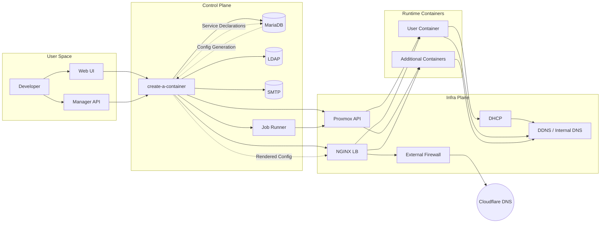
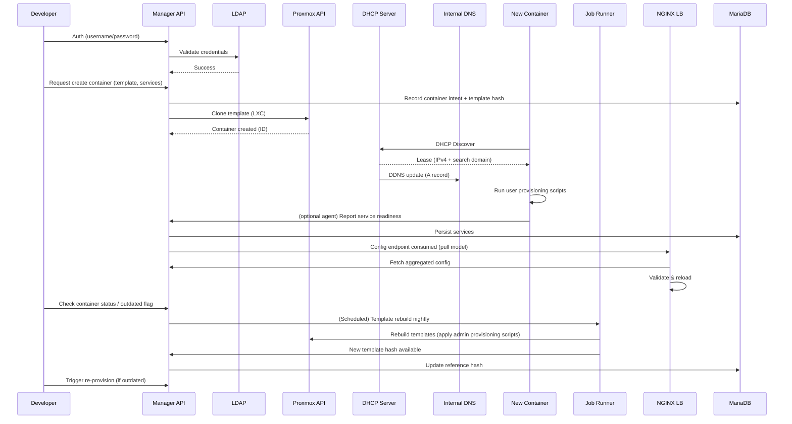
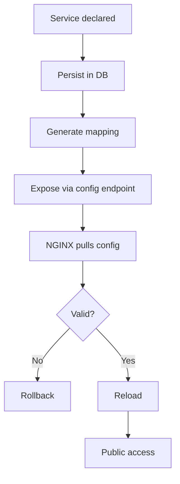
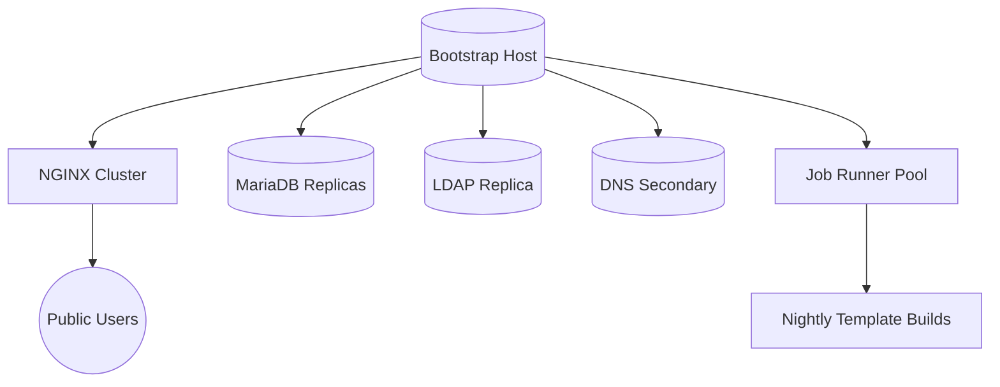

# OpenSource Server Architecture

The goal of `opensource-server` is to provide an integrated, self-service datacenter experience for developers. It orchestrates Proxmox LXC containers, central identity, service exposure, automatic configuration distribution, and lifecycle governance through a manager component (`create-a-container`). This document focuses on **how components interact**, not implementation details.

## High-Level Interaction Narrative

1. A user authenticates via LDAP-backed credentials in the Web UI or API.
2. The manager (`create-a-container`) provisions a container from a Proxmox template, tagging it with template version + admin script commit hash.
3. The container boots, receives its IP via DHCP, which updates DNS (DDNS) with an internal FQDN under `cluster.mieweb.org`.
4. The container boots with admin provisioning artifacts already baked into the template; only user-provided provisioning scripts (cloud-init style) run now to configure declared services (HTTP, TCP, UDP) inside the container.
5. The manager records services in MariaDB. HTTP services create virtual host mappings; Layer 4 services allocate inbound ports.
6. The NGINX load balancer periodically pulls generated configuration (including hostnames and stream mappings) from the manager API and reloads if valid.
7. External traffic to `*.opensource.mieweb.org` (public domain via Cloudflare) is NATed to the internal NGINX. TLS termination is handled centrally (wildcard cert) with HTTP/2 and HTTP/3 enabled.
8. Ancillary platform services (SMTP, LDAP, DNS, DHCP, MariaDB, MongoDB, Job Runner) remain discoverable and governable through the manager UI/API. Only MariaDB is directly used by the manager for metadata; others are assumed reachable locally at bootstrap.
9. Drift detection: If template commit hash differs from latest, the UI surfaces an “outdated” status and allows user or admin-triggered re-provisioning.
10. Administrators can force global script re-runs for urgent remediation (security updates, critical patches).

## Component Interaction Map

### Notes
- Solid arrows: synchronous or direct API interaction.
- Dashed arrows: derived or generated artifacts (configuration, metadata).
- Cloudflare DNS resolves public domain `opensource.mieweb.org` to external IP; NAT + FW forward all (or filtered) ports to internal NGINX.

## Container Lifecycle Interaction

## Service Exposure Interaction

## Configuration Propagation

- Manager acts as **single source of truth** for service and container metadata.
- NGINX configuration is **pull-based** (cron or periodic fetch) ensuring resilience if manager is temporarily unavailable.
- DHCP + DDNS ensure internal name resolution consistency; external domain separation (`cluster.mieweb.org` vs `opensource.mieweb.org`).

## Security & Isolation Interaction Points

| Interaction | Purpose |
|-------------|---------|
| LDAP ↔ Manager | Central auth (SSO with sudo in containers via SSSD) |
| Manager ↔ Proxmox | Controlled provisioning operations |
| Manager ↔ MariaDB | Persistent metadata and service registry |
| NGINX ↔ Manager | Config ingestion (read-only from LB side) |
| SMTP ↔ Manager | Outbound application account provisioning / notifications |
| DHCP ↔ DNS | Automatic internal addressing and naming |
| Developer ↔ Re-provision Scripts | Drift remediation & template governance |

## Drift & Template Governance

- Each template build tagged with commit hash of admin scripts.
- Container records store creation timestamp + template hash.
- Manager compares latest template hash to container hash; surfaces outdated state.
- Re-provision triggers admin scripts only; original user scripts preserved unless explicitly re-run.
- Nightly (or on-demand) template rebuild via Job Runner refreshes baseline.

## Core Bootstrap Assumptions

At first install (single-server bootstrap):
- SMTP, DNS, LDAP, MariaDB all assumed on `localhost`.
- Wizard collects: Proxmox API URL, DHCP network ranges, internal domain (`cluster.mieweb.org`), external domain (`opensource.mieweb.org`).
- Post-bootstrap expansion: additional dedicated containers (NGINX, MariaDB replicas, LDAP, DNS, DHCP, MongoDB, Job Runner) provisioned via supplied admin scripts.

## Expansion & Scaling Interaction

## SMTP Interaction Boundaries

- No user mailbox hosting; only application-level outbound accounts.
- All outbound port 25 traffic (except approved relay) blocked to preserve IP reputation.
- Manager enumerates required DNS (SPF, DKIM, DMARC) values; admin applies externally (Cloudflare).

## Layer 4 vs HTTP Service Interaction

| Service Type | Manager Responsibility | NGINX Responsibility | TLS Handling |
|--------------|-----------------------|----------------------|--------------|
| HTTP         | Hostname registration | vhost proxy + TLS    | Wildcard cert (Cloudflare + acme.sh) |
| TCP/UDP      | Port mapping metadata | Stream forwarding    | Optional TLS termination (TCP only) |

## Failure & Recovery Interaction Paths

| Failure Scenario | Interaction Response |
|------------------|----------------------|
| Manager API down | Existing NGINX config continues serving; next pull deferred |
| NGINX reload fails | Rollback to last valid config (controlled by pull script) |
| Template hash drift | UI surfaces outdated flag; user/admin triggers re-provision |
| DHCP failure | Containers retain leases; DNS not updated until recovery |
| LDAP failure | Authentication blocked; running containers unaffected |

## Data Flow Summary

1. **Control flows**: User -> Manager -> Proxmox / DB / NGINX
2. **Configuration flows**: Manager -> NGINX (pull) ; Job Runner -> Proxmox -> Manager
3. **Addressing flows**: Container -> DHCP -> DNS
4. **Exposure flows**: Public -> Cloudflare DNS -> Firewall/NAT -> NGINX -> Container

## Glossary (Interaction-Centric)

- **Manager (create-a-container)**: Orchestrates provisioning, service registry, config generation.
- **Template Hash**: Commit identifier for admin provisioning scripts included in a nightly build.
- **Service Declaration**: Metadata linking container endpoint to exposure (hostname or port).
- **Drift**: State where container's template hash lags behind current baseline.
- **Pull Model**: Consumer (NGINX) fetches config rather than manager pushing it.
- **DDNS**: Dynamic DNS updates from DHCP events.

---
This architecture emphasizes **clear boundaries** and **minimal coupling**: manager as authoritative metadata hub; load balancer as stateless consumer; provisioning scripts as versioned baseline; dynamic infra (DHCP/DNS) enabling zero manual IP bookkeeping.

