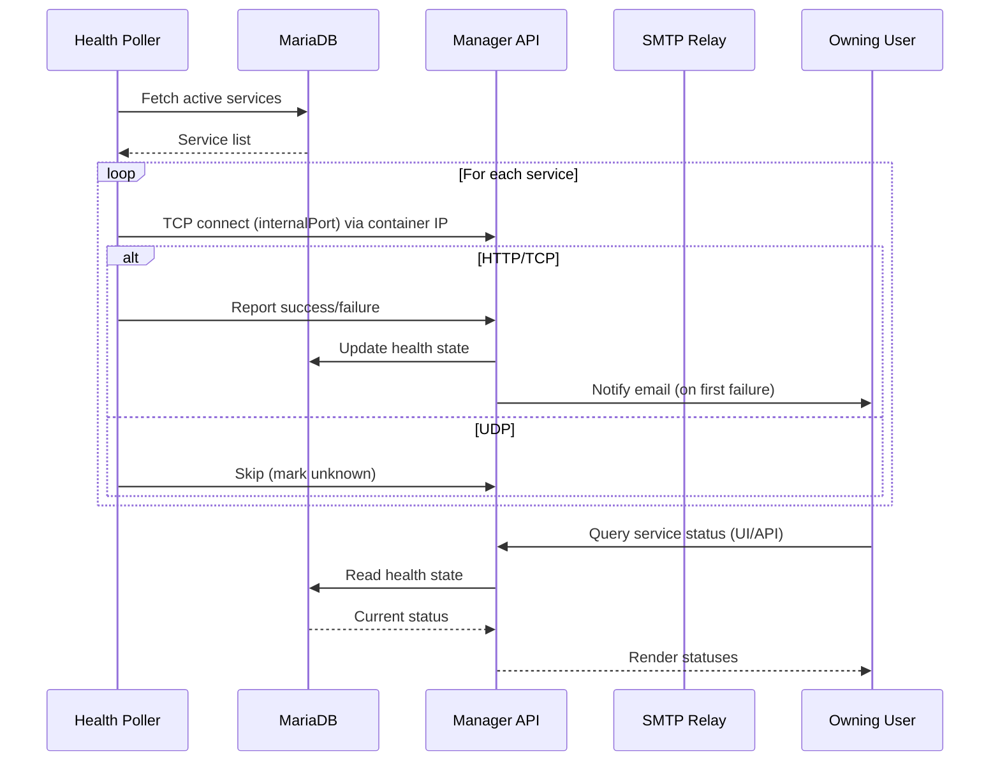

# OpenSource Server Architecture

The goal of `opensource-server` is to provide an integrated, self-service datacenter experience for developers. It orchestrates Proxmox LXC containers, central identity, service exposure, automatic configuration distribution, and lifecycle governance through a manager component (`create-a-container`). This document focuses on **how components interact**, not implementation details.

## High-Level Interaction Narrative

1. A user authenticates via LDAP-backed credentials in the Web UI or API.
2. The manager (`create-a-container`) provisions a container from a Proxmox template, tagging it with template version + admin script commit hash.
3. The container boots, receives its IP via DHCP, which updates DNS (DDNS) with an internal FQDN under `cluster.mieweb.org`.
4. The container boots with admin provisioning artifacts already baked into the template; only user-provided provisioning scripts (cloud-init style) run now to configure declared services (HTTP, TCP, UDP) inside the container.
5. The manager records services in MariaDB. HTTP services create virtual host mappings; Layer 4 services allocate inbound ports.
6. The NGINX load balancer periodically pulls generated configuration (including hostnames and stream mappings) from the manager API and reloads if valid.
7. External traffic to `*.opensource.mieweb.org` (public domain via Cloudflare) is NATed to the internal NGINX. TLS termination is handled centrally (wildcard cert) with HTTP/2 and HTTP/3 enabled.
8. Ancillary platform services (SMTP, LDAP, DNS, DHCP, MariaDB, MongoDB, Job Runner) remain discoverable and governable through the manager UI/API. Only MariaDB is directly used by the manager for metadata; others are assumed reachable locally at bootstrap.
9. Drift detection: If template commit hash differs from latest, the UI surfaces an “outdated” status and allows user or admin-triggered re-provisioning.
10. Administrators can force global script re-runs for urgent remediation (security updates, critical patches).

## Component Interaction Map

### Notes
- Solid arrows: synchronous or direct API interaction.
- Dashed arrows: derived or generated artifacts (configuration, metadata).
- Cloudflare DNS resolves public domain `opensource.mieweb.org` to external IP; NAT + FW forward all (or filtered) ports to internal NGINX.

## Container Lifecycle Interaction

## Service Exposure Interaction

### Service Ownership & Multiplexing

- Every service record is owned by a single user (transitively via container ownership).
- For HTTP services: an external hostname must be unique **per user**, but a user may associate the same hostname with multiple HTTP service entries; NGINX load balancer round-robins those upstream containers/ports.
- For TCP/UDP services: a (protocol, external port) pair is reserved per user at first claim; the user may register multiple service entries reusing that pair, producing a round-robin stream upstream set.
- Each upstream instance (container + internal port) is still represented as its own service entry in the manager API — no aggregation inside persistence; round-robin grouping happens at config generation time.
- Hostname/port collisions across different users are prevented at creation time.

### Automatic Allocation Rules

- **Container Hostname (global uniqueness)**: Each container hostname must be globally unique across all users. This prevents namespace ambiguity and permits deterministic default external hostname generation.
- **Default HTTP External Hostname**: When an HTTP service is first declared without an explicit external hostname, the manager assigns `<container-hostname>.opensource.mieweb.org` (per user context). Users may override this to another available hostname they control.
- **HTTP Hostname Override Constraints**: Overrides must (a) not collide with another user's hostname, (b) respect per-user uniqueness (user can reuse the same hostname to form a round-robin group), and (c) conform to platform DNS naming policy.
- **Automatic External Port Allocation (TCP/UDP)**: For TCP or UDP services declared without an explicit external port, the manager selects a free port from the pool for the given protocol, reserving the (protocol, external port) pair for that user. Subsequent services may reuse that pair for round-robin, or request a new allocation.
- **External Port Override**: Users may request a specific external port if the (protocol, port) pair is currently unclaimed globally. If already claimed by the requesting user, the override simply adds another upstream to that group.
- **Mandatory SSH Exposure**: Every container automatically exposes internal `22/tcp` via a randomly allocated external port at creation time. This mapping is immutable (cannot be overridden or removed) to guarantee baseline management access.
- **Reservation Lifecycle**: Releasing a service does not immediately free a hostname or external port; a grace period (policy-defined) can reduce churn and prevent race conditions in rapid re-provision cycles.

### Administrator-Defined Public Domains & IP Pools

- **Public IP Set**: Administrators may register one or more public IP addresses. Each public IP is mapped 1:1 to an internal load balancer container IP (distinct NGINX instance or cluster virtual IP).
- **Public Domain Set**: Administrators register additional public domains beyond `opensource.mieweb.org`. Each domain’s DNS (Cloudflare or equivalent) must resolve to one of the configured public IPs.
- **Domain–IP Decoupling**: Multiple public domains may point to the same public IP; selection is per HTTP service declaration at creation time or override.
- **HTTP Service Domain Selection**: When defining an HTTP service, users may choose any administrator-defined public domain; resulting external hostname becomes `<chosen-domain>` if fully specified or `<container-hostname>.<chosen-domain>` if default pattern applied.
- **TCP/UDP Service IP Selection**: For non-HTTP services, users may select any administrator-defined public IP for external exposure; port allocation rules (automatic or override) apply against that specific IP + protocol namespace.
- **Per-IP Port Namespace**: (protocol, external port, public IP) forms the true uniqueness key for stream services. Same port number can be reused on different public IPs by different users without collision.
- **Validation Flow**:
	1. User selects domain (HTTP) or public IP (TCP/UDP).
	2. Manager verifies domain is in admin registry and resolves to a known public IP.
	3. Checks uniqueness constraints (hostname per user; port tuple globally per public IP).
	4. Persists service and includes mapping in next config generation.
- **Defaulting Logic**: If user omits domain for HTTP service, system applies the platform primary domain; if user omits public IP for TCP/UDP service, system selects a default public IP (policy: first registered or weighted preference).
- **Future Multi-LB Support**: Domain/IP registry enables horizontal expansion—new LB instances obtain their assigned IPs and subscribe to config pulls scoped by public IP membership.

### Health Monitoring & Service State

- Manager runs periodic TCP connectivity checks for HTTP and TCP services (simple connect -> success/failure).
- UDP services are marked with an "unknown" health state (no reliable connection semantics) and never trigger failure notifications.
- Failed connect events are surfaced in the Web UI and exposed via API for monitoring dashboards.
- Optional email notifications are sent to the owning user on first failure (with backoff / suppression logic recommended for implementation).
- Recovery (next successful check) clears degraded state.

### Health State Semantics

| Protocol | Check Type | Possible States | Notification Eligible |
|----------|------------|-----------------|-----------------------|
| HTTP     | TCP connect (optionally HTTP HEAD future) | healthy / failed | Yes |
| TCP      | TCP connect | healthy / failed | Yes |
| UDP      | (none) | unknown | No |

### Round-Robin Group Formation

| Grouping Key | User Scope | Reuse Allowed | LB Behavior |
|--------------|------------|---------------|-------------|
| HTTP hostname | Per user | Yes (multiple services) | Round-robin upstream list |
| (protocol, external port) | Per user | Yes (multiple services) | Stream round-robin (TCP/UDP) |

Collision prevention enforced globally: different users cannot claim identical HTTP hostname or identical (protocol, external port) tuple.

## Configuration Propagation

- Manager acts as **single source of truth** for service and container metadata.
- NGINX configuration is **pull-based** (cron or periodic fetch) ensuring resilience if manager is temporarily unavailable.
- DHCP + DDNS ensure internal name resolution consistency; external domain separation (`cluster.mieweb.org` vs `opensource.mieweb.org`).

## Security & Isolation Interaction Points

| Interaction | Purpose |
|-------------|---------|
| LDAP ↔ Manager | Central auth (SSO with sudo in containers via SSSD) |
| Manager ↔ Proxmox | Controlled provisioning operations |
| Manager ↔ MariaDB | Persistent metadata and service registry |
| NGINX ↔ Manager | Config ingestion (read-only from LB side) |
| SMTP ↔ Manager | Outbound application account provisioning / notifications |
| DHCP ↔ DNS | Automatic internal addressing and naming |
| Developer ↔ Re-provision Scripts | Drift remediation & template governance |

## Drift & Template Governance

- Each template build tagged with commit hash of admin scripts.
- Container records store creation timestamp + template hash.
- Manager compares latest template hash to container hash; surfaces outdated state.
- Re-provision triggers admin scripts only; original user scripts preserved unless explicitly re-run.
- Nightly (or on-demand) template rebuild via Job Runner refreshes baseline.

## Core Bootstrap Assumptions

At first install (single-server bootstrap):
- SMTP, DNS, LDAP, MariaDB all assumed on `localhost`.
- Wizard collects: Proxmox API URL, DHCP network ranges, internal domain (`cluster.mieweb.org`), external domain (`opensource.mieweb.org`).
- Post-bootstrap expansion: additional dedicated containers (NGINX, MariaDB replicas, LDAP, DNS, DHCP, MongoDB, Job Runner) provisioned via supplied admin scripts.

## Expansion & Scaling Interaction

## SMTP Interaction Boundaries

- No user mailbox hosting; only application-level outbound accounts.
- All outbound port 25 traffic (except approved relay) blocked to preserve IP reputation.
- Manager enumerates required DNS (SPF, DKIM, DMARC) values; admin applies externally (Cloudflare).

## Layer 4 vs HTTP Service Interaction

| Service Type | Manager Responsibility | NGINX Responsibility | TLS Handling |
|--------------|-----------------------|----------------------|--------------|
| HTTP         | Hostname registration | vhost proxy + TLS    | Wildcard cert (Cloudflare + acme.sh) |
| TCP/UDP      | Port mapping metadata | Stream forwarding    | Optional TLS termination (TCP only) |

## Failure & Recovery Interaction Paths

| Failure Scenario | Interaction Response |
|------------------|----------------------|
| Manager API down | Existing NGINX config continues serving; next pull deferred |
| NGINX reload fails | Rollback to last valid config (controlled by pull script) |
| Template hash drift | UI surfaces outdated flag; user/admin triggers re-provision |
| DHCP failure | Containers retain leases; DNS not updated until recovery |
| LDAP failure | Authentication blocked; running containers unaffected |

## Data Flow Summary

1. **Control flows**: User -> Manager -> Proxmox / DB / NGINX
2. **Configuration flows**: Manager -> NGINX (pull) ; Job Runner -> Proxmox -> Manager
3. **Addressing flows**: Container -> DHCP -> DNS
4. **Exposure flows**: Public -> Cloudflare DNS -> Firewall/NAT -> NGINX -> Container

## Glossary (Interaction-Centric)

- **Manager (create-a-container)**: Orchestrates provisioning, service registry, config generation.
- **Template Hash**: Commit identifier for admin provisioning scripts included in a nightly build.
- **Service Declaration**: Metadata linking container endpoint to exposure (hostname or port).
- **Drift**: State where container's template hash lags behind current baseline.
- **Pull Model**: Consumer (NGINX) fetches config rather than manager pushing it.
- **DDNS**: Dynamic DNS updates from DHCP events.

---
This architecture emphasizes **clear boundaries** and **minimal coupling**: manager as authoritative metadata hub; load balancer as stateless consumer; provisioning scripts as versioned baseline; dynamic infra (DHCP/DNS) enabling zero manual IP bookkeeping.

