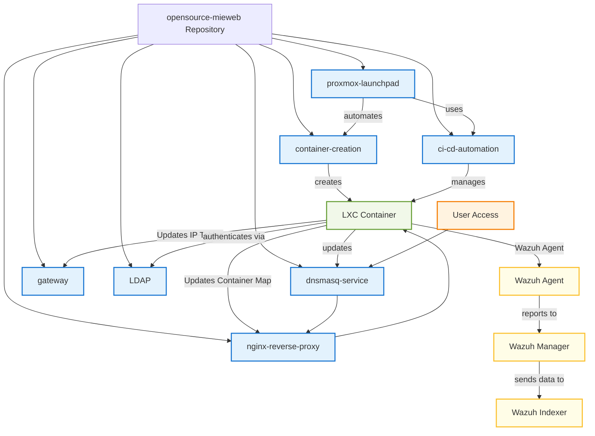

# opensource-mieweb

Configuration storage for the [opensource.mieweb.org](https://opensource.mieweb.org:8006) Proxmox project.

This repository contains configuration files and scripts for managing a Proxmox-based container hosting environment, including automated DNS, NGINX reverse proxy, dynamic port mapping, and the Proxmox LaunchPad GitHub Action for automated container deployment.

## Cluster Graph

### Core Infrastructure

- [`dnsmasq-service/`](dnsmasq-service/):  
  Contains Dnsmasq configuration for DHCP and DNS services, including wildcard routing for the reverse proxy and container network management.

- [`nginx-reverse-proxy/`](nginx-reverse-proxy/):  
  Houses NGINX configuration files for the reverse proxy setup, including JavaScript modules for dynamic backend resolution and SSL certificate management.

- [`gateway/`](gateway/):  
  Gateway configuration and management scripts for network routing and access control between the internal container network and external traffic. Also contains daily clean up scripts for the cluster.

### Container Management

- [`container-creation/`](container-creation/):  
  Contains comprehensive scripts for LXC container lifecycle management, including creation, LDAP configuration, service deployment, and registration with the proxy infrastructure.

- [`ci-cd-automation/`](ci-cd-automation/):  
  Automation scripts for continuous integration and deployment workflows, including container existence checks, updates, and cleanup operations with helper utilities.

### Authentication & Directory Services

- [`LDAP/`](LDAP/):  
  Contains LDAP authentication infrastructure including a custom Node.js LDAP server that bridges database user management with LDAP protocols, and automated LDAP client configuration tools for seamless container authentication integration. LDAP Server configured to reference the [Proxmox VE Users @pve realm](https://pve.proxmox.com/wiki/User_Management) with optional [Push Notification 2FA](https://github.com/mieweb/mieweb_auth_app)

### Security

- [`Wazuh/`](Wazuh/):
  We utilize Wazuh, an opensource security management platform, to provide vulnerability detection and threat hunting services to our cluster. Our custom decoders and rules revolve mainly around mitigating SSH/PAM bruteforce attacks in both our hypervisors and individual containers.

### GitHub Action Integration

- [`proxmox-launchpad/`](proxmox-launchpad/):  
  The Proxmox LaunchPad GitHub Action for automated container deployment directly from GitHub repositories, supporting both single and multi-component applications.

- [`LDAPServer`](https://github.com/mieweb/LDAPServer):
  LDAP Server configured to reference the [Proxmox VE Users @pve realm](https://pve.proxmox.com/wiki/User_Management) with optional [Push Notification 2FA](https://github.com/mieweb/mieweb_auth_app)

## Create a Container

If you have an account in the [opensource-mieweb](https://opensource.mieweb.org:8006) cluster, you can create a container in three ways:
- Use the Web GUI here: [create-a-container](https://create-a-container.opensource.mieweb.org/)
- Use the Command Line: ssh create-container@opensource.mieweb.org (mie123!)
- Use the Proxmox LaunchPad Github Action to automatically provision, update, and delete containers for you: [Proxmox LaunchPad](#proxmox-launchpad)

## How It Works

- **DNS**: All `*.opensource.mieweb.com` requests are routed to the NGINX proxy via Dnsmasq, providing automatic subdomain resolution for containers.
- **Reverse Proxy**: NGINX uses JavaScript modules to dynamically resolve backend IP addresses and ports for each subdomain, based on the container registry in `/etc/nginx/port_map.json`.
- **Container Lifecycle**: When containers start, Proxmox hooks automatically:
  - Wait for DHCP lease assignment
  - Allocate available HTTP and SSH ports
  - Update the NGINX port mapping and reload configuration
  - Configure iptables rules for SSH port forwarding
- **GitHub Integration**: The Proxmox LaunchPad action automates the entire process from repository push to live deployment, including dependency installation, service configuration, and application startup.
- **CI/CD Pipeline**: Automated scripts used by [Proxmox LaunchPad](#proxmox-launchpad) to handle container updates, existence checks, and cleanup operations to maintain a clean and efficient hosting environment.
- **LDAP Server**: All LXC Container Authentication is handled by a centralized LDAP server housed in the cluster. Each Container is configured with SSSD, which communicates with the LDAP server to verify/authenitcate user credentials. This approach is more secure than housing credentials locally.
- **Wazuh**: Both containers and hypervisors are Wazuh Agents, and send all logs to our centralized Wazuh Manager, which matches each log against a large database of decoders and rules. If certain rules are triggered, active response mechanisms respond by triggering certain commands, a common one being a firewall drop of all packets originating from a certain source IP.

## Proxmox LaunchPad

The Proxmox LaunchPad is a powerful GitHub Action that automatically creates, manages, and deploys LXC containers on the Proxmox cluster based on your repository's branch activity. It supports:

- **Automatic Container Creation**: Creates new containers when branches are created or pushed to
- **Multi-Component Deployments**: Supports applications with multiple services (e.g., frontend + backend)
- **Service Integration**: Automatically installs and configures services like MongoDB, Docker, Redis, PostgreSQL, and more
- **Branch-Based Environments**: Each branch gets its own isolated container environment
- **Automatic Cleanup**: Deletes containers when branches are deleted (e.g., after PR merges)

The action integrates with the existing infrastructure to provide automatic DNS registration, reverse proxy configuration, and port mapping for seamless access to deployed applications.

## Opensource Cluster Usage

### For Infrastructure Management

1. **Clone this repository** to your Proxmox host or configuration management system.
2. **Deploy the configuration files** to their respective locations on your infrastructure.
3. **Ensure dependencies**:
   - Proxmox VE with LXC container support
   - NGINX with the `ngx_http_js_module`
   - Dnsmasq for DNS and DHCP services
4. **Set up LDAP authentication** using the provided LDAP server and client configuration tools.
5. **Configure container templates** and network settings according to your environment.
6. **Register new containers** using the provided hook scripts for automatic proxy and DNS integration.

### For GitHub Action Deployment

1. **Add the Proxmox LaunchPad action** to your repository's workflow file.
2. **Configure repository secrets** for Proxmox credentials and optionally a GitHub PAT.
3. **Set up trigger events** for push, create, and delete operations in your workflow.
4. **Configure deployment properties** in your workflow file for automatic application deployment.
5. **Push to your repository** and watch as containers are automatically created and your application is deployed.

See the [`proxmox-launchpad/README.md`](proxmox-launchpad/README.md) for detailed setup instructions and configuration options.

## Optional Submodules
- **Push Notification 2FA** - MIE Auth https://github.com/mieweb/mieweb_auth_app

---

Contributors: Carter Myers, Maxwell Klema, and Anisha Pant