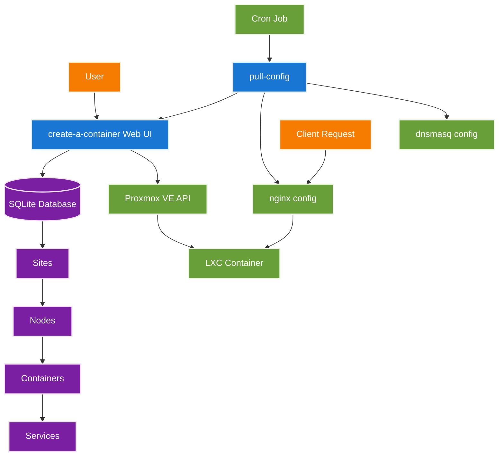
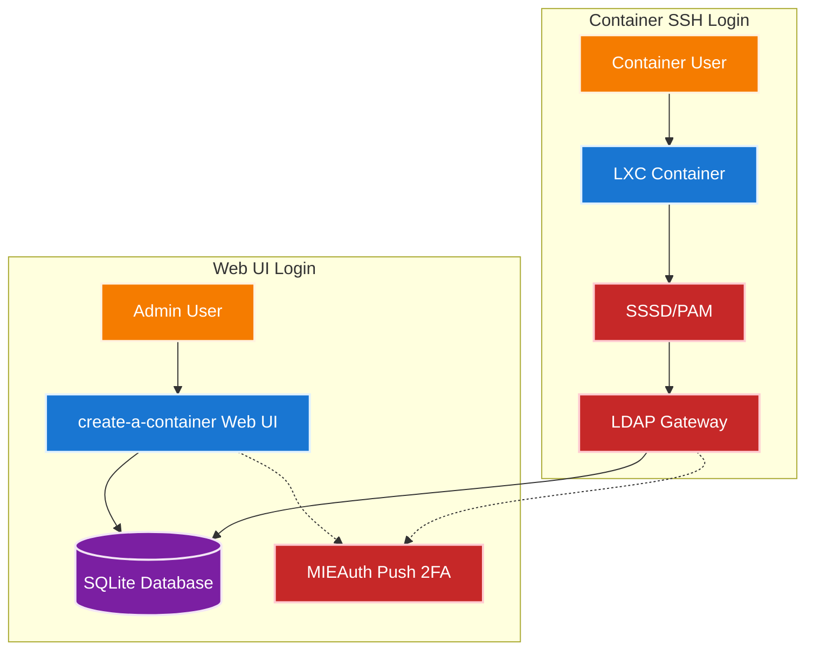
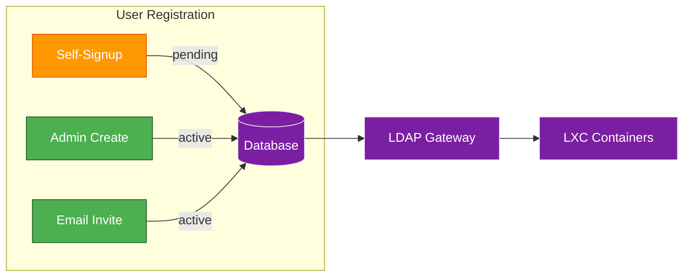

# opensource-server

Infrastructure management platform for automated LXC container hosting with Proxmox VE.

This repository provides a complete self-service container management system with web interface, automated configuration distribution, and integrated DNS/reverse proxy services.

## Project Components

- [`create-a-container/`](create-a-container/README.md) - Web application for container lifecycle management
- [`pull-config/`](pull-config/README.md) - Automated configuration distribution system for nginx and dnsmasq
- [`mie-opensource-landing/`](mie-opensource-landing/README.md) - Landing page and documentation site
- [`packer/`](packer/README.md) - LXC container template creation
- [`ci-cd-automation/`](ci-cd-automation/README.md) - Proxmox API automation scripts
- [`LDAP/`](LDAP/README.md) - Centralized authentication infrastructure
- [`Wazuh/`](Wazuh/README.md) - Security monitoring and threat detection

## Installation

### Recommended: Proxmox 9+ OCI Container (Preferred)

With Proxmox 9's native OCI container support, the easiest installation method is to deploy directly from GitHub Container Registry:

```bash
# Pull and run the container from GHCR
pct create <VMID> ghcr.io/mieweb/opensource-server:latest \
  --hostname opensource-server \
  --net0 name=eth0,bridge=vmbr0,ip=dhcp \
  --features nesting=1 \
  --privileged 1 \
  --onboot 1
```

> **Note**: Adjust the VMID, network configuration, and other parameters according to your Proxmox environment.

### Alternative: Docker Container

See the [`Dockerfile`](Dockerfile) in the repository root for building and running the container with Docker:

```bash
docker build -t opensource-server .
docker run -d --privileged \
  -p 443:443 \
  -p 53:53/udp \
  --name opensource-server \
  opensource-server:latest
```

### Manual Installation (Legacy)

For a traditional installation on a Debian-based system, see the [`Dockerfile`](Dockerfile) for the complete installation steps and dependencies. The Dockerfile serves as the canonical reference for system setup and configuration.

Key steps include:
1. Install nginx (mainline from nginx's repo preferred)
2. Install dnsmasq with proper configuration
3. Clone repository and run `make install`

For detailed configuration and usage instructions, refer to the individual component READMEs linked above.

## Architecture Overview

The system provides automated container hosting through three main components:

1. **Container Management** (`create-a-container/`)
   - Web-based interface for container lifecycle operations
   - Proxmox VE API integration for LXC container provisioning
   - Site-based organization with hierarchical node/container relationships
   - Service port mapping and DNS configuration

2. **Configuration Distribution** (`pull-config/`)
   - Automated pulling of nginx and dnsmasq configurations
   - ETag-based change detection for efficient updates
   - Validation and automatic rollback on errors
   - Multi-instance support via run-parts pattern

3. **Infrastructure Services**
   - nginx reverse proxy with SSL/TLS termination
   - dnsmasq for DHCP and DNS services
   - LDAP authentication for centralized user management
   - Wazuh security monitoring and threat detection

### Data Flow



### Authentication Flow



The LDAP Gateway (from [mieweb/LDAPServer](https://github.com/mieweb/LDAPServer)) provides centralized authentication:
- Users in the `ldapusers` group can SSH into containers
- SSSD on containers connects to the LDAP Gateway for PAM/NSS
- Optional push notification 2FA via [MIEAuth](https://github.com/mieweb/mieweb_auth_app)

### User Management

Users are managed through the `create-a-container` Web UI and stored in the SQLite database. The LDAP Gateway reads from this same database, so changes are immediately available for container authentication.

| Operation | Route | Access |
|-----------|-------|--------|
| Self-Register | `POST /register` | Anyone (status = `pending`) |
| Invited Register | `POST /register?token=...` | Invited users (auto-activated) |
| Admin Create | `POST /users` | Admins only |
| Admin Update | `PUT /users/:id` | Admins only |
| Admin Delete | `DELETE /users/:id` | Admins only |
| Send Invite | `POST /users/invite` | Admins only |



---

Contributors: Carter Myers, Maxwell Klema, Anisha Pant, and Robert Gingras