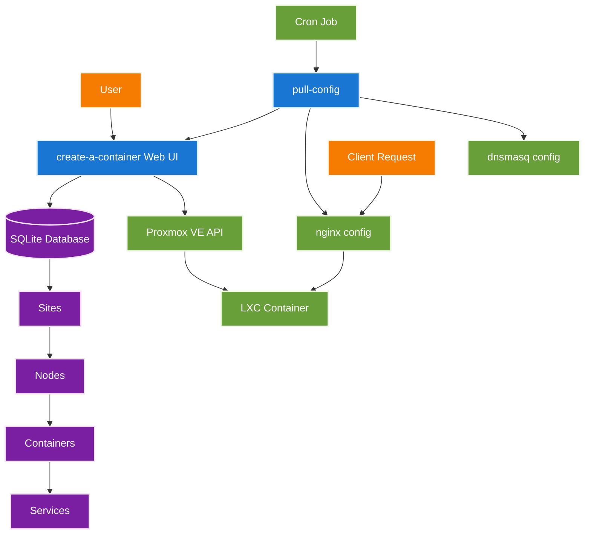

# opensource-server

Infrastructure management platform for automated LXC container hosting with Proxmox VE.

This repository provides a complete self-service container management system with web interface, automated configuration distribution, and integrated DNS/reverse proxy services.

## Project Components

- [`create-a-container/`](create-a-container/README.md) - Web application for container lifecycle management
- [`pull-config/`](pull-config/README.md) - Automated configuration distribution system for nginx and dnsmasq
- [`mie-opensource-landing/`](mie-opensource-landing/README.md) - Landing page and documentation site
- [`packer/`](packer/README.md) - LXC container template creation
- [`ci-cd-automation/`](ci-cd-automation/README.md) - Proxmox API automation scripts
- [`LDAP/`](LDAP/README.md) - Centralized authentication infrastructure
- [`Wazuh/`](Wazuh/README.md) - Security monitoring and threat detection

## Bootstrap Installation

Bootstrap a new infrastructure node from scratch:

### 1. Install a Debian 13 LXC on Proxmox

### 2. Install nginx (mainline from nginx's repo preferred)

```bash
# Add nginx mainline repository (https://nginx.org/en/linux_packages.html#Debian)
apt install curl gnupg2 ca-certificates lsb-release debian-archive-keyring
curl https://nginx.org/keys/nginx_signing.key | gpg --dearmor \
    | tee /usr/share/keyrings/nginx-archive-keyring.gpg >/dev/null
echo "deb [signed-by=/usr/share/keyrings/nginx-archive-keyring.gpg] \
http://nginx.org/packages/mainline/debian `lsb_release -cs` nginx" \
    | tee /etc/apt/sources.list.d/nginx.list
echo -e "Package: *\nPin: origin nginx.org\nPin: release o=nginx\nPin-Priority: 900\n" \
    | tee /etc/apt/preferences.d/99nginx

apt update
apt install -y nginx ssl-cert
systemctl enable --now nginx
```

### 3. Install dnsmasq

```bash
apt install -y dnsmasq
```

Edit Debian's dnsmasq defaults. In `/etc/default/dnsmasq`, comment out `CONFIG_DIR=` and uncomment `IGNORE_RESOLVCONF=`. We want all configuration to be handled by and only by `pull-config`.

```bash
systemctl enable --now dnsmasq.service
```


### 4. Install prerequisites

```bash
apt install -y git make npm
```

### 5. Clone the repository

```bash
git clone https://github.com/mieweb/opensource-server.git /opt/opensource-server
cd /opt/opensource-server
```

### 6. Run installation

```bash
make install
```

> **Note**: The `make install` command will set up the create-a-container web application, install the pull-config system for automated configuration management, and configure nginx and dnsmasq integration.

For detailed configuration and usage instructions, refer to the individual component READMEs linked above.

## Architecture Overview

The system provides automated container hosting through three main components:

1. **Container Management** (`create-a-container/`)
   - Web-based interface for container lifecycle operations
   - Proxmox VE API integration for LXC container provisioning
   - Site-based organization with hierarchical node/container relationships
   - Service port mapping and DNS configuration

2. **Configuration Distribution** (`pull-config/`)
   - Automated pulling of nginx and dnsmasq configurations
   - ETag-based change detection for efficient updates
   - Validation and automatic rollback on errors
   - Multi-instance support via run-parts pattern

3. **Infrastructure Services**
   - nginx reverse proxy with SSL/TLS termination
   - dnsmasq for DHCP and DNS services
   - LDAP authentication for centralized user management
   - Wazuh security monitoring and threat detection

### Data Flow



---

Contributors: Carter Myers, Maxwell Klema, Anisha Pant, and Robert Gingras