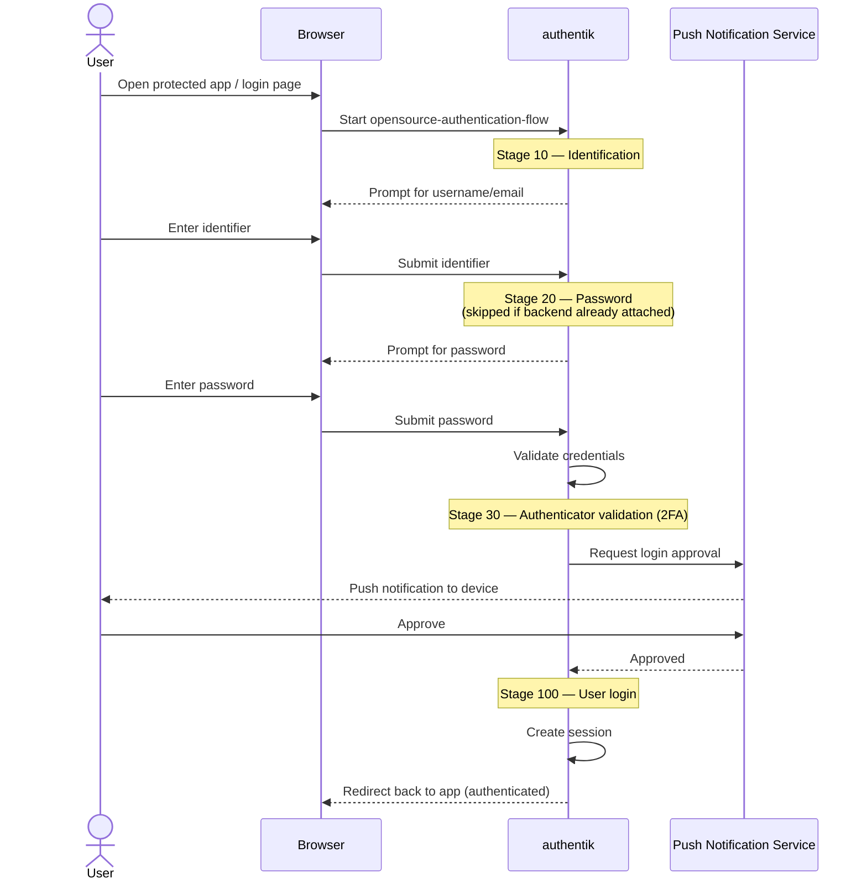
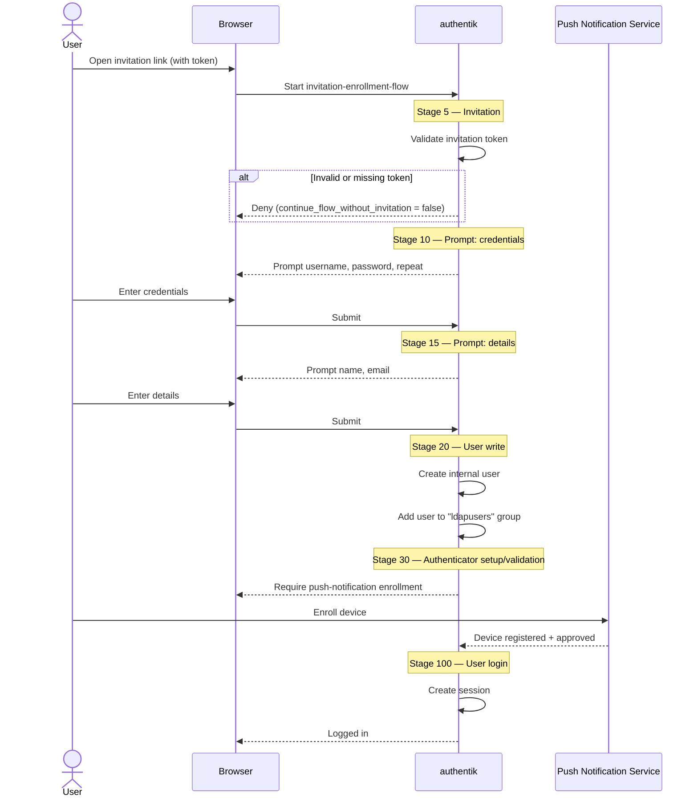
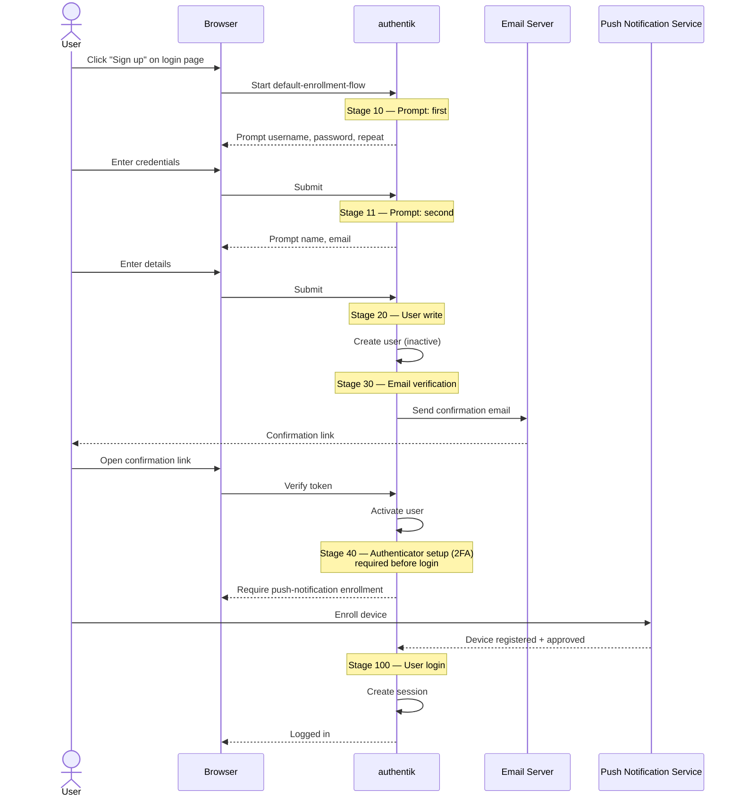
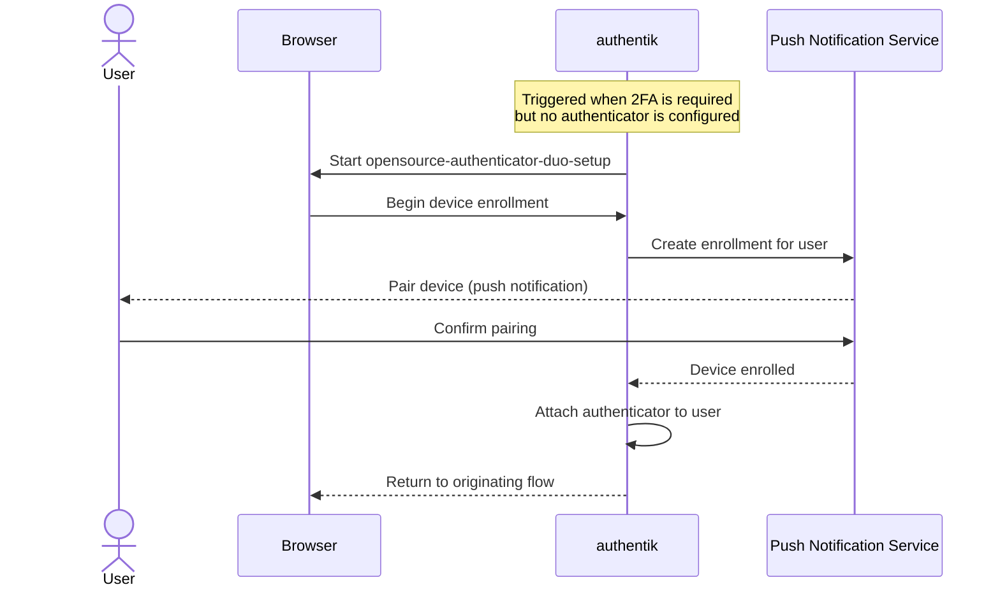
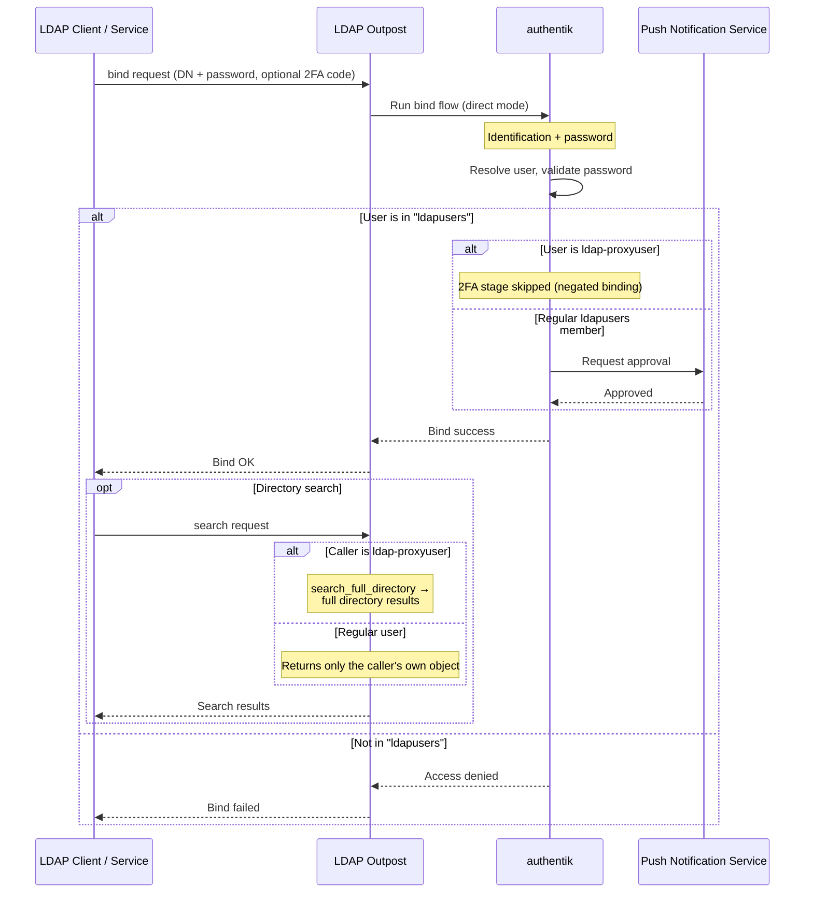

# MIE Opensource — authentik

This directory contains the [authentik](https://goauthentik.io/) deployment that
provides Single Sign-On (SSO), enrollment, and LDAP for the MIE Opensource
platform. Configuration is delivered declaratively through
[blueprints](https://docs.goauthentik.io/docs/customize/blueprints/) so the
identity provider can be reproduced from source.

Two-factor authentication (2FA) is enforced for all interactive users via a
**push notification service** (an external authenticator that approves logins
with a phone push). Throughout this document and the diagrams, "push
notification service" refers to that provider.

## Contents

| Path | Purpose |
|---|---|
| `compose.yml` | Server + worker + PostgreSQL services |
| `blueprints/` | Declarative flows, stages, providers, and applications |
| `certs/` | LDAPS / outpost certificates (git-ignored) |
| `custom-templates/` | Email and flow template overrides (git-ignored) |
| `data/` | Media (logos, icons) and runtime data (git-ignored) |

## Blueprints

Blueprints are applied **in filename order**. The numeric prefix encodes the
required import order — later files reference objects created by earlier ones
(via `!Find`/`!KeyOf`), so importing out of order will fail.

| Order | File | Creates |
|---|---|---|
| 10 | `10-flows-recovery-email-mfa-verification.yaml` | `default-recovery-flow` (password reset) |
| 10 | `10-opensource-authenticator-duo-setup.yaml` | Push-notification authenticator + its setup flow |
| 10 | `10-opensource-ldap-identity.yaml` | `ldapusers` group and the `ldap-proxyuser` service account |
| 11 | `11-opensource-mfa-validation-stage.yaml` | Shared 2FA validation stage (`opensource-authentication-mfa-validation`) |
| 12 | `12-flows-enrollment-email-verification.yaml` | `default-enrollment-flow` (self-service registration) |
| 20 | `20-opensource-authentication-flow.yaml` | `opensource-authentication-flow` (login/bind) + proxyuser 2FA exception |
| 30 | `30-flow-invitation-enrollment.yaml` | `invitation-enrollment-flow` (invite-only onboarding) |
| 30 | `30-opensource-brand.yaml` | Brand: title, logos, and default flows |
| 40 | `40-opensource-ldap.yaml` | LDAP provider + application + access restriction |

> The shared 2FA stage is defined once in `11-...` and referenced (via `!Find`)
> by the registration, authentication, and invitation flows so every interactive
> flow enforces identical 2FA behaviour. It must be imported before those flows,
> and after the push-notification authenticator it depends on.
>
> The `1x-flows-*` files are based on upstream authentik examples
> (`blueprints.goauthentik.io/instantiate: "false"`), used as the enrollment and
> recovery flows referenced by the identification stage.

### Required environment variables

These are read by `!Env` tags at import time and must be present in the
authentik **server** and **worker** environment:

| Variable | Used by | Purpose |
|---|---|---|
| `OPENSOURCE_PUSH_MFA_CLIENT_ID` | `10-...duo-setup` | Push service application key |
| `OPENSOURCE_PUSH_MFA_CLIENT_SECRET` | `10-...duo-setup` | Push service application secret |
| `OPENSOURCE_PUSH_MFA_HOSTNAME` | `10-...duo-setup` | Push service API hostname |
| `OPENSOURCE_PUSH_MFA_ADMIN_ID` | `10-...duo-setup` | Push service admin API key |
| `OPENSOURCE_PUSH_MFA_ADMIN_SECRET` | `10-...duo-setup` | Push service admin API secret |
| `AUTHENTIK_LDAP_PROXYUSER_PASSWORD` | `10-...ldap-identity` | Password for the `ldap-proxyuser` account |
| `AUTHENTIK_LDAP_BASE_DN` | `40-...ldap` | Base DN of the LDAP directory |

## Flow reference

The sections below describe each flow as configured by the blueprints. Stage
order numbers match the `flowstagebinding` `order` values.

### Authentication flow

`opensource-authentication-flow` is the brand's default login flow. It is also
used as the LDAP **bind** flow. Stages:

1. **Identification** (order 10) — username/email; links to enrollment and
   recovery.
2. **Password** (order 20) — skipped if the user already has an authentication
   backend attached (e.g. arrived passwordless).
3. **Authenticator validation** (order 30) — the push-notification 2FA check.
   The binding uses `policy_engine_mode: all`, and the stage is skipped only
   when every bound policy passes — used to exempt the LDAP proxyuser.
4. **User login** (order 100) — creates the session.

### Invitation enrollment flow

`invitation-enrollment-flow` onboards users who hold a valid invitation. New
users are created as **internal** accounts, added to the `ldapusers` group, and
are required to set up the push-notification authenticator before their first
login (the flow reuses the authentication flow's validation stage with
`not_configured_action: configure`).

### Registration flow (self-service)

`default-enrollment-flow` is the self-service registration flow linked from the
identification stage. Users are created **inactive** and must confirm via email
before the account is activated. After verification they are required to set up
the push-notification authenticator (2FA) before the login stage completes.

> Self-registered users are not added to the `ldapusers` group and therefore
> cannot bind to LDAP.

### Push-notification authenticator setup

`opensource-authenticator-duo-setup` is a `stage_configuration` flow that
registers a user's device with the push notification service. It runs whenever a
flow's authenticator-validation stage encounters a user without a configured
authenticator (`not_configured_action: configure`), such as during invitation
enrollment or a first login.

### LDAP bind flow

The LDAP application/provider (`opensource-ldap`) lets directory-aware services
authenticate against authentik. The provider uses the **authentication flow** as
its bind flow with `bind_mode: direct`, so 2FA is evaluated on **every** bind.

Key access rules:

- Only members of the `ldapusers` group may bind (enforced by a group policy
  binding on the application).
- `mfa_support` is enabled, so human users append their one-time code to the
  bind password as `password;code`. (The push notification service prompts the
  user's device during the bind.)
- The `ldap-proxyuser` service account is exempt from 2FA (a negated user policy
  binding skips the validation stage) and is the only principal granted
  `search_full_directory` (read-only search of the whole directory). No user has
  write access over LDAP.

## Deployment

1. Provide the [environment variables](#required-environment-variables) to the
   server and worker (e.g. via the authentik `.env`).
2. Make the blueprints available to authentik (mounted into the container's
   blueprints path).
3. Apply blueprints **in numeric order** (`10` → `20` → `30` → `40`). authentik
   discovers and applies file-based blueprints automatically; when importing
   manually, follow the order in the [Blueprints](#blueprints) table.
4. Deploy an **LDAP outpost** and assign it the `opensource-ldap` application to
   serve the directory. (The outpost is not created by these blueprints.)
