# Container Creation

This document describes the container creation flow used by the MIE Open Source container provisioning system. The sequence below captures the full end-to-end flow from an operator connecting to the jump host through to the container being created, configured, and started on the hypervisor.

High-level summary:

- Operators connect to the `intern-phxdc-pve1` jump host as the `create-container` user.
- A chain of SSH restrictions and environment-variable handoffs lead the request to the container-creation server, which runs scripts that validate credentials, check hostname availability, prepare deployment artifacts, and finally invoke the hypervisor-side scripts that clone and start the container.

Sequence diagram (Mermaid):

```mermaid
sequenceDiagram
	actor User as Operator
	participant Jump as intern-phxdc-pve1 (create-container)
	participant Extract as extract-fingerprint.sh
	participant ProxySSH as ProxySSH (env passthrough)
	participant ContainerServer as container-creation (10.15.234.122)
	participant Sudo as create-lxc-container.sh (runs as root)
	participant JSRunner as js/runner.js
	participant Auth as js/authenticateUser.js
	participant NGINX as NGINX (port_map.json check)
	participant MasterProto as protocols/master_protocol_list.txt
	participant DeployApp as deploy-application.sh
	participant RepoCheck as curl (repo existence)
	participant Gather as gather*.sh
	participant SFTP as sftp to hypervisor
	participant Hypervisor as intern-phxdc-pve1 (hypervisor-side scripts)
	participant CreateCT as create-container.sh
	participant LDAP as configureLDAP.sh
	participant Pown as pown.sh
	participant Wazuh as register-agent.sh
	participant DeployOnStart as deployOnStart.sh
	participant RuntimeInstall as node/python runtime installers

	User->>Jump: ssh create-container@opensource.mieweb.org
	Jump->>Extract: run extract-fingerprint.sh per sshd_config
	Extract->>ProxySSH: pass certain ENV variables
	ProxySSH->>ContainerServer: auto-ssh into 10.15.234.122 as create-container
	ContainerServer->>Sudo: sshd_config triggers create-lxc-container.sh (runs as root via sudo)
	Sudo->>Sudo: prompt for variables not supplied via ENV
	Sudo->>JSRunner: invoke js/runner.js -> js/authenticateUser.js to validate credentials
	Sudo->>NGINX: SSH to NGINX and run checkHostnameRunner.js -> checkHostname.js (validate hostname via port_map.json)
	Sudo->>MasterProto: compare extra protocols against master_protocol_list.txt
	Sudo->>DeployApp: if automatic deployment selected, call deploy-application.sh
	DeployApp->>DeployApp: prompt for unset env vars
	DeployApp->>RepoCheck: curl to check repository exists and is public
	DeployApp->>JSRunner: invoke js/runner.js -> authenticateRepo.js
	DeployApp->>Gather: invoke gatherSetupCommands.sh, gatherEnvVars.sh, gatherRuntimeLangs.sh, gatherServices.sh
	Sudo->>SFTP: send user's public key, protocol file, env vars, and services to hypervisor via sftp
	Sudo->>Hypervisor: invoke create-container.sh on intern-phxdc-pve1 over ssh
	Hypervisor->>CreateCT: create-container.sh assigns CTID, clones CT template, sets tags, ACLs, waits for networking
	CreateCT->>CreateCT: copy user's public key into container, generate random root password
	CreateCT->>LDAP: run configureLDAP.sh
	LDAP->>Pown: configureLDAP clones and runs pown.sh
	CreateCT->>Wazuh: run register-agent.sh to install/configure wazuh manager IP
	CreateCT->>DeployOnStart: call deployOnStart.sh if deployment enabled
	DeployOnStart->>RepoCheck: clone project repo, copy env to .env
	DeployOnStart->>RuntimeInstall: call node_runtime_install.sh or python_runtime_install.sh
	RuntimeInstall->>RuntimeInstall: compile and install language runtime from source
	DeployOnStart->>DeployOnStart: start services
	CreateCT->>CreateCT: register container ports via register-container.sh
	CreateCT->>CreateCT: launch tmux that invokes start_services.sh

```

Notes:

- The diagram closely follows the implementation: SSH restrictions are enforced via per-user `sshd_config` command= clauses and `extract-fingerprint.sh` establishes the environment and fingerprint forwarding.
- The system performs multiple, layered checks (user auth, hostname availability, protocol validation, repo existence) to avoid failed deployments.
- Several scripts prompt for missing variables so interactive runs are possible; these could be converted to fully-noninteractive flows by providing all required env vars.

References:

- See the `create-a-container/` folder for the front-end and server that initiate the flow.
- See the `container-creation/` folder for the server-side scripts invoked during provisioning.

If you'd like, I can also:

- Add a simple diagram PNG export (requires mermaid-cli) and include it in the repo.
- Turn the interactive prompts into optional CLI flags for automation.

