# Container Creation

This document describes the container creation flow used by the MIE Open Source container provisioning system. The sequence below captures the full end-to-end flow from an operator connecting to the jump host through to the container being created, configured, and started on the hypervisor.

High-level summary:

- Operators connect to the `intern-phxdc-pve1` jump host as the `create-container` user.
- A chain of SSH restrictions and environment-variable handoffs lead the request to the container-creation server, which runs scripts that validate credentials, check hostname availability, prepare deployment artifacts, and finally invoke the hypervisor-side scripts that clone and start the container.

Sequence diagram (Mermaid):

```mermaid
sequenceDiagram
	actor User as Operator
	participant Jump as intern-phxdc-pve1 (create-container)
	participant Extract as extract-fingerprint.sh
	participant ProxySSH as ProxySSH (env passthrough)
	participant ContainerServer as container-creation (10.15.234.122)
	participant Sudo as create-lxc-container.sh (runs as root)
	participant JSRunner as js/runner.js
	participant Auth as js/authenticateUser.js
	participant NGINX as NGINX (port_map.json check)
	participant MasterProto as protocols/master_protocol_list.txt
	participant DeployApp as deploy-application.sh
	participant RepoCheck as curl (repo existence)
	participant Gather as gather*.sh
	participant SFTP as sftp to hypervisor
	participant Hypervisor as intern-phxdc-pve1 (hypervisor-side scripts)
	participant CreateCT as create-container.sh
	participant LDAP as configureLDAP.sh
	participant Pown as pown.sh
	participant Wazuh as register-agent.sh
	participant DeployOnStart as deployOnStart.sh
	participant RuntimeInstall as node/python runtime installers

	User->>Jump: ssh create-container@opensource.mieweb.org
	Jump->>Extract: run extract-fingerprint.sh per sshd_config
	Extract->>ProxySSH: pass certain ENV variables
	ProxySSH->>ContainerServer: auto-ssh into 10.15.234.122 as create-container
	ContainerServer->>Sudo: sshd_config triggers create-lxc-container.sh (runs as root via sudo)
	Sudo->>Sudo: prompt for variables not supplied via ENV
	Sudo->>JSRunner: invoke js/runner.js -> js/authenticateUser.js to validate credentials
	Sudo->>NGINX: SSH to NGINX and run checkHostnameRunner.js -> checkHostname.js (validate hostname via port_map.json)
	Sudo->>MasterProto: compare extra protocols against master_protocol_list.txt
	Sudo->>DeployApp: if automatic deployment selected, call deploy-application.sh
	DeployApp->>DeployApp: prompt for unset env vars
	DeployApp->>RepoCheck: curl to check repository exists and is public
	DeployApp->>JSRunner: invoke js/runner.js -> authenticateRepo.js
	DeployApp->>Gather: invoke gatherSetupCommands.sh, gatherEnvVars.sh, gatherRuntimeLangs.sh, gatherServices.sh
	Sudo->>SFTP: send user's public key, protocol file, env vars, and services to hypervisor via sftp
	Sudo->>Hypervisor: invoke create-container.sh on intern-phxdc-pve1 over ssh
	Hypervisor->>CreateCT: create-container.sh assigns CTID, clones CT template, sets tags, ACLs, waits for networking
	CreateCT->>CreateCT: copy user's public key into container, generate random root password
	CreateCT->>LDAP: run configureLDAP.sh
	LDAP->>Pown: configureLDAP clones and runs pown.sh
	CreateCT->>Wazuh: run register-agent.sh to install/configure wazuh manager IP
	CreateCT->>DeployOnStart: call deployOnStart.sh if deployment enabled
	DeployOnStart->>RepoCheck: clone project repo, copy env to .env
	DeployOnStart->>RuntimeInstall: call node_runtime_install.sh or python_runtime_install.sh
	RuntimeInstall->>RuntimeInstall: compile and install language runtime from source
	DeployOnStart->>DeployOnStart: start services
	CreateCT->>CreateCT: register container ports via register-container.sh
	CreateCT->>CreateCT: launch tmux that invokes start_services.sh

```

Notes:

- The diagram closely follows the implementation: SSH restrictions are enforced via per-user `sshd_config` command= clauses and `extract-fingerprint.sh` establishes the environment and fingerprint forwarding.
- The system performs multiple, layered checks (user auth, hostname availability, protocol validation, repo existence) to avoid failed deployments.
- Several scripts prompt for missing variables so interactive runs are possible; these could be converted to fully-noninteractive flows by providing all required env vars.

References:

- See the `create-a-container/` folder for the front-end and server that initiate the flow.
- See the `container-creation/` folder for the server-side scripts invoked during provisioning.

If you'd like, I can also:

- Add a simple diagram PNG export (requires mermaid-cli) and include it in the repo.
- Turn the interactive prompts into optional CLI flags for automation.

Environment variables & prompts
--------------------------------

This section lists the important environment variables that the container-creation scripts read, and which scripts will prompt interactively if those variables are not provided. It also notes special formats (JSON, base64) and scripts that treat some variables as encoded values.

Notes about automation:
- Many scripts support a `GH_ACTION` environment variable (checked as `${GH_ACTION^^}`) which changes behavior for non-interactive CI runs. When `GH_ACTION=Y` some prompts will instead cause the script to fail fast with an error.
- Some inputs are expected as JSON (see entries below) and some are passed base64-encoded when the wrapper invokes remote scripts (see `create-container-wrapper.sh` and `create-container-new.sh`).

Top-level scripts

- create-lxc-container.sh (root-bin)
	- Reads / prompts for: PROXMOX_USERNAME, PROXMOX_PASSWORD (prompts if unset), CONTAINER_NAME (prompts if unset), LINUX_DISTRIBUTION (prompts if unset; defaults to 'debian' if invalid), PUBLIC_KEY (optional; prompts if not auto-detected), HTTP_PORT (prompts if unset), USE_OTHER_PROTOCOLS (prompts), DEPLOY_ON_START (prompts if unset)
	- Special/JSON vars accepted: CONTAINER_ENV_VARS (JSON), SERVICES (JSON), CUSTOM_SERVICES (JSON)
	- Behavior: will prompt for missing values during interactive runs; in GH_ACTION mode missing values generally cause an immediate exit with an error code.

- create-container-wrapper.sh (non-interactive wrapper)
	- Reads required env vars and fails if missing: PROXMOX_USERNAME, PROXMOX_PASSWORD, CONTAINER_NAME, LINUX_DISTRIBUTION, HTTP_PORT
	- Optional / additional envs: DEPLOY_ON_START (defaults to 'n'), AI_CONTAINER, PUBLIC_KEY, USE_OTHER_PROTOCOLS, OTHER_PROTOCOLS_LIST, OTHER_PORT, OTHER envs used for deployment (PROJECT_REPOSITORY, PROJECT_BRANCH, PROJECT_ROOT, INSTALL_COMMAND, BUILD_COMMAND, START_COMMAND, RUNTIME_LANGUAGE, ENV_FOLDER, SERVICES_FILE, MULTI_COMPONENT, ROOT_START_COMMAND, SELF_HOSTED_RUNNER, VERSIONS_DICT)
	- Notes: wrapper validates values (hostname format, http port range, distro choices) and will exit with an error message if validation fails — it is intended for fully-automated runs (CI or scripted environment where all required envs are provided).

- create-container-new.sh / create-container.sh (hypervisor-side)
	- Receives positional args from the wrapper; many deployment values are passed as base64-encoded strings (INSTALL_COMMAND, BUILD_COMMAND, START_COMMAND, RUNTIME_LANGUAGE, VERSIONS_DICT) and then decoded inside the script.
	- Uses/reads: CONTAINER_NAME, GH_ACTION, HTTP_PORT, PROXMOX_USERNAME, PUB_FILE, PROTOCOL_FILE, DEPLOY_ON_START, PROJECT_REPOSITORY, PROJECT_BRANCH, PROJECT_ROOT, INSTALL_COMMAND, BUILD_COMMAND, START_COMMAND, RUNTIME_LANGUAGE, ENV_BASE_FOLDER, SERVICES_BASE_FILE, LINUX_DISTRO, MULTI_COMPONENTS, ROOT_START_COMMAND, SELF_HOSTED_RUNNER, VERSIONS_DICT
	- Prompts: Generally does not prompt when invoked remotely by the wrapper — prompting occurs earlier in the wrapper or in the deploy-application flow.

Deployment helper scripts (sourced by deploy-application.sh / create-lxc-container.sh)

- deployment-scripts/deploy-application.sh
	- Reads / prompts for: PROJECT_REPOSITORY (prompts if unset), PROJECT_BRANCH (prompts if unset; defaults to 'main'), PROJECT_ROOT (prompts if unset), MULTI_COMPONENT (prompts if unset), and then gathers setup commands and environment/runtime/services by sourcing helper scripts below.
	- Validates repository and branch existence via curl and uses `js/runner.js authenticateRepo` to validate project root paths.

- deployment-scripts/gatherEnvVars.sh
	- Prompts interactively for environment variable key/value pairs when `REQUIRE_ENV_VARS` is set to 'Y' (prompts if `CONTAINER_ENV_VARS` JSON is not provided).
	- Environment variables handled: REQUIRE_ENV_VARS, CONTAINER_ENV_VARS (JSON), ENV_FOLDER (output folder path set by the script)
	- Behavior: creates temporary env files under `/root/bin/env/…` and will recurse to gather multiple variables/components.

- deployment-scripts/gatherRuntimeLangs.sh
	- Prompts for RUNTIME_LANGUAGE per component if not set via the `RUNTIME_LANGUAGE` env var (which can be JSON mapping component -> runtime).
	- Environment variables: RUNTIME_LANGUAGE (JSON or single string), RT_ENV_VAR (internal), UNIQUE_COMPONENTS (sourced from deployment context)

- deployment-scripts/gatherServices.sh
	- Prompts for required services when `REQUIRE_SERVICES` is set (or reads `SERVICES` / `CUSTOM_SERVICES` env vars when provided).
	- Environment variables: REQUIRE_SERVICES, SERVICES (JSON list), CUSTOM_SERVICES (JSON), SERVICES_FILE (output temporary file path)
	- Behavior: validates requested services against `/root/bin/services/service_map_$LINUX_DISTRIBUTION.json` and writes install commands to a temporary services file.

Runtime installers & deploy-on-start

- helper-scripts/deployOnStart.sh
	- Used inside hypervisor-side create script when DEPLOY_ON_START is 'Y'. It sources the deployment-scripts above and then performs runtime installation and service setup.
	- Environment vars used: CONTAINER_ID, REPO/branch/root variables, VERSIONS_DICT, RUNTIME_LANGUAGE, INSTALL_COMMAND, START_COMMAND, MULTI_COMPONENTS, ENV_BASE_FOLDER, SERVICES_BASE_FILE

- helper-scripts/node_runtime_install.sh
	- Installs a Node.js major version inside the target container using the system package manager. Called with a major version argument.
	- Environment variables used: CONTAINER_ID, PACKAGE_MANAGER (set by distro), MAJOR_VERSION (argument)

- helper-scripts/python_runtime_install.sh
	- Installs a specific Python version inside the target container. Called with distro and version arguments.
	- Environment variables used: CONTAINER_ID, LINUX_DISTRO (argument), version (argument)

Other utilities invoked during provisioning

- helper-scripts/configureLDAP.sh
	- Copies the generated `.env` into the container and downloads/runs `pown.sh` to configure SSSD/LDAP inside the container.
	- Environment variables used: CONTAINER_ID, CONTAINER_IP, LINUX_DISTRO, and path `/var/lib/vz/snippets/.env` for the environment file.
	- Prompts: none (runs non-interactively when called from create scripts).

- Wazuh/register-agent.sh
	- Registers the container with the Wazuh manager and installs the wazuh-agent inside the container.
	- Environment variables used: CONTAINER_NAME, CONTAINER_IP, CONTAINER_ID
	- Prompts: none (non-interactive when invoked from create scripts); it obtains the agent key via a `js/runner.js` call.

Notes on JSON / encoded variables

- `CONTAINER_ENV_VARS` — if present, expected as JSON mapping component -> key/value pairs. When provided, many scripts will avoid prompting and instead write env files from the JSON.
- `RUNTIME_LANGUAGE` — can be a single value (e.g., 'nodejs') or a JSON object mapping components to runtimes. When JSON is provided, `gatherRuntimeLangs.sh` will not prompt interactively.
- `VERSIONS_DICT`, `INSTALL_COMMAND`, `BUILD_COMMAND`, `START_COMMAND` — often passed between the wrapper and hypervisor scripts as base64-encoded strings and decoded on the other side.

Quick reference table (script -> key env vars that may be read or prompted)

 - create-lxc-container.sh: PROXMOX_USERNAME*, PROXMOX_PASSWORD*, CONTAINER_NAME*, LINUX_DISTRIBUTION*, PUBLIC_KEY, HTTP_PORT*, USE_OTHER_PROTOCOLS, DEPLOY_ON_START
 - create-container-wrapper.sh: PROXMOX_USERNAME*, PROXMOX_PASSWORD*, CONTAINER_NAME*, LINUX_DISTRIBUTION*, HTTP_PORT*, DEPLOY_ON_START
 - create-container-new.sh / create-container.sh: (positional args from wrapper; many deployment vars passed as base64)
 - deployment-scripts/deploy-application.sh: PROJECT_REPOSITORY*, PROJECT_BRANCH, PROJECT_ROOT*, MULTI_COMPONENT
 - deployment-scripts/gatherEnvVars.sh: REQUIRE_ENV_VARS, CONTAINER_ENV_VARS (JSON)
 - deployment-scripts/gatherRuntimeLangs.sh: RUNTIME_LANGUAGE (string or JSON)
 - deployment-scripts/gatherServices.sh: REQUIRE_SERVICES, SERVICES (JSON), CUSTOM_SERVICES (JSON)
 - helper-scripts/deployOnStart.sh: VERSIONS_DICT, RUNTIME_LANGUAGE, INSTALL_COMMAND, START_COMMAND, SERVICES_FILE
 - helper-scripts/node_runtime_install.sh: CONTAINER_ID, MAJOR_VERSION (arg)
 - helper-scripts/python_runtime_install.sh: CONTAINER_ID, LINUX_DISTRO (arg), version (arg)
 - helper-scripts/configureLDAP.sh: CONTAINER_ID, CONTAINER_IP, LINUX_DISTRO
 - Wazuh/register-agent.sh: CONTAINER_NAME, CONTAINER_IP, CONTAINER_ID

Legend: variables marked with * are commonly prompted for when unset in interactive runs.