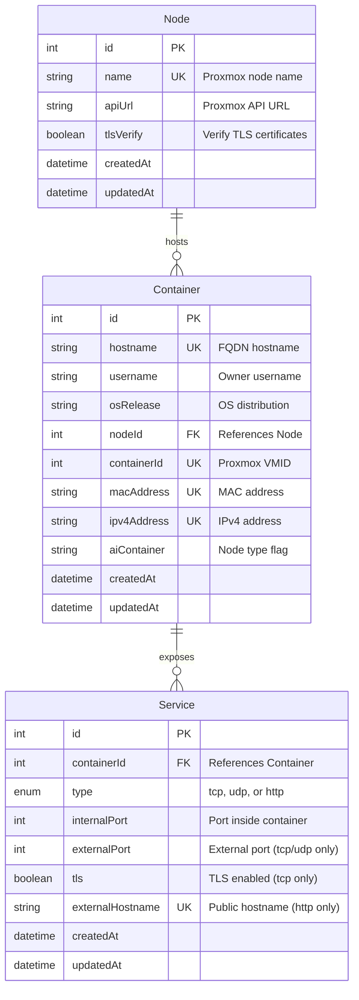

# Create-a-Container

A web application for managing LXC container creation, configuration, and lifecycle on Proxmox VE infrastructure. Provides a user-friendly interface and REST API for container management with automated database tracking and nginx reverse proxy configuration generation.

## Data Model



**Key Constraints:**
- `(Node.name)` - Unique
- `(Container.hostname)` - Unique
- `(Container.nodeId, Container.containerId)` - Unique (same VMID can exist on different nodes)
- `(Service.externalHostname)` - Unique when type='http'
- `(Service.type, Service.externalPort)` - Unique when type='tcp' or type='udp'

## Features

- **User Authentication** - Proxmox VE authentication integration
- **Container Management** - Create, list, and track LXC containers
- **Service Registry** - Track HTTP/TCP/UDP services running on containers
- **Dynamic Nginx Config** - Generate nginx reverse proxy configurations on-demand
- **Real-time Progress** - SSE (Server-Sent Events) for container creation progress
- **User Registration** - Self-service account request system with email notifications
- **Rate Limiting** - Protection against abuse (100 requests per 15 minutes)

## Prerequisites

### System Requirements
- **Node.js** 18.x or higher
- **MariaDB/MySQL** 5.7 or higher
- **Proxmox VE** cluster with API access
- **SMTP server** for email notifications (optional)

### Services
```bash
# Install Node.js (Debian/Ubuntu)
curl -fsSL https://deb.nodesource.com/setup_20.x | sudo -E bash -
sudo apt-get install -y nodejs

# Install MariaDB
sudo apt-get install mariadb-server -y
sudo mysql_secure_installation
```

## Installation

### 1. Clone Repository
```bash
cd /opt
sudo git clone https://github.com/mieweb/opensource-server.git
cd opensource-server/create-a-container
```

### 2. Install Dependencies
```bash
npm install
```

### 3. Database Setup

#### Create Database and User
```sql
CREATE DATABASE opensource_containers CHARACTER SET utf8mb4 COLLATE utf8mb4_unicode_ci;
CREATE USER 'container_manager'@'localhost' IDENTIFIED BY 'secure_password_here';
GRANT ALL PRIVILEGES ON opensource_containers.* TO 'container_manager'@'localhost';
FLUSH PRIVILEGES;
```

#### Run Migrations
```bash
npm run db:migrate
```

This creates the following tables:
- `Containers` - Container records (hostname, IP, MAC, OS, etc.)
- `Services` - Service mappings (ports, protocols, hostnames)

### 4. Configuration

Create a `.env` file in the `create-a-container` directory:

```bash
# Database Configuration
MYSQL_HOST=localhost
MYSQL_PORT=3306
MYSQL_USER=container_manager
MYSQL_PASSWORD=secure_password_here
MYSQL_DATABASE=opensource_containers

# Session Configuration
SESSION_SECRET=generate_random_secret_here

# Application
NODE_ENV=production
```

#### Generate Session Secret
```bash
node -e "console.log(require('crypto').randomBytes(32).toString('hex'))"
```

### 5. Start Application

#### Development Mode (with auto-reload)
```bash
npm run dev
```

#### Production Mode
```bash
node server.js
```

#### As a System Service
Create `/etc/systemd/system/create-a-container.service`:
```ini
[Unit]
Description=Create-a-Container Service
After=network.target mariadb.service

[Service]
Type=simple
User=www-data
WorkingDirectory=/opt/opensource-server/create-a-container
Environment=NODE_ENV=production
ExecStart=/usr/bin/node server.js
Restart=always
RestartSec=10

[Install]
WantedBy=multi-user.target
```

Enable and start:
```bash
sudo systemctl daemon-reload
sudo systemctl enable create-a-container
sudo systemctl start create-a-container
sudo systemctl status create-a-container
```

## API Routes

### Authentication Routes

#### `GET /login`
Display login page

#### `POST /login`
Authenticate user with Proxmox VE credentials
- **Body**: `{ username, password }`
- **Returns**: `{ success: true, redirect: "/" }`

#### `POST /logout`
End user session

### Container Management Routes

#### `GET /` 
Redirect to `/containers`

#### `GET /containers` (Auth Required)
List all containers for authenticated user
- **Returns**: HTML page with container list

#### `GET /containers/new` (Auth Required)
Display container creation form

#### `POST /containers`
Create or register a container
- **Query Parameter**: `init` (boolean) - If true, requires auth and spawns container creation
- **Body (init=true)**: `{ hostname, osRelease, httpPort, aiContainer }`
- **Body (init=false)**: Container registration data (for scripts)
- **Returns (init=true)**: Redirect to status page
- **Returns (init=false)**: `{ containerId, message }`

#### `DELETE /containers/:id` (Auth Required)
Delete a container from both Proxmox and the database
- **Path Parameter**: `id` - Container database ID
- **Authorization**: User can only delete their own containers
- **Process**:
  1. Verifies container ownership
  2. Deletes container from Proxmox via API
  3. On success, removes container record from database (cascades to services)
- **Returns**: `{ success: true, message: "Container deleted successfully" }`
- **Errors**: 
  - `404` - Container not found
  - `403` - User doesn't own the container
  - `500` - Proxmox API deletion failed or node not configured

#### `GET /status/:jobId` (Auth Required)
View container creation progress page

#### `GET /api/stream/:jobId`
SSE stream for real-time container creation progress
- **Returns**: Server-Sent Events stream

### Job Runner & Jobs API Routes

#### `POST /jobs` (Admin Auth Required)
Enqueue a job for background execution
- **Body**: `{ "command": "<shell command>" }`
- **Response**: `201 { id, status }`
- **Authorization**: Admin only (prevents arbitrary command execution)
- **Behavior**: Admin's username is recorded in `createdBy` column for audit trail

#### `GET /jobs/:id` (Auth Required)
Fetch job metadata (command, status, timestamps)
- **Response**: `{ id, command, status, createdAt, updatedAt, createdBy }`
- **Authorization**: Only the job owner or admins may view
- **Returns**: `404` if unauthorized (prevents information leakage)

#### `GET /jobs/:id/status` (Auth Required)
Fetch job output rows with offset/limit pagination
- **Query Params**: 
  - `offset` (optional, default 0) - Skip first N rows
  - `limit` (optional, max 1000) - Return up to N rows
- **Response**: Array of JobStatus objects `[{ id, jobId, output, createdAt, updatedAt }, ...]`
- **Authorization**: Only the job owner or admins may view
- **Returns**: `404` if unauthorized

### Job Runner System

#### Background Job Execution
The job runner (`job-runner.js`) is a background Node.js process that:
1. Polls the `Jobs` table for `pending` status records
2. Claims a job transactionally (sets status to `running` and acquires row lock)
3. Spawns the job command in a shell subprocess
4. Streams stdout/stderr into the `JobStatuses` table in real-time
5. Updates job status to `success` or `failure` on process exit
6. Gracefully cancels running jobs on shutdown (SIGTERM/SIGINT) and marks them `cancelled`

#### Data Models

**Job Model** (`models/job.js`)
```
id          INT PRIMARY KEY AUTO_INCREMENT
command     VARCHAR(2000) NOT NULL - shell command to execute
createdBy   VARCHAR(255) - username of admin who enqueued (nullable for legacy jobs)
status      ENUM('pending', 'running', 'success', 'failure', 'cancelled')
createdAt   DATETIME
updatedAt   DATETIME
```

**JobStatus Model** (`models/jobstatus.js`)
```
id          INT PRIMARY KEY AUTO_INCREMENT
jobId       INT NOT NULL (FK → Jobs.id, CASCADE delete)
output      TEXT - chunk of stdout/stderr from the job
createdAt   DATETIME
updatedAt   DATETIME
```

**Migrations**
- `migrations/20251117120000-create-jobs.js`
- `migrations/20251117120001-create-jobstatuses.js` (includes `updatedAt`)
- `migrations/20251117120002-add-job-createdby.js` (adds nullable `createdBy` column + index)

#### Running the Job Runner

**Development (foreground, logs to stdout)**
```bash
cd create-a-container
npm run job-runner
```

**Production (systemd service)**
Copy `systemd/job-runner.service` to `/etc/systemd/system/job-runner.service`:
```bash
sudo cp systemd/job-runner.service /etc/systemd/system/
sudo systemctl daemon-reload
sudo systemctl enable --now job-runner.service
sudo systemctl status job-runner.service
```

#### Configuration

**Database** (via `.env`)
- `MYSQL_HOST`, `MYSQL_PORT`, `MYSQL_USER`, `MYSQL_PASSWORD`, `MYSQL_DATABASE`

**Runner Behavior** (environment variables)
- `JOB_RUNNER_POLL_MS` (default 2000) - Polling interval in milliseconds
- `JOB_RUNNER_CWD` (default cwd) - Working directory for spawned commands
- `NODE_ENV=production` - Recommended for production

**Systemd Setup** (recommended for production)
Create `/etc/default/container-creator` with DB credentials:
```bash
MYSQL_HOST=localhost
MYSQL_PORT=3306
MYSQL_USER=container_manager
MYSQL_PASSWORD=secure_password_here
MYSQL_DATABASE=opensource_containers
```

Update `job-runner.service` to include:
```ini
EnvironmentFile=/etc/default/container-creator
```

#### Security Considerations

1. **Command Injection Risk**: The runner spawns commands via shell. Only admins can enqueue jobs via the API. Do not expose `POST /jobs` to untrusted users.
2. **Job Ownership**: Jobs are scoped by `createdBy`. Only the admin who created the job (or other admins) can view its metadata and output. Non-owners receive `404` (not `403`) to prevent information leakage.
3. **Legacy Jobs**: Jobs created before the `createdBy` migration will have `createdBy = NULL` and are visible only to admins.
4. **Graceful Shutdown**: On SIGTERM/SIGINT, the runner kills all running child processes and marks their jobs as `cancelled`.

#### Testing & Troubleshooting

**Insert a test job (SQL)**
```sql
INSERT INTO Jobs (command, status, createdAt, updatedAt)
VALUES ('echo "Hello" && sleep 5 && echo "World"', 'pending', NOW(), NOW());
```

**Inspect job status**
```sql
SELECT id, status, updatedAt FROM Jobs ORDER BY id DESC LIMIT 10;
```

**View job output**
```sql
SELECT id, output, createdAt FROM JobStatuses WHERE jobId = 1 ORDER BY id ASC;
```

**Long-running test (5 minutes)**
1. Stop runner to keep job pending
```bash
sudo systemctl stop job-runner.service
```
2. Insert job
```bash
mysql ... -e "INSERT INTO Jobs (command, status, createdAt, updatedAt) VALUES ('for i in \$(seq 1 300); do echo \"line \$i\"; sleep 1; done', 'pending', NOW(), NOW()); SELECT LAST_INSERT_ID();"
```
3. Start runner and monitor
```bash
node job-runner.js
# In another terminal:
while sleep 15; do
  mysql ... -e "SELECT id, output FROM JobStatuses WHERE jobId=<ID> ORDER BY id ASC;" 
done
```
4. Check final status
```sql
SELECT id, status FROM Jobs WHERE id = <ID>;
```

#### Deployment Checklist

- [ ] Run migrations: `npm run db:migrate`
- [ ] Deploy `job-runner.js` to target host (e.g., `/opt/container-creator/`)
- [ ] Copy `systemd/job-runner.service` to `/etc/systemd/system/`
- [ ] Create `/etc/default/container-creator` with DB env vars
- [ ] Reload systemd: `sudo systemctl daemon-reload`
- [ ] Enable and start: `sudo systemctl enable --now job-runner.service`
- [ ] Verify runner is running: `sudo systemctl status job-runner.service`
- [ ] Test API by creating a job via `POST /jobs` (admin user)

#### Future Enhancements

- Replace raw `command` API with safe task names and parameter mapping
- Add SSE or WebSocket streaming endpoint (`/jobs/:id/stream`) to push log lines to frontend in real-time
- Add batching or file-based logs for high-volume output to reduce DB pressure
- Implement job timeout/deadline and automatic cancellation

### Configuration Routes

#### `GET /nginx.conf`
Generate nginx configuration for all registered services
- **Returns**: `text/plain` - Complete nginx configuration with all server blocks

### User Registration Routes

#### `GET /register`
Display account request form

#### `POST /register`
Submit account request (sends email to admins)
- **Body**: `{ name, email, username, reason }`
- **Returns**: Success message

### Utility Routes

#### `GET /send-test-email` (Dev Only)
Test email configuration (development/testing)

## Database Schema

### Containers Table
```sql
id              INT PRIMARY KEY AUTO_INCREMENT
hostname        VARCHAR(255) UNIQUE NOT NULL
username        VARCHAR(255) NOT NULL
osRelease       VARCHAR(255)
containerId     INT UNSIGNED UNIQUE
macAddress      VARCHAR(17) UNIQUE
ipv4Address     VARCHAR(45) UNIQUE
aiContainer     VARCHAR(50) DEFAULT 'N'
createdAt       DATETIME
updatedAt       DATETIME
```

### Services Table
```sql
id                  INT PRIMARY KEY AUTO_INCREMENT
containerId         INT FOREIGN KEY REFERENCES Containers(id)
type                ENUM('tcp', 'udp', 'http') NOT NULL
internalPort        INT NOT NULL
externalPort        INT
tls                 BOOLEAN DEFAULT FALSE
externalHostname    VARCHAR(255)
createdAt           DATETIME
updatedAt           DATETIME
```

## Configuration Files

### `config/config.js`
Sequelize database configuration (reads from `.env`)

### `models/`
- `container.js` - Container model definition
- `service.js` - Service model definition
- `index.js` - Sequelize initialization

### `data/services.json`
Service type definitions and port mappings

### `views/`
- `login.html` - Login form
- `form.html` - Container creation form
- `request-account.html` - Account request form
- `status.html` - Container creation progress viewer
- `containers.ejs` - Container list (EJS template)
- `nginx-conf.ejs` - Nginx config generator (EJS template)

### `public/`
- `style.css` - Application styles

### `migrations/`
Database migration files for schema management

## Environment Variables

### Required
- `MYSQL_HOST` - Database host (default: localhost)
- `MYSQL_PORT` - Database port (default: 3306)
- `MYSQL_USER` - Database username
- `MYSQL_PASSWORD` - Database password
- `MYSQL_DATABASE` - Database name
- `SESSION_SECRET` - Express session secret (cryptographically random string)

### Optional
- `NODE_ENV` - Environment (development/production, default: development)

## Security

### Authentication
- Proxmox VE integration via API
- Session-based authentication with secure cookies
- Per-route authentication middleware

### Rate Limiting
- 100 requests per 15-minute window per IP
- Protects against brute force and abuse

### Session Security
- Session secret required for cookie signing
- Secure cookie flag enabled
- Session data server-side only

### Input Validation
- URL encoding for all parameters
- Sequelize ORM prevents SQL injection
- Form data validation

## Troubleshooting

### Database Connection Issues
```bash
# Test database connection
mysql -h localhost -u container_manager -p opensource_containers

# Check if migrations ran
npm run db:migrate

# Verify tables exist
mysql -u container_manager -p -e "USE opensource_containers; SHOW TABLES;"
```

### Application Won't Start
```bash
# Check Node.js version
node --version  # Should be 18.x or higher

# Verify .env file exists and is readable
cat .env

# Check for syntax errors
node -c server.js

# Run with verbose logging
NODE_ENV=development node server.js
```

### Authentication Failing
```bash
# Verify Proxmox API is accessible
curl -k https://10.15.0.4:8006/api2/json/version

# Check if certificate validation is working
# Edit server.js if using self-signed certs
```

### Email Not Sending
```bash
# Test SMTP connection
telnet mail.example.com 25

# Test route (development only)
curl http://localhost:3000/send-test-email
```

### Port Already in Use
```bash
# Find process using port 3000
sudo lsof -i :3000

# Change port in .env or kill conflicting process
kill -9 <PID>
```

## Development

### Database Migrations
```bash
# Create new migration
npx sequelize-cli migration:generate --name description-here

# Run migrations
npm run db:migrate

# Undo last migration
npx sequelize-cli db:migrate:undo
```

### Code Structure
```
create-a-container/
├── server.js           # Main Express application
├── package.json        # Dependencies and scripts
├── .env               # Environment configuration (gitignored)
├── config/            # Sequelize configuration
├── models/            # Database models
├── migrations/        # Database migrations
├── views/             # HTML templates
├── public/            # Static assets
├── data/              # JSON data files
└── bin/               # Utility scripts
```

## Integration with Nginx Reverse Proxy

This application generates nginx configurations consumed by the `nginx-reverse-proxy` component:

1. Containers register their services in the database
2. The `/nginx.conf` endpoint generates complete nginx configs
3. The reverse proxy polls this endpoint via cron
4. Nginx automatically reloads with updated configurations

See `../nginx-reverse-proxy/README.md` for reverse proxy setup.

## License

See the main repository LICENSE file.

## Support

For issues, questions, or contributions, see the main opensource-server repository.
