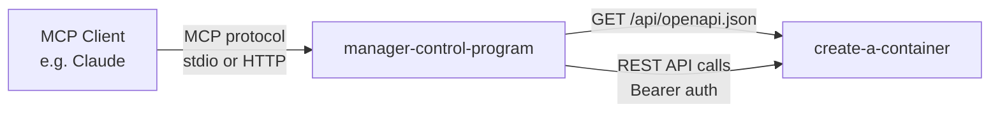

# manager-control-program

MCP server that exposes the [create-a-container](../create-a-container/) REST API as [Model Context Protocol](https://modelcontextprotocol.io/) tools. It reads the OpenAPI spec at runtime from `create-a-container` and auto-generates MCP tool definitions using [`awslabs-openapi-mcp-server`](https://github.com/awslabs/mcp/tree/main/src/openapi-mcp-server), so it stays in sync with API changes automatically.

## Prerequisites

- Python 3.13+
- [uv](https://docs.astral.sh/uv/) package manager
- A running `create-a-container` instance with API access
- A bearer token (API key) from `create-a-container`

## Setup

```bash
uv sync
```

## Environment Variables

| Variable | Required | Description |
|---|---|---|
| `API_BASE_URL` | **Yes** | Base URL of the `create-a-container` instance (e.g., `https://containers.example.com`) |
| `AUTH_TOKEN` | stdio only | Bearer token for API authentication (create one at `/apikeys` in `create-a-container`). Not needed in HTTP mode, where each caller sends their own token |
| `SERVER_TRANSPORT` | No | `stdio` (default), `http` (streamable HTTP), or `sse` (legacy) |
| `SERVER_HOST` | No | Bind address in HTTP mode (default `127.0.0.1`) |
| `SERVER_PORT` | No | Port in HTTP mode (default `8000`) |

The server automatically sets `API_SPEC_URL` to `${API_BASE_URL}/api/openapi.json`, and `AUTH_TYPE` to `bearer` (stdio) or `none` (HTTP).

## Usage

### From a Local Clone

```bash
API_BASE_URL=https://containers.example.com AUTH_TOKEN=your-api-key uv run manager-control-program
```

### From Git (No Clone Required)

```bash
API_BASE_URL=https://containers.example.com AUTH_TOKEN=your-api-key \
  uvx --from "manager-control-program @ git+https://github.com/mieweb/opensource-server.git#subdirectory=manager-control-program" \
  manager-control-program
```

### MCP Client Configuration

Add to your MCP client config (e.g., Claude Desktop, VS Code):

```json
{
  "mcpServers": {
    "container-manager": {
      "command": "uvx",
      "args": [
        "--from",
        "manager-control-program @ git+https://github.com/mieweb/opensource-server.git#subdirectory=manager-control-program",
        "manager-control-program"
      ],
      "env": {
        "API_BASE_URL": "https://containers.example.com",
        "AUTH_TOKEN": "your-api-key"
      }
    }
  }
}
```

### HTTP Mode (Shared Server, Per-Request Auth)

Run one shared MCP server over streamable HTTP instead of one stdio process per client:

```bash
API_BASE_URL=https://containers.example.com SERVER_TRANSPORT=http SERVER_PORT=8000 \
  uv run manager-control-program
```

In HTTP mode no `AUTH_TOKEN` is needed at startup. Instead, each MCP client sends its own API key in the `Authorization` header, and the server forwards that header to the API on every request — so every caller acts under their own identity and permissions:

```json
{
  "mcpServers": {
    "container-manager": {
      "url": "http://mcp.example.com:8000/mcp",
      "headers": {
        "Authorization": "Bearer your-api-key"
      }
    }
  }
}
```

Requests without an `Authorization` header are rejected by the API (401) unless you explicitly configure a static fallback by setting `AUTH_TYPE=bearer` and `AUTH_TOKEN` alongside `SERVER_TRANSPORT=http`.

> **Note:** The MCP server itself does not validate tokens — it forwards them for the API to verify. Bind it to `127.0.0.1` (the default) or otherwise restrict network access, and use HTTPS via a reverse proxy if exposing it beyond localhost.

## How It Works



1. On startup, fetches the OpenAPI spec from `create-a-container`
2. Generates an MCP tool for each API operation (list containers, create jobs, etc.)
3. Proxies tool calls as authenticated REST requests to the API

## Available Tools

Tools are generated dynamically from the OpenAPI spec. Typical operations include:

- **API Keys** — list, create, update, delete API keys
- **Containers** — list, create, inspect, delete LXC containers
- **Jobs** — create and monitor provisioning jobs
- **Storage** — query available Proxmox storage
