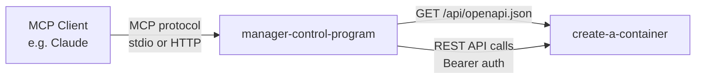

# manager-control-program

MCP server that exposes the [create-a-container](../create-a-container/) REST API as [Model Context Protocol](https://modelcontextprotocol.io/) tools. It reads the OpenAPI spec at runtime from `create-a-container` and auto-generates MCP tool definitions using [`awslabs-openapi-mcp-server`](https://github.com/awslabs/mcp/tree/main/src/openapi-mcp-server), so it stays in sync with API changes automatically.

This README documents the component itself. For setting up an MCP client
(VS Code, Claude Desktop) or hosting a shared server, start with the guide
below.

| If you want to... | Read |
|---|---|
| Connect your editor/assistant, or host a shared HTTP server | [MCP Server](../mie-opensource-landing/docs/users/mcp-server.md) |
| Create the API key the server authenticates with | [API Keys](../mie-opensource-landing/docs/users/creating-containers/api-keys.md) |

## Running It

### Development (local clone)

Requires Python 3.13+ and [uv](https://docs.astral.sh/uv/):

```bash
uv sync
API_BASE_URL=https://containers.example.com AUTH_TOKEN=your-api-key uv run manager-control-program
```

End users don't need a clone — `uvx` runs it straight from git (see the
[MCP Server guide](../mie-opensource-landing/docs/users/mcp-server.md)).

### Production (packaged)

This component ships inside the `opensource-server` package built by
[create-a-container](../create-a-container/): its `make install` calls this
directory's `install` target, which stages the app at
`/opt/opensource-server/manager-control-program` with **all Python
dependencies vendored** (uv exports the lockfile and installs prebuilt wheels
for Debian 13 / amd64 / CPython 3.13). The target host needs only
`/usr/bin/python3` — no uv, pip, venv, or network access.

It runs as the `manager-control-program.service` systemd unit: HTTP transport
on `127.0.0.1:8100`, started via `python3 -m manager_control_program.server`
with `PYTHONPATH` pointed at the vendored directory. The Manager
reverse-proxies `/mcp` to it, so MCP clients connect through the Manager's
public origin with TLS. Optional overrides (e.g. `SERVER_PORT`) go in
`/etc/default/manager-control-program`.

## Configuration

Configuration is read from environment variables:

| Variable | Required | Description |
|---|---|---|
| `API_BASE_URL` | **Yes** | Base URL of the `create-a-container` instance (e.g., `https://containers.example.com`) |
| `AUTH_TOKEN` | stdio only | Bearer token for API authentication. Unused in HTTP mode, where each caller sends their own token per request |
| `SERVER_TRANSPORT` | No | `stdio` (default), `http` (streamable HTTP), or `sse` (legacy) |
| `SERVER_HOST` | No | Bind address in HTTP mode (default `127.0.0.1`) |
| `SERVER_PORT` | No | Port in HTTP mode (default `8000`) |
| `API_SPEC_URL` | No | OpenAPI spec location; defaults to `${API_BASE_URL}/api/openapi.json` |

`AUTH_TYPE` defaults to `bearer` in stdio mode and `none` in HTTP mode. Setting
`AUTH_TYPE=bearer` with `AUTH_TOKEN` alongside an HTTP transport configures a
static fallback used when a request carries no `Authorization` header.

## How It Works



1. On startup, fetches the OpenAPI spec from `create-a-container`
2. Generates an MCP tool for each API operation (list containers, create jobs, etc.)
3. Proxies tool calls as authenticated REST requests to the API

Authentication depends on the transport:

- **stdio** — one server per user; the static `AUTH_TOKEN` is attached to every API request.
- **HTTP** (`SERVER_TRANSPORT=http`) — one shared server; each incoming MCP request's `Authorization` header is forwarded to the API (see `ForwardAuthorizationHeader` in [`server.py`](manager_control_program/server.py)), so every caller acts under their own identity. No token is needed at startup.

## Available Tools

Tools are generated dynamically from the OpenAPI spec. Typical operations include:

- **API Keys** — list, create, update, delete API keys
- **Containers** — list, create, inspect, delete LXC containers
- **Jobs** — create and monitor provisioning jobs
- **Storage** — query available Proxmox storage
