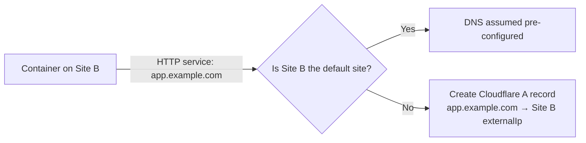

# External Domains

External domains expose container HTTP services to the internet with automatic SSL/TLS certificate management via ACME (Let's Encrypt). Domains are global resources available to all sites.

## Prerequisites

- A registered domain with Cloudflare DNS (only supported provider)
- Cloudflare API token with **Zone:DNS:Edit** permissions

## Domain Properties

| Field | Description |
|-------|-------------|
| **Domain** | Top-level domain (e.g., `example.com`) |
| **Default Site** | Optional — the site whose DNS is assumed pre-configured (e.g., wildcard A record) |
| **ACME Email** | Certificate expiration notifications |
| **ACME Directory** | CA endpoint (Let's Encrypt Production/Staging) |
| **Cloudflare API Token** | For DNS-01 challenge authentication and cross-site DNS record management |

:::tip
Use Let's Encrypt **Staging** for testing — it has higher rate limits. Switch to **Production** once verified.
:::

:::warning
If you don't configure ACME, you'll need to manage SSL certificates manually. Instructions for doing so are out-of-scope for this documentation.
:::

## Setup

1. Add your domain to Cloudflare and update nameservers
2. Create a Cloudflare API token with **Zone:DNS:Edit** permissions
3. In the admin interface, navigate to **External Domains** → **Create New External Domain**
4. Enter domain, ACME email, ACME directory, and Cloudflare API token
5. Save — the system validates Cloudflare API access automatically

The creating site is set as the domain's **default site**. Wildcard DNS (`*.example.com`) is assumed to point to the default site's IP.

## Cross-Site DNS

When an HTTP service uses an external domain on a site that is **not** the domain's default site, the system automatically creates a Cloudflare A record pointing `hostname.domain` to the service's site `externalIp`.

**Requirements for cross-site DNS:**
- The external domain must have Cloudflare API credentials configured
- The container's site must have an **External IP** configured (set in Site settings)

DNS operations are **optimistic and non-fatal**. If Cloudflare API calls fail during container create, edit, or delete, the lifecycle operation completes and a warning is shown. Server logs contain full debug detail.

## How It Works

When a container exposes an HTTP service on an external domain:

1. DNS-01 challenge created via Cloudflare API
2. Certificate issued and auto-installed
3. Certificates auto-renew before expiration (~every 60 days)
4. DNS records and reverse proxy routing configured automatically
5. Cross-site A records created if the service's site ≠ domain's default site

On container or service deletion, cross-site A records are cleaned up automatically.

## Using with Services

When creating a container service, users select an external domain and specify a subdomain (e.g., `app` for `app.example.com`). All external domains are available regardless of which site the container is on. See the [Web GUI guide](/docs/users/creating-containers/web-gui) for details.

## Security

- Store Cloudflare API tokens with minimal permissions (Zone:DNS:Edit only)
- Rotate tokens periodically; revoke immediately if compromised
- Private keys never leave the cluster

