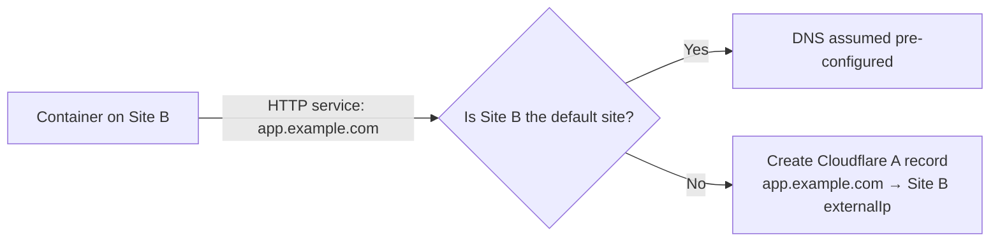
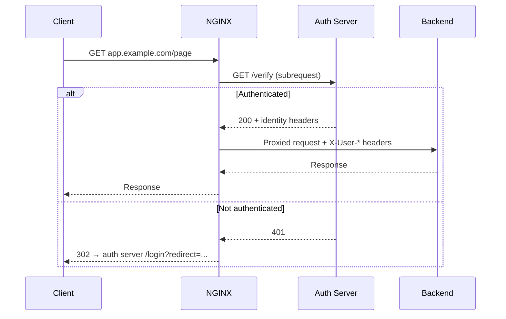

# External Domains

External domains expose container HTTP services to the internet. Domains are global resources available to all sites.

## Prerequisites

- A registered domain with Cloudflare DNS (only supported provider)
- Cloudflare API token with **Zone:DNS:Edit** permissions

## Domain Properties

| Field | Description |
|-------|-------------|
| **Domain** | Top-level domain (e.g., `example.com`) |
| **Default Site** | Optional — the site whose DNS is assumed pre-configured (e.g., wildcard A record) |
| **ACME Email** | Certificate expiration notifications |
| **ACME Directory** | CA endpoint (Let's Encrypt Production/Staging) |
| **Cloudflare API Token** | For DNS-01 challenge authentication and cross-site DNS record management |
| **Auth Server URL** | Optional — URL of an authentication server for NGINX `auth_request`. See [Authentication](#authentication) |

!!! tip
    Use Let's Encrypt **Staging** for testing — it has higher rate limits. Switch to **Production** once verified.

## Setup

1. Add your domain to Cloudflare and update nameservers
2. Create a Cloudflare API token with **Zone:DNS:Edit** permissions
3. In the admin interface, navigate to **External Domains** → **Create New External Domain**
4. Enter domain, ACME email, ACME directory, and Cloudflare API token
5. Save — the system validates Cloudflare API access automatically

The creating site is set as the domain's **default site**. Wildcard DNS (`*.example.com`) is assumed to point to the default site's IP.

## SSL Certificate Provisioning

SSL certificates are managed manually using [acme.sh](https://github.com/acmesh-official/acme.sh), which is pre-installed on all agent and manager containers. NGINX reads certificates from standard locations:

| File | Path |
|------|------|
| Certificate (fullchain) | `/etc/ssl/certs/<domain>.crt` |
| Private key | `/etc/ssl/private/<domain>.key` |

### Issue a Certificate

Run on each agent and manager container that serves traffic for the domain:

```bash
export CF_Token="your_cloudflare_api_token"
export CF_Account_ID="your_cloudflare_account_id"

acme.sh --issue --dns dns_cf -d example.com -d '*.example.com'
```

### Install the Certificate

After issuing, install the certificate to the standard locations and configure automatic NGINX reload on renewal:

```bash
acme.sh --install-cert -d example.com \
  --fullchain-file /etc/ssl/certs/example.com.crt \
  --key-file /etc/ssl/private/example.com.key \
  --reloadcmd "nginx -s reload"
```

acme.sh stores this configuration and automatically renews the certificate and runs the reload command on renewal.

### Verify

```bash
nginx -t && nginx -s reload
curl -vI https://example.com 2>&1 | grep 'subject:'
```

## Cross-Site DNS

When an HTTP service uses an external domain on a site that is **not** the domain's default site, the system automatically creates a Cloudflare A record pointing `hostname.domain` to the service's site `externalIp`.


```mermaid
flowchart LR
    A[Container on Site B] -->|HTTP service: app.example.com| B{Is Site B the default site?}
    B -->|Yes| C[DNS assumed pre-configured]
    B -->|No| D[Create Cloudflare A record<br/>app.example.com → Site B externalIp]
```

**Requirements for cross-site DNS:**
- The external domain must have Cloudflare API credentials configured
- The container's site must have an **External IP** configured (set in Site settings)

DNS operations are **optimistic and non-fatal**. If Cloudflare API calls fail during container create, edit, or delete, the lifecycle operation completes and a warning is shown. Server logs contain full debug detail.

## How It Works

When a container exposes an HTTP service on an external domain:

1. DNS records and reverse proxy routing configured automatically
2. Cross-site A records created if the service's site ≠ domain's default site

On container or service deletion, cross-site A records are cleaned up automatically.

## Using with Services

When creating a container service, users select an external domain and specify a subdomain (e.g., `app` for `app.example.com`). All external domains are available regardless of which site the container is on. See the [Web GUI guide](../../users/creating-containers/web-gui.md) for details.

## Security

- Store Cloudflare API tokens with minimal permissions (Zone:DNS:Edit only)
- Rotate tokens periodically; revoke immediately if compromised
- Private keys never leave the cluster

## Authentication

HTTP services can require authentication via NGINX's [`auth_request`](https://nginx.org/en/docs/http/ngx_http_auth_request_module.html) module. When a service has **Require auth** enabled, NGINX sends a subrequest to the domain's auth server before proxying each request. Unauthenticated users are redirected to the auth server's login page.

### Auth Server Requirements

The auth server URL (e.g., `https://manager.example.com`) must implement two endpoints:

| Endpoint | Behavior |
|----------|----------|
| `GET /verify` | Return `2xx` if the user is authenticated, `401` otherwise. May return identity headers (see below). |
| `GET /login?redirect=<url>` | Login page that redirects to `<url>` after successful authentication. |

The manager application implements both endpoints and can be used as the auth server.

### Identity Headers

On successful authentication, the auth server can return identity headers that NGINX forwards to the backend:

| Header | Description |
|--------|-------------|
| `X-User-ID` | Numeric user ID |
| `X-Username` | Username |
| `X-User-First-Name` | First name |
| `X-User-Last-Name` | Last name |
| `X-Email` | Email address |
| `X-Groups` | Comma-separated group names |

### Cookie Sharing

The auth server must be on a subdomain of the external domain (e.g., `manager.example.com` for domain `example.com`). The manager sets its session cookie on the parent domain (`.example.com`) so sibling subdomains share the cookie for `auth_request` subrequests.

### Flow


```mermaid
sequenceDiagram
    participant Client
    participant NGINX
    participant AuthServer as Auth Server
    participant Backend

    Client->>NGINX: GET app.example.com/page
    NGINX->>AuthServer: GET /verify (subrequest)
    alt Authenticated
        AuthServer-->>NGINX: 200 + identity headers
        NGINX->>Backend: Proxied request + X-User-* headers
        Backend-->>NGINX: Response
        NGINX-->>Client: Response
    else Not authenticated
        AuthServer-->>NGINX: 401
        NGINX-->>Client: 302 → auth server /login?redirect=...
    end
```

