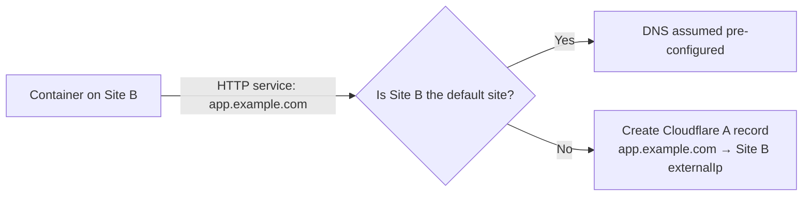
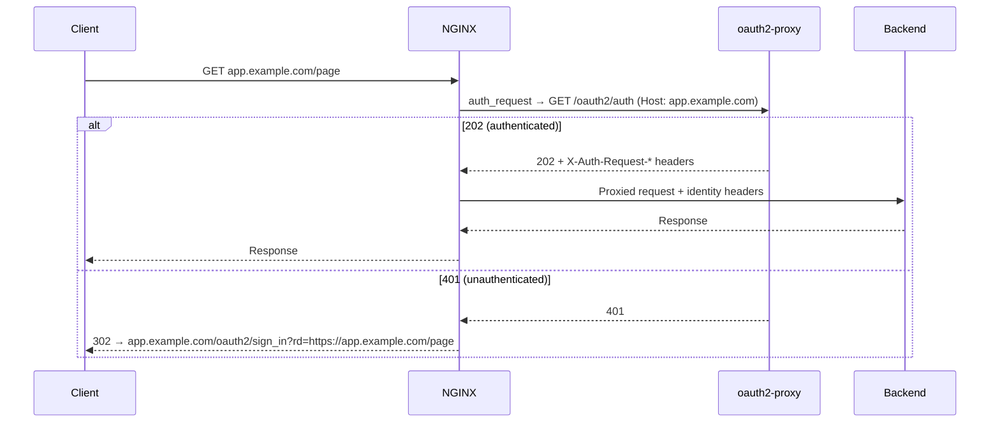

# External Domains

External domains expose container HTTP services to the internet. Domains are global resources available to all sites.

## Prerequisites

- A registered domain with Cloudflare DNS (only supported provider)
- Cloudflare account email and a User API Token for DNS management

## Domain Properties

| Field | Description |
|-------|-------------|
| **Domain Name** | Top-level domain (e.g., `example.com`) |
| **Default Site** | The site whose DNS is assumed pre-configured (e.g., wildcard A record). Selected explicitly when creating the domain. |
| **ACME Email** | Certificate expiration notifications (currently unused) |
| **ACME Directory** | CA endpoint, Let's Encrypt Production/Staging (currently unused) |
| **Cloudflare API Email** | Cloudflare account email, sent as the `X-Auth-Email` header — optional unless using Cross-Site DNS |
| **Cloudflare API Key** | Cloudflare **User API Token**, sent as `Authorization: Bearer <token>`. Despite the field name, this is *not* the legacy Global API Key. Optional unless using Cross-Site DNS. |
| **oauth2-proxy URL** | Optional — address of an [oauth2-proxy](https://oauth2-proxy.github.io/oauth2-proxy/) process (e.g. `http://127.0.0.1:4180`) that NGINX proxies `/oauth2/*` to for `auth_request`. See [Authentication](#authentication) |

!!! tip
    Use Let's Encrypt **Staging** for testing — it has higher rate limits. Switch to **Production** once verified.

## Setup

1. Add your domain to Cloudflare and update nameservers
2. (Optional, for Cross-Site DNS) Create a Cloudflare **User API Token** with `Zone:DNS:Edit` permission for the zone
3. In the admin interface, navigate to **External Domains** → **New External Domain**
4. Enter domain name, default site, ACME email, ACME directory, and Cloudflare email + API token (if used)
5. Select **Create External Domain**

Wildcard DNS (`*.example.com`) is assumed to point to the default site's IP.

## SSL Certificate Provisioning

SSL certificates are managed manually using [acme.sh](https://github.com/acmesh-official/acme.sh), which is pre-installed on all agent and manager containers. NGINX reads certificates from standard locations:

| File | Path |
|------|------|
| Certificate (fullchain) | `/etc/ssl/certs/<domain>.crt` |
| Private key | `/etc/ssl/private/<domain>.key` |

### Issue a Certificate

Run on each agent and manager container that serves traffic for the domain:

```bash
export CF_Token="your_cloudflare_api_token"
export CF_Account_ID="your_cloudflare_account_id"

acme.sh --issue --dns dns_cf -d example.com -d '*.example.com'
```

### Install the Certificate

After issuing, install the certificate to the standard locations and configure automatic NGINX reload on renewal:

```bash
acme.sh --install-cert -d example.com \
  --fullchain-file /etc/ssl/certs/example.com.crt \
  --key-file /etc/ssl/private/example.com.key \
  --reloadcmd "nginx -s reload"
```

acme.sh stores this configuration and automatically renews the certificate and runs the reload command on renewal.

### Verify

```bash
nginx -t && nginx -s reload
curl -vI https://example.com 2>&1 | grep 'subject:'
```

## Cross-Site DNS

When an HTTP service uses an external domain on a site that is **not** the domain's default site, the system automatically creates a Cloudflare A record pointing `hostname.domain` to the service's site `externalIp`.


```mermaid
flowchart LR
    A[Container on Site B] -->|HTTP service: app.example.com| B{Is Site B the default site?}
    B -->|Yes| C[DNS assumed pre-configured]
    B -->|No| D[Create Cloudflare A record<br/>app.example.com → Site B externalIp]
```

**Requirements for cross-site DNS:**
- The external domain must have Cloudflare API credentials configured
- The container's site must have an **External IP** configured (set in Site settings)

DNS operations are **optimistic and non-fatal**. If Cloudflare API calls fail during container create, edit, or delete, the lifecycle operation completes and a warning is shown. Server logs contain full debug detail.

## How It Works

When a container exposes an HTTP service on an external domain:

1. DNS records and reverse proxy routing configured automatically
2. Cross-site A records created if the service's site ≠ domain's default site

On container or service deletion, cross-site A records are cleaned up automatically.

## Using with Services

When creating a container service, users select an external domain and specify a subdomain (e.g., `app` for `app.example.com`). All external domains are available regardless of which site the container is on. See the [Web GUI guide](../../users/creating-containers/web-gui.md) for details.

## Security

- Issue Cloudflare User API Tokens with minimum scope (`Zone:DNS:Edit` for the target zone only)
- Rotate tokens periodically; revoke immediately if compromised
- Private keys never leave the cluster

## Authentication

HTTP services can require authentication via NGINX's [`auth_request`](https://nginx.org/en/docs/http/ngx_http_auth_request_module.html) module, delegated to an [oauth2-proxy](https://oauth2-proxy.github.io/oauth2-proxy/) server that you run and configure. When a service has **Require auth** enabled, NGINX authenticates each request against oauth2-proxy's `/oauth2/auth` endpoint before proxying. Unauthenticated users are redirected to oauth2-proxy's sign-in page.

The manager does **not** provide authentication itself — you must deploy and configure a valid oauth2-proxy server (with your chosen OIDC/OAuth2 provider) and point the domain's **oauth2-proxy URL** at it.

### Configuring oauth2-proxy

Run oauth2-proxy with a config like the one below, then:

1. **Point protected domains at it.** Set the **oauth2-proxy URL** on each external domain whose services should require auth to the address from `http_address` (e.g. `http://127.0.0.1:4180`).
2. **Enable Require auth** on the individual services you want protected.

Copy this `oauth2-proxy.cfg`, fill in the four OIDC values from your identity provider plus a generated cookie secret, and run `oauth2-proxy --config=/etc/oauth2-proxy.cfg`:

```toml
# --- listen address -------------------------------------------------------
# This is what you put in the domain's "oauth2-proxy URL".
http_address = "127.0.0.1:4180"

# --- your identity provider (fill these in) -------------------------------
provider = "oidc"
oidc_issuer_url = "https://idp.example.com/realms/your-realm"
client_id = "REPLACE_ME"
client_secret = "REPLACE_ME"
cookie_secret = "REPLACE_ME"   # 16, 24, or 32 bytes; generate: openssl rand -base64 32
email_domains = ["*"]          # which users may sign in; "*" = any email the IdP returns
code_challenge_method = "S256" # use PKCE (recommended)

# --- required for this manager's nginx integration ------------------------
set_xauthrequest = true        # return identity in X-Auth-Request-* headers
pass_access_token = true       # also expose the access token (drop if unused)
force_https = true             # browser is HTTPS even though nginx talks to us over HTTP
cookie_secure = true
cookie_samesite = "lax"        # works with the OAuth redirect back from the IdP; avoid "strict"
# The __Host- prefix locks the cookie to the exact host that set it (no Domain
# attribute), so each subdomain requires its own sign-in. Requires cookie_secure.
cookie_name = "__Host-oauth2_proxy"
# Must cover every protected host — nginx sends an absolute post-sign-in
# redirect, which oauth2-proxy rejects unless its domain is whitelisted.
# A leading dot matches the apex and all subdomains.
whitelist_domains = [".example.com"]

# --- recommended ----------------------------------------------------------
session_store_type = "redis"   # keep the session cookie small (see below)
redis_connection_url = "redis://127.0.0.1:6379"

# --- optional, depending on your IdP / preference -------------------------
skip_provider_button = true              # go straight to the IdP, skip the oauth2-proxy landing page
# insecure_oidc_allow_unverified_email = true  # accept logins when the IdP marks email unverified
```

That's the whole setup. The rest of this section explains how it fits together and the options worth knowing about.

### How it works

oauth2-proxy runs as a standalone process listening on its own address (`http_address`). NGINX proxies the whole `/oauth2/*` path on each protected service straight to that address, so to the browser the OAuth2 endpoints appear under the app's own hostname (`app.example.com/oauth2/...`) while actually being served by oauth2-proxy.

A single instance can serve many services this way — they all proxy `/oauth2/*` to the same address. Because NGINX passes each app's own `Host` through, oauth2-proxy builds redirect URIs and cookies against the correct app hostname without any extra configuration.

!!! note "Putting oauth2-proxy behind the same load balancer"
    oauth2-proxy does **not** need to be on the NGINX host. If you want it to live behind the same load-balancer IP, expose its port with an L4 (TCP) passthrough — e.g. a **transport service**, which NGINX serves via its `stream {}` block — and point the **oauth2-proxy URL** at that address.

!!! note "Multiple apps, one oauth2-proxy"
    Leave `redirect_url` unset — oauth2-proxy derives the callback per request as `https://<requested-host>/oauth2/callback`, so each app gets the right one. Register `https://<app-host>/oauth2/callback` as a redirect URI for **each** app in your IdP, and make sure every protected host is covered by `whitelist_domains`.

!!! warning "HTTPS scheme"
    oauth2-proxy builds its `redirect_uri` and secure cookies from the scheme of the connection it receives, which is whatever scheme you put in the **oauth2-proxy URL**:

    - **`http://…` upstream** (most common, e.g. `http://127.0.0.1:4180`): oauth2-proxy sees a plain-HTTP connection, so the config sets `force_https = true` and `cookie_secure = true` to still emit `https://` redirect URIs and Secure cookies for HTTPS browsers.
    - **`https://…` upstream**: terminate TLS on the oauth2-proxy listener instead (`tls_cert_file` / `tls_key_file`); oauth2-proxy then infers HTTPS from the connection and you can drop `force_https`.

!!! warning "Large session cookies"
    With the default **cookie** session store, oauth2-proxy packs the entire encrypted session (access, refresh, and ID tokens plus claims) into the `_oauth2_proxy` cookie, sent on every request. This easily exceeds 4&nbsp;KB and can trip NGINX header-buffer limits (e.g. a `502` on the `/oauth2/callback` response). The config above avoids this with the **Redis** session store (`session_store_type = "redis"`), which keeps only a small ticket in the cookie.

    If you cannot run Redis, reduce what the cookie carries instead: drop `pass_access_token` if your app doesn't need the token, and request only the scopes you use. See the [session storage docs](https://oauth2-proxy.github.io/oauth2-proxy/configuration/session_storage/).

See the [oauth2-proxy NGINX integration guide](https://oauth2-proxy.github.io/oauth2-proxy/configuration/integrations/nginx/) for full configuration details.

### Identity Headers

When oauth2-proxy runs with `--set-xauthrequest`, NGINX captures its `X-Auth-Request-*` response headers and forwards the user's identity to the backend under a **stable header contract** (`X-User`, `X-Preferred-Username`, `X-Email`, `X-Groups`, and — with `--pass-access-token` — `X-Access-Token`).

For the full header table and how applications consume the identity (server-side headers, verifying the access-token JWT, and the browser `/oauth2/userinfo` endpoint for static frontends), see [Adding Authentication](../../users/consuming-auth.md).

### Flow


```mermaid
sequenceDiagram
    participant Client
    participant NGINX
    participant OAuth2Proxy as oauth2-proxy
    participant Backend

    Client->>NGINX: GET app.example.com/page
    NGINX->>OAuth2Proxy: auth_request → GET /oauth2/auth (Host: app.example.com)
    alt 202 (authenticated)
        OAuth2Proxy-->>NGINX: 202 + X-Auth-Request-* headers
        NGINX->>Backend: Proxied request + identity headers
        Backend-->>NGINX: Response
        NGINX-->>Client: Response
    else 401 (unauthenticated)
        OAuth2Proxy-->>NGINX: 401
        NGINX-->>Client: 302 → app.example.com/oauth2/sign_in?rd=https://app.example.com/page
    end
```

If **Require auth** is enabled but no **oauth2-proxy URL** is configured on the domain, NGINX serves a 503 "Authentication Unavailable" page.

