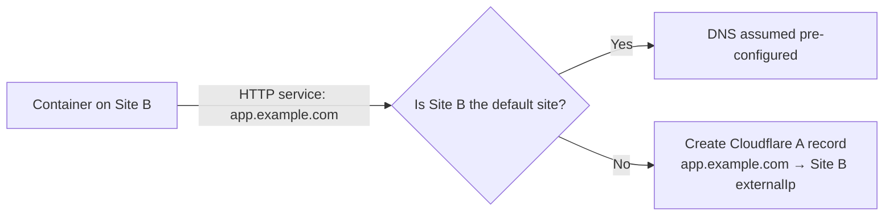
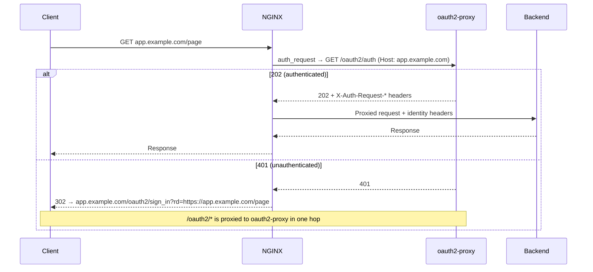

# External Domains

External domains expose container HTTP services to the internet. Domains are global resources available to all sites.

## Prerequisites

- A registered domain with Cloudflare DNS (only supported provider)
- Cloudflare account email and a User API Token for DNS management

## Domain Properties

| Field | Description |
|-------|-------------|
| **Domain Name** | Top-level domain (e.g., `example.com`) |
| **Default Site** | The site whose DNS is assumed pre-configured (e.g., wildcard A record). Selected explicitly when creating the domain. |
| **ACME Email** | Certificate expiration notifications (currently unused) |
| **ACME Directory** | CA endpoint, Let's Encrypt Production/Staging (currently unused) |
| **Cloudflare API Email** | Cloudflare account email, sent as the `X-Auth-Email` header — optional unless using Cross-Site DNS |
| **Cloudflare API Key** | Cloudflare **User API Token**, sent as `Authorization: Bearer <token>`. Despite the field name, this is *not* the legacy Global API Key. Optional unless using Cross-Site DNS. |
| **oauth2-proxy URL** | Optional — address of an [oauth2-proxy](https://oauth2-proxy.github.io/oauth2-proxy/) process (e.g. `http://127.0.0.1:4180`) that NGINX proxies `/oauth2/*` to for `auth_request`. See [Authentication](#authentication) |

!!! tip
    Use Let's Encrypt **Staging** for testing — it has higher rate limits. Switch to **Production** once verified.

## Setup

1. Add your domain to Cloudflare and update nameservers
2. (Optional, for Cross-Site DNS) Create a Cloudflare **User API Token** with `Zone:DNS:Edit` permission for the zone
3. In the admin interface, navigate to **External Domains** → **New External Domain**
4. Enter domain name, default site, ACME email, ACME directory, and Cloudflare email + API token (if used)
5. Select **Create External Domain**

Wildcard DNS (`*.example.com`) is assumed to point to the default site's IP.

## SSL Certificate Provisioning

SSL certificates are managed manually using [acme.sh](https://github.com/acmesh-official/acme.sh), which is pre-installed on all agent and manager containers. NGINX reads certificates from standard locations:

| File | Path |
|------|------|
| Certificate (fullchain) | `/etc/ssl/certs/<domain>.crt` |
| Private key | `/etc/ssl/private/<domain>.key` |

### Issue a Certificate

Run on each agent and manager container that serves traffic for the domain:

```bash
export CF_Token="your_cloudflare_api_token"
export CF_Account_ID="your_cloudflare_account_id"

acme.sh --issue --dns dns_cf -d example.com -d '*.example.com'
```

### Install the Certificate

After issuing, install the certificate to the standard locations and configure automatic NGINX reload on renewal:

```bash
acme.sh --install-cert -d example.com \
  --fullchain-file /etc/ssl/certs/example.com.crt \
  --key-file /etc/ssl/private/example.com.key \
  --reloadcmd "nginx -s reload"
```

acme.sh stores this configuration and automatically renews the certificate and runs the reload command on renewal.

### Verify

```bash
nginx -t && nginx -s reload
curl -vI https://example.com 2>&1 | grep 'subject:'
```

## Cross-Site DNS

When an HTTP service uses an external domain on a site that is **not** the domain's default site, the system automatically creates a Cloudflare A record pointing `hostname.domain` to the service's site `externalIp`.


```mermaid
flowchart LR
    A[Container on Site B] -->|HTTP service: app.example.com| B{Is Site B the default site?}
    B -->|Yes| C[DNS assumed pre-configured]
    B -->|No| D[Create Cloudflare A record<br/>app.example.com → Site B externalIp]
```

**Requirements for cross-site DNS:**
- The external domain must have Cloudflare API credentials configured
- The container's site must have an **External IP** configured (set in Site settings)

DNS operations are **optimistic and non-fatal**. If Cloudflare API calls fail during container create, edit, or delete, the lifecycle operation completes and a warning is shown. Server logs contain full debug detail.

## How It Works

When a container exposes an HTTP service on an external domain:

1. DNS records and reverse proxy routing configured automatically
2. Cross-site A records created if the service's site ≠ domain's default site

On container or service deletion, cross-site A records are cleaned up automatically.

## Using with Services

When creating a container service, users select an external domain and specify a subdomain (e.g., `app` for `app.example.com`). All external domains are available regardless of which site the container is on. See the [Web GUI guide](../../users/creating-containers/web-gui.md) for details.

## Security

- Issue Cloudflare User API Tokens with minimum scope (`Zone:DNS:Edit` for the target zone only)
- Rotate tokens periodically; revoke immediately if compromised
- Private keys never leave the cluster

## Authentication

HTTP services can require authentication via NGINX's [`auth_request`](https://nginx.org/en/docs/http/ngx_http_auth_request_module.html) module, delegated to an [oauth2-proxy](https://oauth2-proxy.github.io/oauth2-proxy/) server that you run and configure. When a service has **Require auth** enabled, NGINX authenticates each request against oauth2-proxy's `/oauth2/auth` endpoint before proxying. Unauthenticated users are redirected to oauth2-proxy's sign-in page.

The manager does **not** provide authentication itself — you must deploy and configure a valid oauth2-proxy server (with your chosen OIDC/OAuth2 provider) and point the domain's **oauth2-proxy URL** at it.

### Configuring oauth2-proxy

Run oauth2-proxy as a standalone process listening on its own address, and set the domain's **oauth2-proxy URL** to that address (e.g. `http://127.0.0.1:4180`). NGINX proxies the whole `/oauth2/*` path on each protected service straight to that address in a **single hop**, so to the browser the OAuth2 endpoints appear under the app's own hostname (`app.example.com/oauth2/...`) while actually being served by oauth2-proxy.

1. **Run oauth2-proxy** on a fixed address reachable from the NGINX host (loopback if co-located, e.g. `http://127.0.0.1:4180`, or a private host/port).
2. **Point protected domains at it.** Set the **oauth2-proxy URL** on each external domain whose services should require auth.
3. **Enable Require auth** on the individual services you want protected.

A single oauth2-proxy instance can serve many services this way — they all proxy `/oauth2/*` to the same address. Because NGINX passes each app's own `Host` through, oauth2-proxy builds redirect URIs and cookies against the correct app hostname without any extra configuration.

!!! note "Putting oauth2-proxy behind the same load balancer"
    oauth2-proxy does **not** need to be on the NGINX host. If you want it to live behind the same load-balancer IP, expose its port with an L4 (TCP) passthrough — e.g. a **transport service**, which NGINX serves via its `stream {}` block — and point the **oauth2-proxy URL** at that address. The `/oauth2/*` traffic still reaches oauth2-proxy in a single hop, so none of the header/`--reverse-proxy` handling below is required.

Run oauth2-proxy with at least:

- `--set-xauthrequest=true` — so identity is returned in `X-Auth-Request-*` response headers (forwarded to the backend).
- `--pass-access-token=true` *(optional)* — to forward the access token as `X-Access-Token`.

Because NGINX proxies straight to oauth2-proxy (nothing sits in front of it from its point of view), you do **not** need `--reverse-proxy`, `--real-ip-from`, or any `X-Forwarded-*` headers.

!!! warning "HTTPS scheme"
    oauth2-proxy builds its `redirect_uri` and secure cookies from the scheme of the connection it receives. The scheme is whatever you put in the **oauth2-proxy URL**:

    - **`http://…` upstream** (most common, e.g. `http://127.0.0.1:4180`): oauth2-proxy sees a plain-HTTP connection. Run it with `--force-https=true` and `--cookie-secure=true` so it still emits `https://` redirect URIs and secure cookies for HTTPS browsers.
    - **`https://…` upstream**: terminate TLS on the oauth2-proxy listener; oauth2-proxy infers HTTPS from the connection directly.

See the [oauth2-proxy NGINX integration guide](https://oauth2-proxy.github.io/oauth2-proxy/configuration/integrations/nginx/) for full configuration details.

!!! warning "Large session cookies"
    With the default **cookie** session store, oauth2-proxy packs the entire encrypted session (access, refresh, and ID tokens plus claims) into the `_oauth2_proxy` cookie, sent on every request. This easily exceeds 4&nbsp;KB and can trip NGINX header-buffer limits (e.g. a `502` on the `/oauth2/callback` response).

    Use the **Redis** session store so only a small ticket is stored in the cookie:

    ```
    --session-store-type=redis
    --redis-connection-url=redis://<host>:6379
    ```

    If you cannot run Redis, reduce what the cookie carries instead: drop `--pass-access-token` / `--set-authorization-header` if you do not need the token downstream, and request only the scopes you use. See the [session storage docs](https://oauth2-proxy.github.io/oauth2-proxy/configuration/session_storage/).

### Identity Headers

When oauth2-proxy runs with `--set-xauthrequest`, NGINX captures its `X-Auth-Request-*` response headers and forwards them to the backend under a **stable header contract** (so the backend sees the same names regardless of the auth provider):

| Header forwarded to backend | Source (oauth2-proxy response) |
|-----------------------------|--------------------------------|
| `X-User` | `X-Auth-Request-User` |
| `X-Email` | `X-Auth-Request-Email` |
| `X-Groups` | `X-Auth-Request-Groups` |
| `X-Access-Token` | `X-Auth-Request-Access-Token` (with `--pass-access-token`) |

### Sharing one sign-in across subdomains

Because `/oauth2/*` is served on each app's own hostname, the oauth2-proxy cookie is scoped to that host by default. To share a single sign-in across multiple subdomains, run oauth2-proxy with `--cookie-domain=.example.com` and `--whitelist-domain=.example.com`, and make the protected services subdomains of the same parent domain.

### Flow


```mermaid
sequenceDiagram
    participant Client
    participant NGINX
    participant OAuth2Proxy as oauth2-proxy
    participant Backend

    Client->>NGINX: GET app.example.com/page
    NGINX->>OAuth2Proxy: auth_request → GET /oauth2/auth (Host: app.example.com)
    alt 202 (authenticated)
        OAuth2Proxy-->>NGINX: 202 + X-Auth-Request-* headers
        NGINX->>Backend: Proxied request + identity headers
        Backend-->>NGINX: Response
        NGINX-->>Client: Response
    else 401 (unauthenticated)
        OAuth2Proxy-->>NGINX: 401
        NGINX-->>Client: 302 → app.example.com/oauth2/sign_in?rd=https://app.example.com/page
        Note over Client,OAuth2Proxy: /oauth2/* is proxied to oauth2-proxy in one hop
    end
```

If **Require auth** is enabled but no **oauth2-proxy URL** is configured on the domain, NGINX serves a 503 "Authentication Unavailable" page.

