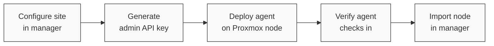
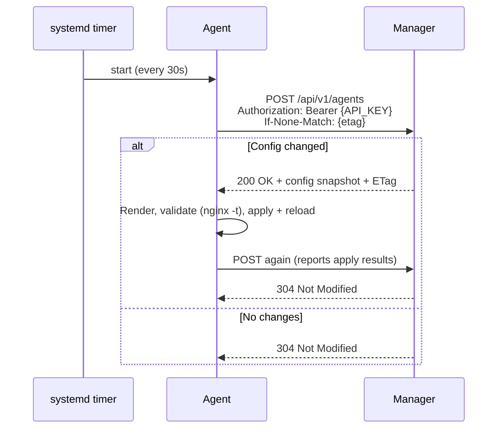

# Deploying Agents

An agent container runs nginx, dnsmasq, and [acme.sh](https://github.com/acmesh-official/acme.sh) for a site. Deploy one agent per Proxmox node to handle networking for containers on that node.

Agents are deployed **manually in Proxmox** (not through the manager UI) and should be set up **after** configuring the site in the manager but **before** importing the node. This ensures DNS and reverse proxy services are running when the node comes online.

## Prerequisites

- Management container deployed and running ([Installation Guide](installation.md))
- A [site](core-concepts/sites.md) configured in the manager
- An [API key](../users/creating-containers/api-keys.md) generated from an **admin** account
- SSH or web UI access to the target Proxmox host

## Workflow


```mermaid
graph LR
    A[Configure site<br/>in manager] --> B[Generate<br/>admin API key] --> C[Deploy agent<br/>on Proxmox node] --> D[Verify agent<br/>checks in] --> E[Import node<br/>in manager]

    classDef step fill:#f9f9f9,stroke:#333,stroke-width:1px
    class A,B,C,D,E step
```

## 1. Pull the Agent Image

On the target Proxmox host:

```bash
apt update && apt install -y skopeo

skopeo copy docker://ghcr.io/mieweb/opensource-server/agent:latest \
  oci-archive:/var/lib/vz/template/cache/opensource-server-agent.tar
```

## 2. Create the Agent Container

In the Proxmox web interface (`https://your-proxmox-host:8006`):

1. **Create CT** on the target node
2. **Template**: Select `opensource-server-agent`
3. **Network**: Configure with a **static IP** in the site's subnet
4. **Resources**: Allocate CPU, memory, and storage as needed

Alternatively, use `pct create` from the command line:

```bash
pct create <vmid> /var/lib/vz/template/cache/opensource-server-agent.tar \
  --hostname agent \
  --net0 name=eth0,bridge=vmbr0,ip=<static-ip>/24,gw=<gateway> \
  --memory 512 \
  --features nesting=1 \
  --unprivileged 1
```

## 3. Configure Environment Variables

Set `SITE_ID`, `MANAGER_URL`, and `API_KEY` via the Proxmox LXC configuration. These propagate to `/etc/environment` on boot via the base image's `environment.sh` service.

Add to `/etc/pve/lxc/<vmid>.conf`:

```ini
lxc.environment = SITE_ID=<site-id>
lxc.environment = MANAGER_URL=http://<manager-ip>:3000
lxc.environment = API_KEY=<admin-api-key>
```

| Variable | Description |
|----------|-------------|
| `SITE_ID` | Numeric site ID from the manager (visible in the URL when viewing the site) |
| `MANAGER_URL` | Base URL of the manager container (e.g., `http://192.168.1.10:3000`) |
| `API_KEY` | API key from an admin account. Used to authenticate check-ins. |

## 4. Start and Verify

```bash
pct start <vmid>
```

Verify the agent is checking in and applied its configs:

```bash
# Enter the container
pct enter <vmid>

# Timer and last runs
systemctl status opensource-agent.timer
journalctl -u opensource-agent.service

# Check that configs were applied
cat /etc/nginx/nginx.conf
cat /etc/dnsmasq.conf

# Run a check-in manually
systemctl start opensource-agent.service
```

The agent also appears on the manager's **Agents** page (`/agents`, admin only) with its last check-in time and service health.

## 5. Forward Network Traffic

Forward the following ports from the Proxmox host to the agent container:

| Port | Protocol | Service |
|------|----------|---------|
| 80 | TCP | HTTP (nginx) |
| 443 | TCP | HTTPS (nginx) |
| 443 | UDP | QUIC (nginx) |
| 53 | TCP/UDP | DNS (dnsmasq) |

## 6. Import the Node

With the agent running, proceed to [import the node](core-concepts/nodes.md#import-nodes-recommended) in the manager. The agent's dnsmasq and nginx will automatically receive updated configurations as containers are created and removed.

## How It Works

A systemd timer launches the agent every 30 seconds. It checks in with the manager, reporting host info and service status, and receives the site's config snapshot in return — see the [agent developer reference](../developers/agent.md) for the protocol and apply/rollback details.


```mermaid
sequenceDiagram
    participant Timer as systemd timer
    participant Agent
    participant Manager

    Timer->>Agent: start (every 30s)
    Agent->>Manager: POST /api/v1/agents<br/>Authorization: Bearer {API_KEY}<br/>If-None-Match: {etag}
    alt Config changed
        Manager-->>Agent: 200 OK + config snapshot + ETag
        Agent->>Agent: Render, validate (nginx -t), apply + reload
        Agent->>Manager: POST again (reports apply results)
        Manager-->>Agent: 304 Not Modified
    else No changes
        Manager-->>Agent: 304 Not Modified
    end
```

Each check-in is recorded by the manager, so admins can monitor agent health on the **Agents** page. ETag caching keeps unchanged configs to a single 304 round trip. Dnsmasq's main config triggers a full restart when it changes, while the auxiliary files (DHCP hosts, host records, options, upstream servers) only trigger a SIGHUP reload.
