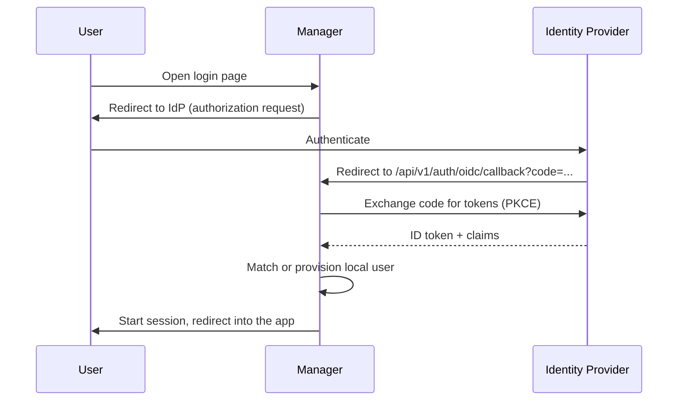
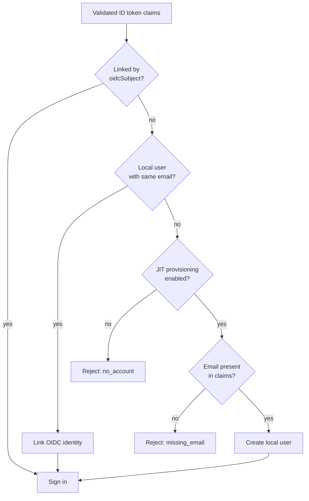

# Configuring OIDC Single Sign-On

The Manager can delegate authentication to an external [OpenID Connect](https://openid.net/connect/) (OIDC) identity provider (IdP) such as Keycloak, Okta, Microsoft Entra ID, Auth0, or Google. When OIDC is enabled, the login page redirects users to your IdP and internal password login is turned off.

OIDC is configured entirely through environment variables on the Manager container — there is no UI toggle. This keeps the credentials out of the database and lets you recover from a misconfiguration by editing the container config and restarting.

## How It Works



The Manager uses the authorization-code flow with PKCE. On the callback it validates the ID token and resolves a local account from the token claims (see [User Matching & Provisioning](#user-matching-provisioning)).

!!! info "Effect of enabling OIDC"
    When the issuer, client ID, and client secret are all set:

    - The login screen automatically redirects to the IdP.
    - Internal username/password login (`POST /api/v1/auth/login`) returns `403 oidc_enabled`.
    - Self-registration and invitation-based registration are disabled.

    Password reset endpoints remain available but are irrelevant for OIDC-only accounts, which authenticate through the IdP.

## Prerequisites

- The Manager container deployed and running ([Installation Guide](installation.md)).
- An OIDC client (also called an "application" or "relying party") registered with your identity provider, which gives you a **client ID** and **client secret**.
- The IdP's **discovery URL** (the issuer). The Manager performs discovery against `${OIDC_ISSUER_URL}/.well-known/openid-configuration`.

## 1. Register the Manager With Your Identity Provider

In your IdP, create a confidential OIDC client (web application) and configure:

| Setting | Value |
|---------|-------|
| Grant / flow | Authorization Code (with PKCE) |
| Redirect / callback URI | `https://manager.example.org/api/v1/auth/oidc/callback` |
| Scopes | `openid`, `profile`, `email` |
| Post-logout redirect URI | `https://manager.example.org/login?logged_out=1` (see [Sign-out](#sign-out)) |

Replace `manager.example.org` with the external hostname you configured for the Manager in the [Installation Guide](installation.md). The path is always `/api/v1/auth/oidc/callback`.

!!! warning "Redirect URI must match exactly"
    The callback URL registered with the IdP must match the URL the Manager sends, including scheme and host. If you set `OIDC_REDIRECT_URI` (below), use that exact value here. If you leave it unset, the Manager derives the callback from the incoming request as `${protocol}://${host}/api/v1/auth/oidc/callback`, so the Manager must be reached on the same hostname the IdP redirects back to.

Note the **client ID** and **client secret** issued by the IdP for the next step.

## 2. Set the Environment Variables

OIDC is enabled only when `OIDC_ISSUER_URL`, `OIDC_CLIENT_ID`, and `OIDC_CLIENT_SECRET` are **all** set. The other variables are optional.

| Variable | Required | Description |
|----------|----------|-------------|
| `OIDC_ISSUER_URL` | ✅ | Discovery base URL of the IdP (the issuer). Discovery is performed at `${OIDC_ISSUER_URL}/.well-known/openid-configuration`. |
| `OIDC_CLIENT_ID` | ✅ | OAuth2 client ID issued by the IdP. |
| `OIDC_CLIENT_SECRET` | ✅ | OAuth2 client secret issued by the IdP. |
| `OIDC_REDIRECT_URI` | | Absolute callback URL registered with the IdP. If unset, it is derived from the request as `${protocol}://${host}/api/v1/auth/oidc/callback`. |
| `OIDC_SCOPES` | | Space-separated scopes requested from the IdP. Default: `openid profile email`. |
| `OIDC_JIT_PROVISION` | | Set to `true` to auto-create users on first login (just-in-time provisioning). Default: `false`. See [User Matching & Provisioning](#user-matching-provisioning). |
| `OIDC_POST_LOGOUT_REDIRECT_URI` | | Where the IdP returns the browser after [sign-out](#sign-out). If unset, the Manager defaults to `${protocol}://${host}/login?logged_out=1`. Whatever value is used **must be registered with the IdP**. |

### Apply via the Proxmox LXC configuration

Like other Manager and agent settings, OIDC variables are set on the container and propagate to `/etc/environment` on boot via the base image's `environment.sh` service.

Add to `/etc/pve/lxc/<vmid>.conf` on the Proxmox host (the Manager uses container ID `100` in the [Installation Guide](installation.md)):

```ini
lxc.environment = OIDC_ISSUER_URL=https://idp.example.org/realms/main
lxc.environment = OIDC_CLIENT_ID=mie-container-manager
lxc.environment = OIDC_CLIENT_SECRET=<client-secret>
lxc.environment = OIDC_REDIRECT_URI=https://manager.example.org/api/v1/auth/oidc/callback
lxc.environment = OIDC_JIT_PROVISION=true
```

Then restart the container so the new environment is loaded:

```bash
pct restart 100
```

!!! tip "Local development"
    When running the Manager directly (not in Proxmox), the same variables can be placed in the `.env` file next to `server.js`; the server loads it via `dotenv` on startup. See [`example.env`](https://github.com/mieweb/opensource-server/blob/main/create-a-container/example.env).

## 3. Verify

1. Confirm the Manager reports OIDC as enabled:

    ```bash
    curl -s https://manager.example.org/api/v1/health
    # { "status": "ok", "isDev": false, "oidcEnabled": true }
    ```

2. Open the Manager login page. It should redirect to your IdP automatically.
3. Sign in with an IdP account and confirm you land back in the Manager with an active session.

## User Matching & Provisioning

After a successful sign-in, the Manager resolves a local account from the ID token claims in this order:

1. **By OIDC subject** — an existing user previously linked to this IdP identity (`oidcSubject` = the token's `sub`).
2. **By email** — an existing local user whose email matches the token's `email` claim. The OIDC identity is then linked to that account so future logins match by subject.
3. **Just-in-time provisioning** — if no match is found and `OIDC_JIT_PROVISION=true`, a new local user is created from the claims.



When JIT provisioning creates a user, fields are derived from the claims:

| Local field | Source claim(s) |
|-------------|-----------------|
| Username (`uid`) | `preferred_username`, otherwise the local-part of `email` (made unique) |
| First / last name | `given_name` / `family_name`, falling back to `name` |
| Email | `email` (required) |
| Password | A random, unusable value — OIDC users authenticate via the IdP only |

!!! note "Provisioned users are not admins"
    JIT-provisioned accounts are added to the standard users group, not `sysadmins` — except when the provisioned account is the **very first user** in the system, which is automatically granted admin (the same rule as internal registration). Manage privileges afterward under [Users & Groups](core-concepts/users-and-groups.md).

!!! warning "JIT disabled means accounts must exist first"
    With `OIDC_JIT_PROVISION` unset or `false`, only users that already exist locally (matched by subject or email) can sign in. Pre-create accounts, or match on email, before users attempt their first OIDC login.

## Sign-out

When OIDC is enabled, **Sign out** performs RP-initiated logout so that signing out actually ends the session at the identity provider — not just the local Manager session:

1. The Manager clears its own session cookie.
2. The browser is redirected to the IdP's `end_session_endpoint` (with an `id_token_hint`), which terminates the IdP session.
3. The IdP returns the browser to the post-logout URL, which lands on the Manager's login page with a `?logged_out=1` flag so it does **not** immediately redirect back into SSO.

!!! warning "Why logout used to loop"
    Without RP-initiated logout, clearing only the local session leaves the IdP session alive. The login page then auto-redirects to the IdP, which silently issues a fresh login — so the user appears to never sign out. The post-logout redirect plus the `logged_out` flag break that loop.

!!! note "Register the post-logout redirect URI"
    The IdP only honors a `post_logout_redirect_uri` that is **registered** with the client. Add the value you use to your IdP client:

    - If `OIDC_POST_LOGOUT_REDIRECT_URI` is **unset**, register `https://manager.example.org/login?logged_out=1` (the Manager derives this from the request host).
    - If you **set** `OIDC_POST_LOGOUT_REDIRECT_URI`, register that exact URL instead.

    If the IdP's discovery document advertises no `end_session_endpoint`, the Manager falls back to a local-only logout (the local session is cleared, but the IdP session may persist).

!!! example "authentik"
    authentik has no dedicated post-logout field — the post-logout redirect is validated against the provider's **Redirect URIs** list. In your OAuth2/OIDC provider, under **Protocol settings → Redirect URIs/Origins**, add a **second entry** for the post-logout URL next to your login callback:

    | Matching Mode | URL | Type |
    |---------------|-----|------|
    | Strict | `https://manager.example.org/api/v1/auth/oidc/callback` | Authorization |
    | Strict | `https://manager.example.org/login?logged_out=1` | Logout |

    Three things to get right:

    - **Type must be `Logout`** for the post-logout entry. The end-session endpoint only checks entries typed `Logout`; an `Authorization`-typed URL (your callback) is ignored for logout and the request fails with `400 invalid_post_logout_redirect_uri`.
    - With **Strict** mode authentik does an exact string comparison, so the URL must match byte-for-byte — including the `?logged_out=1` query string. (If you use **Regex** mode instead, escape metacharacters: `https://manager\.example\.org/login\?logged_out=1`, matched with `fullmatch`.)
    - The post-logout URL must use a non-forbidden scheme (use `https`).

    authentik's end-session endpoint (`/application/o/<application-slug>/end-session/`) is discovered automatically, so no other logout configuration is required.

    !!! note "Older authentik"
        Versions without a per-entry **Type** selector treat each Redirect URI line as a regex and don't distinguish login vs. logout — there, just add the (escaped) post-logout URL as an additional line.

## Disabling OIDC / Recovery

OIDC has no database state to undo. To return to internal password login, remove the `OIDC_ISSUER_URL`, `OIDC_CLIENT_ID`, and `OIDC_CLIENT_SECRET` lines from `/etc/pve/lxc/<vmid>.conf` and restart the container:

```bash
pct restart 100
```

The login page will once again show the username/password form. Accounts that were created or linked via OIDC remain, but OIDC users provisioned with a random password will need a password reset (or an admin-set password) before they can log in internally.

## Troubleshooting

If the IdP redirects back to the Manager but sign-in fails, the login page shows an error and the URL contains `?oidc_error=<code>`. The Manager also logs callback and provisioning failures to its console.

| `oidc_error` code | Meaning | Likely fix |
|-------------------|---------|------------|
| `expired` | The pending sign-in state was lost before the callback completed. | Retry. Ensure session cookies are not blocked and the user did not take too long. |
| `exchange_failed` | The authorization-code exchange or ID-token validation failed. | Check client ID/secret, redirect URI mismatch, and IdP/Manager clock skew. Review Manager logs. |
| `provisioning_failed` | An unexpected error occurred while creating/linking the local account. | Review Manager logs; check database connectivity. |
| `no_account` | No matching local user and JIT provisioning is disabled. | Pre-create the user, or set `OIDC_JIT_PROVISION=true`. |
| `missing_email` | JIT provisioning is enabled but the IdP did not return an `email` claim. | Request the `email` scope and ensure the IdP releases the email claim. |
| `account_inactive` | A matching account exists but its status is not `active`. | Activate the account under [Users & Groups](core-concepts/users-and-groups.md). |

Other checks:

- **Discovery fails on startup / first login** — verify `OIDC_ISSUER_URL` is reachable from the Manager container and that `${OIDC_ISSUER_URL}/.well-known/openid-configuration` returns valid JSON.
- **Stuck on the password form** — confirm all three required variables are set and the container was restarted; check `oidcEnabled` via `GET /api/v1/health`.
- **Redirect loop or "redirect URI mismatch" from the IdP** — ensure the callback URL registered with the IdP exactly matches `OIDC_REDIRECT_URI` (or the derived `${protocol}://${host}/api/v1/auth/oidc/callback`).
