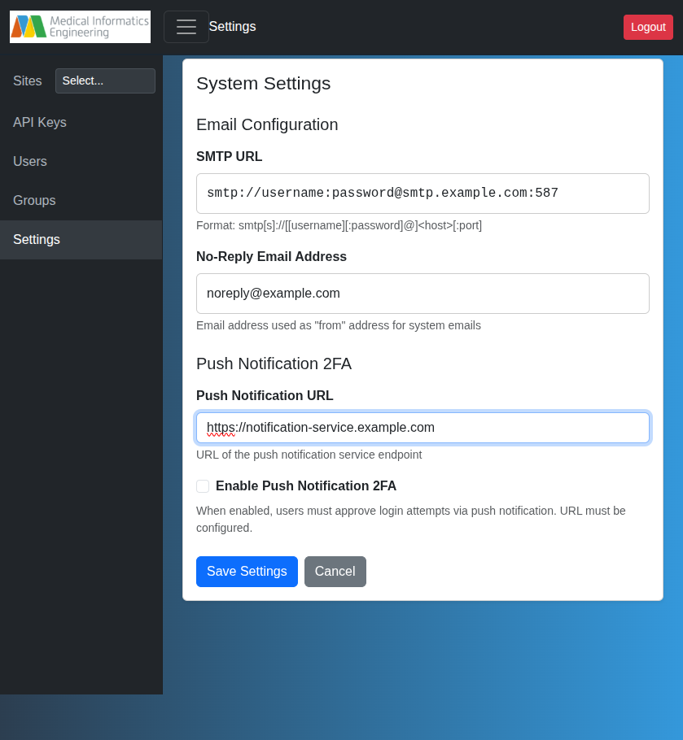

# System Settings

Admin-only system-wide configuration. Access via **Settings** in the admin sidebar.

## Email (SMTP)

Configure SMTP for password resets and system notifications.

- **SMTP URL**: `smtp[s]://[[user][:pass]@]<host>[:port]`
- **No-Reply Email**: "From" address for system emails (e.g., `noreply@example.com`)

When configured, users can reset passwords via "Forgot your password?" on the login page (reset link valid for 1 hour).

!!! warning
    Without SMTP, password resets require manual admin intervention.

## Authentication

The Manager authenticates users with internal username/password by default. To delegate authentication (and MFA) to an external identity provider, configure single sign-on — see [OIDC Single Sign-On](oidc.md). When OIDC is enabled, internal password login and self-registration are disabled.

!!! note "Push Notification 2FA removed"
    Earlier releases offered push-notification two-factor authentication via the MieWeb Auth App. That feature has been removed in favor of delegating MFA to an OIDC identity provider.

## Access Control

Requires membership in a group with admin privileges (typically `sysadmins`). See [Users & Groups](core-concepts/users-and-groups.md).
