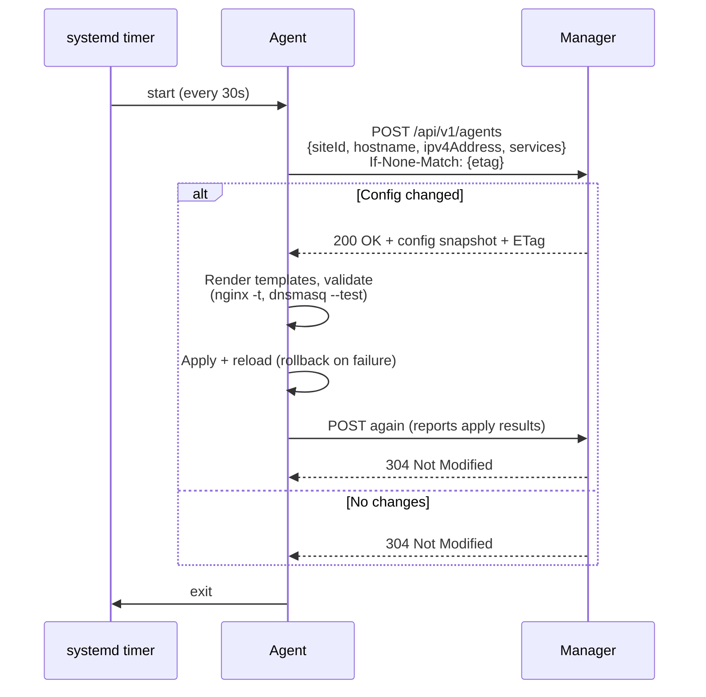

# agent

{{ contributor_warning }}

Node.js (TypeScript) check-in agent that reports host/service status to the manager and applies nginx and dnsmasq configuration. Installed on agent and manager containers. For deployment instructions, see [Deploying Agents](../admins/deploying-agents.md).

## Architecture

A systemd timer launches the oneshot agent every 30 seconds. Each run checks in with the manager (`POST /api/v1/agents`), applies any config changes, and exits.

```
agent/
├── src/                     # TypeScript sources (compiled to dist/)
│   ├── index.ts             # Oneshot entry point: check-in loop
│   ├── config.ts            # Environment configuration
│   ├── state.ts             # Persisted ETag + last apply results
│   ├── system.ts            # Hostname/IP/systemd state collection
│   ├── api.ts               # Check-in HTTP client
│   └── apply.ts             # Managed services: render/test/apply/reload
├── templates/               # EJS templates rendered locally
│   ├── nginx.conf.ejs
│   └── dnsmasq/             # conf, dhcp-hosts, hosts, dhcp-opts, servers
├── contrib/
│   ├── systemd/             # opensource-agent.service + .timer (30s)
│   └── postinstall.sh       # Enables the timer on package install
└── Makefile                 # Builds the opensource-agent package (see Release Pipeline)
```

## Check-in Protocol



The check-in body carries system info and per-service status:

```json
{
  "siteId": 1,
  "hostname": "agent",
  "currentTime": 1771234560,
  "ipv4Address": "172.17.0.2",
  "services": {
    "nginx":   { "state": "active", "lastApply": "success" },
    "dnsmasq": { "state": "active", "lastApply": "success" }
  }
}
```

The manager records every check-in in the `Agents` table (shown on the web client's `/agents` page) and responds with the site's config snapshot as JSON. A strong `ETag` covers the snapshot; the agent stores it in `/var/lib/opensource-agent/state.json` and sends it back via `If-None-Match`, so unchanged configs cost a single `304` round trip.

## Environment Variables

Read from the process environment (systemd loads `/etc/environment`). Set via container runtime (Docker `ENV`, Proxmox LXC config) — the base image's `environment.sh` service propagates them on boot.

| Variable | Required | Description |
|----------|----------|-------------|
| `SITE_ID` | Yes | Numeric site ID from the manager |
| `MANAGER_URL` | Yes | Base URL of the manager (e.g., `http://192.168.1.10:3000`) |
| `API_KEY` | No | Admin API key for remote agents. Not needed on the manager (localhost is trusted). |
| `STATE_DIR` | No | State directory (default `/var/lib/opensource-agent`) |

The agent Dockerfile defaults to `SITE_ID=1` and `MANAGER_URL=http://localhost:3000` so the manager container works without configuration.

## Managed Services

| Service | Files | Test | Reload |
|---------|-------|------|--------|
| nginx | `/etc/nginx/nginx.conf` | `nginx -t` | `systemctl reload-or-restart nginx` |
| dnsmasq | `/etc/dnsmasq.conf`, `/var/lib/dnsmasq/{dhcp-hosts,hosts,dhcp-opts,servers}` | `dnsmasq --test` | restart when `/etc/dnsmasq.conf` changed, otherwise SIGHUP |

Apply flow per service: render templates, skip if nothing changed, stage new files, run the test command, roll back on failure, then reload. Failures are reported as `lastApply: "failure"` at the next check-in.

To add a managed service, add a `ManagedService` entry in [`agent/src/apply.ts`](https://github.com/mieweb/opensource-server/blob/main/agent/src/apply.ts) plus its template(s) under `agent/templates/`, and extend the config snapshot in `create-a-container/utils/agent-config.js`.

## Running Manually

```bash
systemctl status opensource-agent.timer     # timer state
journalctl -u opensource-agent.service      # past runs
node /opt/opensource-server/agent/dist/index.js   # single run by hand
```
