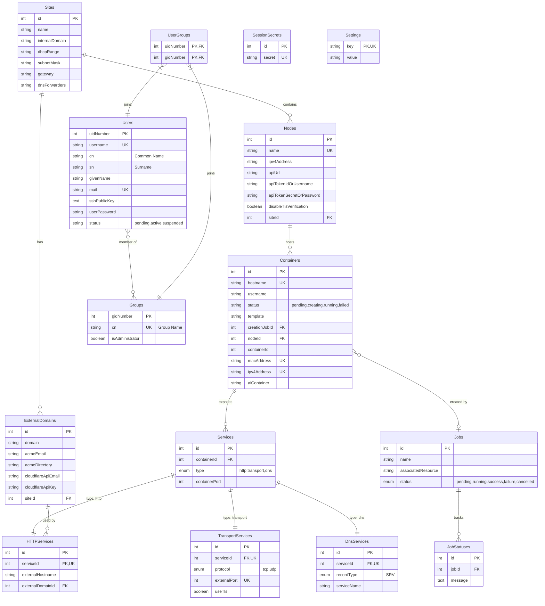

# Database Schema

The cluster management system uses a relational database to store all configuration, state, and user information. This document describes the database schema and relationships between tables.

## Entity Relationship Diagram



## Core Models

### Site

The **Site** model represents a top-level organizational unit, typically corresponding to a physical or logical Proxmox cluster location.

**Key Fields:**
- `name`: Display name for the site
- `internalDomain`: Internal DNS domain (e.g., `cluster.internal`)
- `dhcpRange`: IP range for container assignment (e.g., `192.168.1.100-192.168.1.200`)
- `subnetMask`: Network subnet mask
- `gateway`: Default gateway IP
- `dnsForwarders`: Upstream DNS servers (comma-separated)

**Relationships:**
- Has many Nodes
- Has many ExternalDomains

### Node

The **Node** model represents a Proxmox VE server within a site.

**Key Fields:**
- `name`: Node name (must match Proxmox hostname)
- `ipv4Address`: Node's IP address for DNS
- `apiUrl`: Proxmox API endpoint
- `apiTokenIdOrUsername`: Authentication credential (username or token ID)
- `apiTokenSecretOrPassword`: Authentication secret
- `disableTlsVerification`: Skip TLS certificate validation

**Relationships:**
- Belongs to Site
- Has many Containers

**Constraints:**
- `name` is unique across all nodes

### Container

The **Container** model represents an LXC container running on a Proxmox node.

**Key Fields:**
- `hostname`: Container hostname (unique)
- `username`: Owner of the container (who created it)
- `status`: Container creation state ('pending', 'creating', 'running', 'failed')
- `template`: Name of the Proxmox template used to create this container
- `creationJobId`: Foreign key to the Job that created this container (nullable)
- `containerId`: Proxmox container ID (CTID)
- `macAddress`: Unique MAC address (nullable for pending containers)
- `ipv4Address`: Assigned IP address (nullable for pending containers)
- `aiContainer`: AI container flag (default: 'N')

**Relationships:**
- Belongs to Node
- Has many Services
- Belongs to Job (optional, via creationJobId)

**Constraints:**
- Unique composite index on `(nodeId, containerId)`
- `hostname`, `macAddress`, and `ipv4Address` are globally unique

### Service (Base Model)

The **Service** model uses Single Table Inheritance (STI) to represent different types of services exposed by containers.

**Key Fields:**
- `containerId`: Container exposing this service
- `type`: Service type ('http', 'transport', or 'dns')
- `containerPort`: Port number inside the container

**Relationships:**
- Belongs to Container
- Has one HTTPService, TransportService, or DnsService (based on type)

### HTTPService

Represents HTTP/HTTPS services with automatic SSL certificate management.

**Key Fields:**
- `externalHostname`: Subdomain for the service (e.g., 'app' for 'app.example.com')
- `externalDomainId`: External domain to use

**Relationships:**
- Belongs to Service (one-to-one)
- Belongs to ExternalDomain

**Constraints:**
- Unique composite index on `(externalHostname, externalDomainId)`

### TransportService

Represents TCP/UDP services exposed via port mapping.

**Key Fields:**
- `protocol`: 'tcp' or 'udp'
- `externalPort`: Public port number
- `useTls`: Whether to use TLS for TCP connections

**Relationships:**
- Belongs to Service (one-to-one)

**Constraints:**
- Unique composite index on `(protocol, externalPort)`

**Static Methods:**
- `findNextAvailablePort()`: Finds the next available external port

### DnsService

Represents services registered in DNS (typically SRV records).

**Key Fields:**
- `recordType`: DNS record type (currently only 'SRV' supported)
- `serviceName`: Service name for DNS record

**Relationships:**
- Belongs to Service (one-to-one)

### ExternalDomain

The **ExternalDomain** model manages public domains for HTTP service exposure.

**Key Fields:**
- `domain`: Domain name (e.g., 'example.com')
- `acmeEmail`: Email for certificate notifications
- `acmeDirectory`: ACME CA endpoint URL
- `cloudflareApiEmail`: Cloudflare account email
- `cloudflareApiKey`: Cloudflare API key for DNS challenges

**Relationships:**
- Belongs to Site
- Has many HTTPServices

## User Management Models

### User

The **User** model stores user accounts with LDAP-compatible attributes.

**Key Fields:**
- `uidNumber`: Unique user ID (starting at 2000)
- `username`: Login username
- `cn`: Common name (full name)
- `sn`: Surname (last name)
- `givenName`: First name
- `mail`: Email address
- `sshPublicKey`: SSH public key for container access
- `userPassword`: Hashed password (argon2)
- `status`: Account status ('pending', 'active', 'suspended')

**Relationships:**
- Belongs to many Groups (through UserGroups)

**Security:**
- Passwords are hashed with argon2 before storage
- Only 'active' users can authenticate
- First registered user is automatically added to 'sysadmins' group

**Static Methods:**
- `getNextUid()`: Returns next available UID starting at 2000

**Instance Methods:**
- `validatePassword(password)`: Verifies password against hash

### Group

The **Group** model represents user groups with LDAP-compatible attributes.

**Key Fields:**
- `gidNumber`: Unique group ID
- `cn`: Group name (common name)
- `isAdministrator`: Whether group members have admin privileges

**Relationships:**
- Has many Users (through UserGroups)

**Default Groups:**
- `ldapusers` (gid: 2000): Standard container access
- `sysadmins` (gid: 2001): Full cluster administration

### UserGroup

The **UserGroup** model is a join table for the many-to-many User-Group relationship.

**Key Fields:**
- `uidNumber`: Foreign key to Users
- `gidNumber`: Foreign key to Groups

**Constraints:**
- Composite primary key on `(uidNumber, gidNumber)`

## Job Management Models

### Job

The **Job** model tracks asynchronous operations.

**Key Fields:**
- `name`: Job description
- `associatedResource`: Reference to related resource
- `status`: Job state ('pending', 'running', 'success', 'failure', 'cancelled')

**Relationships:**
- Has many JobStatuses

### JobStatus

The **JobStatus** model stores job execution history and progress messages.

**Key Fields:**
- `jobId`: Foreign key to Jobs
- `message`: Status update message

**Relationships:**
- Belongs to Job

## Session Management

### SessionSecret

The **SessionSecret** model stores express-session secrets.

**Key Fields:**
- `secret`: 32-64 character secret string

**Constraints:**
- `secret` is unique

## System Settings

### Setting

The **Setting** model stores system-wide configuration key-value pairs.

**Key Fields:**
- `key`: Setting identifier (primary key)
- `value`: Setting value (string)

**Constraints:**
- `key` is unique and serves as primary key

**Current Settings:**
- `push_notification_url`: URL for push notification service (empty by default)
- `push_notification_enabled`: Whether push notification 2FA is enabled ('true' or 'false')

**Static Methods:**
- `get(key)`: Retrieve a setting value by key
- `set(key, value)`: Create or update a setting
- `getMultiple(keys)`: Retrieve multiple settings as an object

## Database Abstraction

The schema is implemented using **Sequelize ORM**, providing:

- **Database Portability**: Supports SQLite (default), PostgreSQL, and MySQL
- **Migrations**: Schema versioning and updates via `sequelize-cli`
- **Validation**: Field-level validation rules
- **Hooks**: Automatic password hashing, UID/GID assignment
- **Associations**: Declarative relationship definitions

## Key Design Patterns

### Single Table Inheritance (STI)

The Service model uses STI to handle different service types:
- Base `Services` table with `type` discriminator
- Child tables (`HTTPServices`, `TransportServices`, `DnsServices`) extend via one-to-one relationships
- Allows polymorphic service handling while maintaining type-specific fields

### LDAP Schema Compatibility

User and Group models follow LDAP naming conventions:
- `uidNumber` / `gidNumber` for numeric IDs
- `cn` (common name) for names
- `sn` (surname), `givenName` for user names
- Enables seamless integration with LDAP authentication

### Hierarchical Organization

Resources are organized hierarchically:
```
Site → Nodes → Containers → Services
```

This mirrors the physical infrastructure topology and simplifies queries.

## Next Steps

- [System Architecture](system-architecture): Understand how the database integrates with other components
- [Development Workflow](development-workflow): Learn how to create migrations
- [Core Technologies](core-technologies): Sequelize ORM documentation
