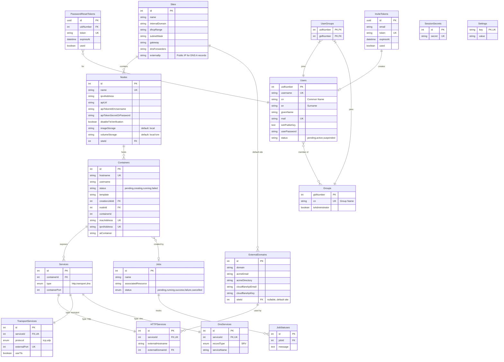

# Database Schema

The cluster management system uses Sequelize ORM for database abstraction, supporting SQLite (default), PostgreSQL, and MySQL.

## Entity Relationship Diagram

## Core Models

### Site
Top-level organizational unit. Has many Nodes. Has many ExternalDomains (as default site). `externalIp` is the public IP used as the target for Cloudflare DNS A records when cross-site HTTP services are created.

### Node
Proxmox VE server within a site. `name` must match Proxmox hostname (unique). `imageStorage` defaults to `'local'` (CT templates). `volumeStorage` defaults to `'local-lvm'` (container rootfs). Belongs to Site, has many Containers.

### Container
LXC container on a Proxmox node. Unique composite index on `(nodeId, containerId)`. `hostname`, `macAddress`, `ipv4Address` globally unique. Belongs to Node and optionally to a Job.

### Service (STI)
Base model with `type` discriminator (`http`, `transport`, `dns`). Belongs to Container.

- **HTTPService**: `(externalHostname, externalDomainId)` unique. Belongs to ExternalDomain.
- **TransportService**: `(protocol, externalPort)` unique. `findNextAvailablePort()` static method.
- **DnsService**: SRV records with `serviceName`.

### ExternalDomain
Manages public domains for HTTP service exposure. `siteId` is nullable — when set, indicates the "default site" whose DNS is assumed pre-configured (e.g., wildcard A record). Global resource available to all sites. Has many HTTPServices. Cloudflare credentials used for both ACME DNS-01 challenges and cross-site A record management.

## User Management Models

### User
LDAP-compatible user accounts. Passwords hashed with argon2. UIDs start at 2000 (`getNextUid()`). Only `active` users can authenticate. First registered user auto-added to `sysadmins`.

### Group
LDAP-compatible groups. Default groups: `ldapusers` (gid: 2000), `sysadmins` (gid: 2001).

### UserGroup
Join table. Composite primary key on `(uidNumber, gidNumber)`.

### PasswordResetToken
UUID-based tokens with 1-hour default expiry. Methods: `generateToken()`, `validateToken()`, `cleanup()`.

### InviteToken
UUID-based invite tokens with 24-hour default expiry. Email tied to token and locked during registration. Methods: `generateToken()`, `validateToken()`, `cleanup()`.

## Job Management

### Job
Tracks async operations (container creation, etc.). Statuses: `pending`, `running`, `success`, `failure`, `cancelled`.

### JobStatus
Progress messages for a Job.

## System

- **SessionSecret**: Stores express-session secrets
- **Setting**: Key-value pairs for system config. Methods: `get()`, `set()`, `getMultiple()`

## Database Abstraction

Implemented with **Sequelize ORM**: supports SQLite (default), PostgreSQL, MySQL. Includes migrations, field validation, hooks (password hashing, UID assignment), and declarative associations.

## Key Design Patterns

- **Service STI**: Base `Services` table with `type` discriminator; child tables (`HTTPServices`, `TransportServices`, `DnsServices`) extend via one-to-one relationships
- **LDAP compatibility**: User/Group models use LDAP naming (`uidNumber`, `gidNumber`, `cn`, `sn`, `givenName`)
- **Hierarchy**: Site → Nodes → Containers → Services (mirrors physical topology)
