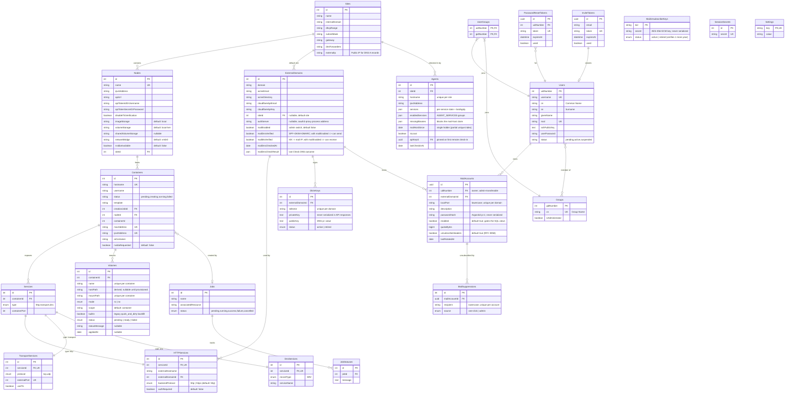

# Database Schema

{{ contributor_warning }}

The cluster management system uses Sequelize ORM with PostgreSQL. While Sequelize supports other databases, only PostgreSQL is officially supported.

## Entity Relationship Diagram

```mermaid
erDiagram
    Sites ||--o{ Nodes : contains
    Sites ||--o{ ExternalDomains : "default site"
    Sites ||--o{ Agents : "checked in by"
    Nodes ||--o{ Containers : hosts
    Containers ||--o{ Services : exposes
    Containers ||--o{ Volumes : mounts
    Containers }o--o| Jobs : "created by"
    Services ||--|| HTTPServices : "type: http"
    Services ||--|| TransportServices : "type: transport"
    Services ||--|| DnsServices : "type: dns"
    ExternalDomains ||--o{ HTTPServices : "used by"
    ExternalDomains ||--o{ DkimKeys : signs
    ExternalDomains ||--o{ MailAccounts : hosts
    MailAccounts ||--o{ MailSuppressions : "unsubscribed by"
    Users ||--o{ MailAccounts : owns
    Jobs ||--o{ JobStatuses : tracks
    Users }o--o{ Groups : "member of"
    UserGroups }|--|| Users : joins
    UserGroups }|--|| Groups : joins
    PasswordResetTokens }o--|| Users : "for"
    InviteTokens ||--o| Users : "creates"

    Sites {
        int id PK
        string name
        string internalDomain
        string dhcpRange
        string subnetMask
        string gateway
        string dnsForwarders
        string externalIp "Public IP for DNS A records"
    }

    Nodes {
        int id PK
        string name UK
        string ipv4Address
        string apiUrl
        string apiTokenIdOrUsername
        string apiTokenSecretOrPassword
        boolean disableTlsVerification
        string imageStorage "default: local"
        string volumeStorage "default: local-lvm"
        string sharedVolumeStorage "nullable"
        string networkBridge "default: vmbr0"
        boolean nvidiaAvailable "default: false"
        int siteId FK
    }

    Agents {
        int id PK
        int siteId FK
        string hostname "unique per site"
        string ipv4Address
        json services "per-service state + lastApply"
        json enabledServices "AGENT_SERVICES groups"
        json missingBinaries "blocks the mail-host claim"
        date mailHostSince "single holder (partial unique index)"
        boolean isLocal
        uuid apiKeyId FK "pinned on first remote check-in"
        date lastCheckinAt
    }

    Containers {
        int id PK
        string hostname UK
        string username
        string status "pending,creating,running,failed"
        string template
        int creationJobId FK
        int nodeId FK
        int containerId
        string macAddress UK
        string ipv4Address UK
        string aiContainer
        boolean nvidiaRequested "default: false"
    }

    Services {
        int id PK
        int containerId FK
        enum type "http,transport,dns"
        int containerPort
    }

    Volumes {
        int id PK
        int containerId FK
        string name "unique per container"
        string hostPath "derived; nullable until provisioned"
        string mountPath "unique per container"
        enum mode "ro | rw"
        string scope "default: container"
        boolean builtin "legacy quick_and_dirty backfill"
        enum status "pending | ready | failed"
        string statusMessage "nullable"
        date appliedAt "nullable"
    }

    HTTPServices {
        int id PK
        int serviceId FK,UK
        string externalHostname
        int externalDomainId FK
        enum backendProtocol "http | https (default: http)"
        boolean authRequired "default: false"
    }

    TransportServices {
        int id PK
        int serviceId FK,UK
        enum protocol "tcp,udp"
        int externalPort UK
        boolean useTls
    }

    DnsServices {
        int id PK
        int serviceId FK,UK
        enum recordType "SRV"
        string serviceName
    }

    ExternalDomains {
        int id PK
        string domain
        string acmeEmail
        string acmeDirectory
        string cloudflareApiEmail
        string cloudflareApiKey
        int siteId FK "nullable, default site"
        string authServer "nullable, oauth2-proxy process address"
        boolean mailEnabled "admin switch, default false"
        boolean mailDnsVerified "SPF+DKIM+DMARC; with mailEnabled => can send"
        boolean mailMxVerified "MX -> mail IP; with mailEnabled => can receive"
        date mailDnsCheckedAt
        json mailDnsCheckResult "last Check DNS outcome"
    }

    DkimKeys {
        int id PK
        int externalDomainId FK
        string selector "unique per domain"
        text privateKey "never serialized in API responses"
        text publicKey "DNS p= value"
        enum status "active | retired"
    }

    MailAccounts {
        uuid id PK
        int uidNumber FK "owner; admin-transferable"
        int externalDomainId FK
        string localPart "lowercase; unique per domain"
        string description
        string passwordHash "Argon2id p=1; never serialized"
        boolean enabled "default true; gates the SQL views"
        bigint quotaBytes
        boolean unsubscribeHeaders "default true (RFC 8058)"
        date lastRotatedAt
    }

    MailSuppressions {
        int id PK
        uuid mailAccountId FK
        string recipient "lowercase; unique per account"
        enum source "one-click | admin"
    }

    MailUnsubscribeKeys {
        string kid PK
        string secret "AES-256-GCM key; never serialized"
        enum status "active | retired (verifies 1 more year)"
    }

    Jobs {
        int id PK
        string name
        string associatedResource
        enum status "pending,running,success,failure,cancelled"
    }

    JobStatuses {
        int id PK
        int jobId FK
        text message
    }

    Users {
        int uidNumber PK
        string username UK
        string cn "Common Name"
        string sn "Surname"
        string givenName
        string mail UK
        text sshPublicKey
        string userPassword
        string status "pending,active,suspended"
    }

    Groups {
        int gidNumber PK
        string cn UK "Group Name"
        boolean isAdministrator
    }

    UserGroups {
        int uidNumber PK,FK
        int gidNumber PK,FK
    }

    SessionSecrets {
        int id PK
        string secret UK
    }

    Settings {
        string key PK,UK
        string value
    }

    PasswordResetTokens {
        uuid id PK
        int uidNumber FK
        string token UK
        datetime expiresAt
        boolean used
    }

    InviteTokens {
        uuid id PK
        string email
        string token UK
        datetime expiresAt
        boolean used
    }
```

## Core Models

### Site
Top-level organizational unit. Has many Nodes. Has many ExternalDomains (as default site). `externalIp` is the public IP used as the target for Cloudflare DNS A records when cross-site HTTP services are created.

### Node
Proxmox VE server within a site. `name` must match Proxmox hostname (unique). `imageStorage` defaults to `'local'` (CT templates). `volumeStorage` defaults to `'local-lvm'` (container rootfs). `sharedVolumeStorage` (nullable) names the path-backed shared storage hosting persistent volumes; null falls back to `volumeStorage`. `networkBridge` defaults to `'vmbr0'` (Proxmox bridge used in container net0 config). `nvidiaAvailable` indicates the node has NVIDIA drivers and nvidia-container-toolkit configured for GPU passthrough. Belongs to Site, has many Containers.

### Agent
Site agent registered by its check-in (`POST /api/v1/agents`, every 30s). Unique composite index on `(siteId, hostname)`. `services` stores the per-service status reported by the agent (`{ nginx: { state, lastApply }, ... }`); `lastCheckinAt` drives the online/offline health shown on the web client's Agents page. Belongs to Site. See [agent](agent.md).

### Container
LXC container on a Proxmox node. Unique composite index on `(nodeId, containerId)`. `hostname`, `macAddress`, `ipv4Address` globally unique. `nvidiaRequested` indicates GPU passthrough was requested — the container is assigned to an NVIDIA-capable node and the nvidia hookscript is attached. Belongs to Node and optionally to a Job.

### Service (STI)
Base model with `type` discriminator (`http`, `transport`, `dns`). Belongs to Container.

- **HTTPService**: `(externalHostname, externalDomainId)` unique. Belongs to ExternalDomain. `backendProtocol` controls `proxy_pass` scheme (`http` or `https`). `authRequired` enables NGINX `auth_request` against the domain's oauth2-proxy — requires the domain's `authServer` to be configured.
- **TransportService**: `(protocol, externalPort)` unique. `findNextAvailablePort()` static method.
- **DnsService**: SRV records with `serviceName`.

### Volume
Persistent bind-mount attached to a container (issue #421). Unique composite indexes on `(containerId, name)` and `(containerId, mountPath)`. `hostPath` is derived server-side from the node volume storage's actual configured `path` (`<path>/volumes/site-<siteId>/<owner>/<hostname>/<name>`; scoped by site so containers with the same hostname across sites don't collide on shared storage, and by owner so retained data is only reattached for the same owner) and is null until the create job derives it. `mode` is `ro`/`rw`; each row renders to a Proxmox `mpN` bind mount (`Volume.buildMountConfig`). `status` (`pending` → `ready` | `failed`) is the readiness barrier the create/reconfigure jobs block on — the site agent creates the host directory and reports the result at check-in, which the manager writes to `status`/`statusMessage`/`appliedAt`. `builtin` marks the retired `quick_and_dirty` mount backfilled onto pre-#421 containers for reference (never re-applied; its live `mp0` slot is reserved by `buildMountConfig`). Belongs to Container. See [Volumes](../admins/core-concepts/volumes.md).

### ExternalDomain
Manages public domains for HTTP service exposure. `siteId` is nullable — when set, indicates the "default site" whose DNS is assumed pre-configured (e.g., wildcard A record). Global resource available to all sites. Has many HTTPServices. Cloudflare credentials used for both ACME DNS-01 challenges and cross-site A record management. `authServer` is an optional address of an [oauth2-proxy](https://oauth2-proxy.github.io/oauth2-proxy/) process (e.g. `http://127.0.0.1:4180`) that NGINX proxies `/oauth2/*` to for `auth_request` (see [External Domains](../admins/core-concepts/external-domains.md#authentication)). Mail gates (`mailEnabled`, `mailDnsVerified`, `mailMxVerified`) are changed only via the `…/mail/*` endpoints; has many DkimKeys and MailAccounts.

## Mail Models (issue #67)

### DkimKey
RSA-2048 signing key per external domain, generated at domain creation (selector `osYYYYMMDD`). `status` supports future rotation. The private key is never serialized in API responses — it reaches only the mail-host agent snapshot and the admin DKIM export.

### MailAccount
A user-owned SMTP/IMAP account on a can-send domain. Password stored as an Argon2id PHC string with `p=1` (Dovecot verifies via libsodium, which only supports parallelism 1); the plaintext is returned exactly once at create/rotate. `enabled` gates the SQL views, so disabling locks the account out instantly.

### MailSuppression
A recipient who one-click-unsubscribed (RFC 8058) from a MailAccount, or was suppressed by an admin. Enforced synchronously at RCPT on the submission ports.

### MailUnsubscribeKey
AES-256-GCM key for unsubscribe tokens. One `active` key; `retired` keys keep verifying previously issued links for one year.

### Mail Views
The dialect-aware views created by migration `20261008000006` (SQL built in `create-a-container/utils/mail-views.js`) are the **stable contract** Dovecot/Postfix — or a self-managed MTA — read live:

| View | Columns | Consumer |
|------|---------|----------|
| `mail_accounts_v` | `address`, `password` (`{ARGON2ID}`-prefixed), `home`, `quota_bytes`, `can_send`, `can_receive` — enabled accounts only | Dovecot passdb/userdb (`mail_dovecot` role) |
| `mail_senders_v` | `sender`, `login`, `account_id`, `unsubscribe_headers` — can-send accounts | Postfix `smtpd_sender_login_maps` + opensource-mail-helper (`mail_postfix` role) |
| `mail_suppressions_v` | `sender`, `recipient` | Submission policy service (`mail_postfix` role) |

`bin/setup-mail-db-roles.sh` creates the two read-only roles and grants; the views migration also grants best-effort so either ordering converges.

## User Management Models

### User
LDAP-compatible user accounts. Passwords hashed with argon2. UIDs start at 2000 (`getNextUid()`). Only `active` users can authenticate. First registered user auto-added to `sysadmins`.

### Group
LDAP-compatible groups. Default groups: `ldapusers` (gid: 2000), `sysadmins` (gid: 2001).

### UserGroup
Join table. Composite primary key on `(uidNumber, gidNumber)`.

### PasswordResetToken
UUID-based tokens with 1-hour default expiry. Methods: `generateToken()`, `validateToken()`, `cleanup()`.

### InviteToken
UUID-based invite tokens with 24-hour default expiry. Email tied to token and locked during registration. Methods: `generateToken()`, `validateToken()`, `cleanup()`.

## Job Management

### Job
Tracks async operations (container creation, etc.). Statuses: `pending`, `running`, `success`, `failure`, `cancelled`.

### JobStatus
Progress messages for a Job.

## System

- **SessionSecret**: Stores express-session secrets
- **Setting**: Key-value pairs for system config. Methods: `get()`, `set()`, `getMultiple()`

## Database Abstraction

Implemented with **Sequelize ORM** backed by **PostgreSQL**. Includes migrations, field validation, hooks (password hashing, UID assignment), and declarative associations.

## Key Design Patterns

- **Service STI**: Base `Services` table with `type` discriminator; child tables (`HTTPServices`, `TransportServices`, `DnsServices`) extend via one-to-one relationships
- **LDAP compatibility**: User/Group models use LDAP naming (`uidNumber`, `gidNumber`, `cn`, `sn`, `givenName`)
- **Hierarchy**: Site → Nodes → Containers → Services (mirrors physical topology)
