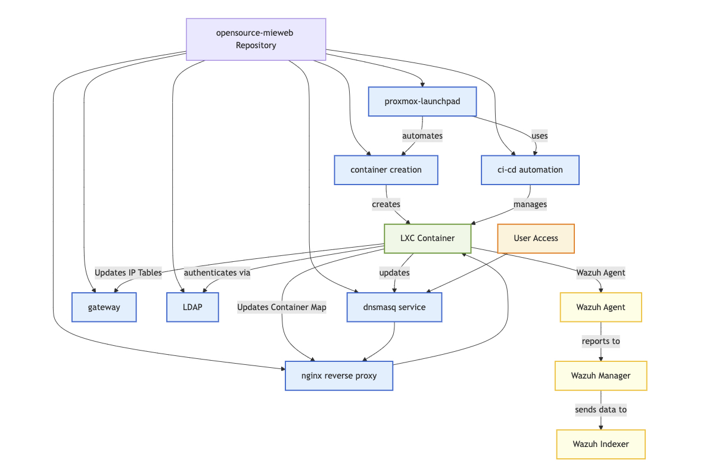

# How MIE's Proxmox Cluster Works

MIE's Opensource Proxmox Cluster is a robust, automated container hosting environment designed for developers and researchers. It leverages open-source technologies to provide scalable, secure, and efficient infrastructure for deploying applications.

:::note Note
In this diagram, the gateway represents our PVE1 hypervisor machine. This serves as the gateway between the internal subnet of the cluster (10.15.0.0/16) and external traffic.
:::

## Cluster Architecture & Hypervisors

Our cluster consists of **two Proxmox hypervisors**:
- **PVE1**
- **PVE2**

Each of these machines are Dell PowerEdges, each with 500 GiB of RAM and 72 Core CPUs.

We use a simple load balancing strategy: **odd-numbered containers are deployed to PVE1, and even-numbered containers are deployed to PVE2**. This ensures balanced resource usage and high availability across the cluster.

## Core Services & Workflow

- **Dnsmasq Service**: Manages DHCP and DNS, providing automatic subdomain routing for containers via wildcard DNS entries.
- **NGINX Reverse Proxy**: Dynamically resolves backend IPs and ports for each container using a registry file, and manages SSL certificates for secure access.
- **Gateway**: Handles network routing, access control, and daily cleanup scripts for cluster maintenance.
- **LDAP Authentication**: Centralized LDAP server manages user authentication for all containers, integrating with Proxmox VE user management and optional 2FA.
- **Container Creation**: Automated scripts handle the full lifecycle of LXC containers, including creation, configuration, and registration with the proxy and DNS infrastructure.
- **CI/CD Automation**: Helper scripts and workflows manage container updates, existence checks, and cleanup operations for efficient hosting.
- **Proxmox LaunchPad**: GitHub Action that automates container deployment, service installation, and application startup directly from repository pushes.
- **Wazuh Security**: All containers and hypervisors run Wazuh agents, sending logs to a centralized manager for threat detection and active response.

## How It Works

1. **User Access**: Users access their containers via subdomains routed by DNS and NGINX.
2. **Container Lifecycle**:
   - Containers are created via web GUI, CLI, or GitHub Action
   - DHCP assigns IP, ports are mapped, and NGINX updates its registry
   - LDAP authenticates users for secure access
   - Wazuh agents monitor security events
3. **Automated Deployment**:
   - Push to GitHub triggers Proxmox LaunchPad
   - Containers are provisioned, dependencies installed, and services started
   - DNS and proxy are updated for seamless access
4. **Security & Monitoring**:
   - Wazuh provides real-time threat detection and response
   - Metrics for CPU, RAM, Swap, and SSD usage are monitored for each container

## Key Features

- **Automated DNS & Proxy**: Instant subdomain and port mapping for new containers
- **Centralized Authentication**: LDAP integration for secure, unified access
- **CI/CD Integration**: GitHub Actions for automated deployment and updates
- **Security Monitoring**: Wazuh agents for vulnerability detection and active response
- **Load Balanced Hypervisors**: Odd containers on PVE1, even containers on PVE2

## Getting Started

- Create containers via the web GUI, CLI, or GitHub Action
- Monitor and manage your containers through the Proxmox web interface
- Integrate your projects with Proxmox LaunchPad for automated deployments
- Review container metrics and security events in the dashboard

---

For more details, see our [GitHub repository](https://github.com/mieweb/opensource-server) and explore the documentation for step-by-step guides!

