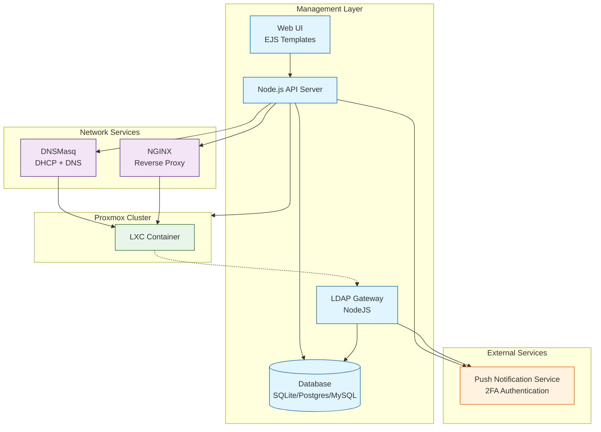
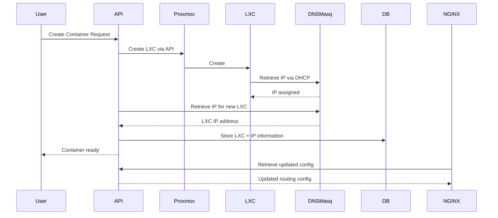
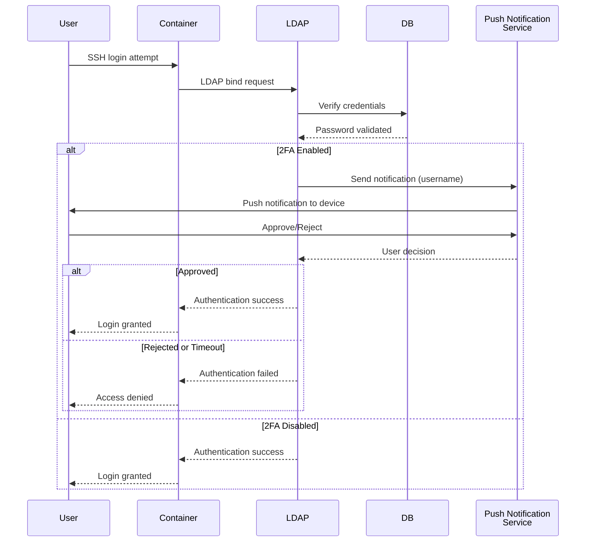
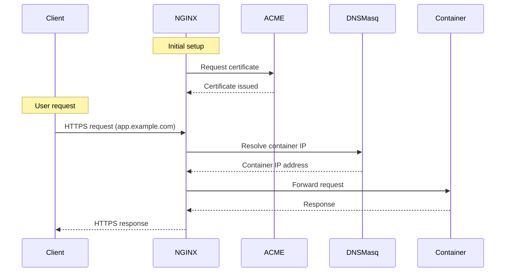

# System Architecture

## Overview

## Components

| Component | Role |
|-----------|------|
| **Proxmox VE 13+** | Hypervisor — manages LXC containers via REST API. [Nodes](/docs/admins/core-concepts/nodes) are registered Proxmox servers. |
| **DNSMasq** | DHCP + DNS. Auto-assigns IPs to containers, provides internal name resolution (`container.cluster.internal`). |
| **NGINX** | Reverse proxy — L7 (HTTP/HTTPS with auto TLS via ACME) and L4 (TCP port mapping). Config auto-generated from container services. |
| **LDAP Gateway** | Node.js LDAP server ([source](https://github.com/mieweb/LDAPServer)). Reads users/groups from the DB; containers authenticate via PAM/SSSD. |
| **Push Notification Service** | 2FA via push notifications ([source](https://github.com/mieweb/mieweb_auth_app)). Configured in [Settings](/docs/admins/settings). Used by LDAP gateway when `AUTH_BACKENDS` includes `notification`. |
| **Database** | SQLite (default), PostgreSQL, or MySQL via Sequelize ORM. Stores users, groups, sites, nodes, containers, and service config. |

## Data Flow

### Container Creation

### User Authentication

### HTTP Service Exposure

