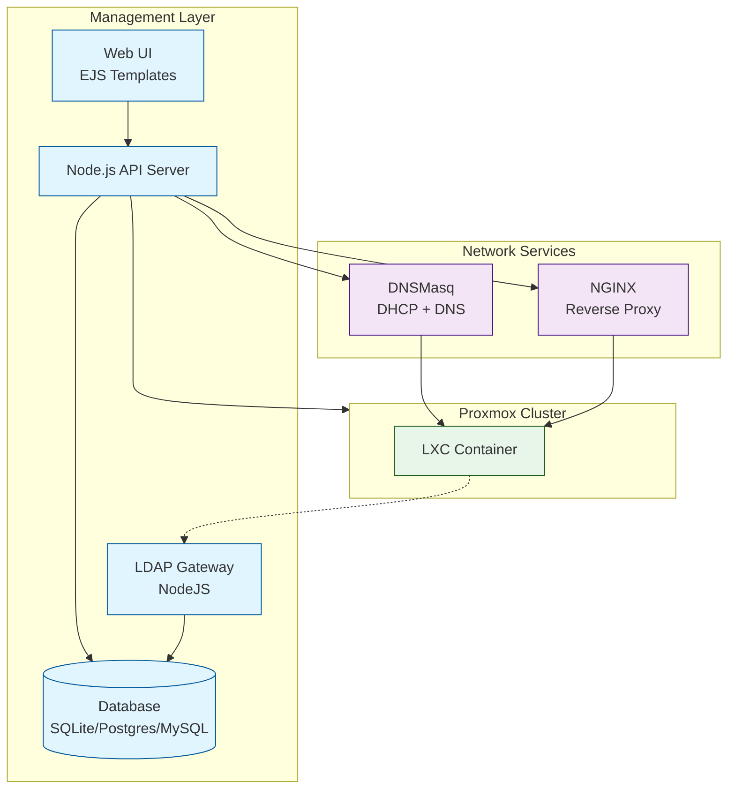
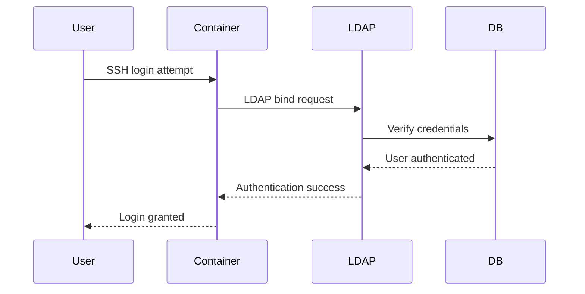

# System Architecture

The MIE Opensource Proxmox Cluster is built on a carefully integrated stack of open-source technologies that work together to provide automated container hosting and management.

## System Architecture

## Core Components

### Proxmox VE 13+

**Proxmox Virtual Environment** serves as the hypervisor layer, providing virtualization capabilities through KVM and LXC. Version 13 or higher is required for OCI image support.

**Key Features:**
- LXC (Linux Containers) management for lightweight compute nodes
- API-driven automation for container lifecycle management
- Web interface for manual container administration
- Clustering support for high availability

**Integration:**
- The management API communicates with Proxmox via REST API
- [Nodes](/docs/admins/nodes) are registered Proxmox servers in the cluster
- [Containers](/docs/admins/containers) are LXC instances managed by Proxmox

### DNSMasq

**DNSMasq** provides both DHCP and DNS services for the cluster network.

**DHCP Functionality:**
- Automatically assigns IP addresses to new containers from the configured range
- Containers and [nodes](/docs/admins/nodes) reserve their assigned IPs for stability
- IP reservations persist across container restarts and lifecycle events

**DNS Functionality:**
- Provides name resolution for containers within the cluster
- Internal domain structure: `container-name.cluster.internal`
- Forwards external DNS queries to configured upstream servers

**Integration:**
- Management API updates DNSMasq configuration when containers are created/destroyed
- IP assignments are tracked in the backend database
- DNS records are automatically created for all cluster resources

### NGINX

**NGINX** handles all ingress traffic to containers, supporting both HTTP/HTTPS and TCP protocols.

**Layer 7 HTTP Proxying:**
- Terminates TLS for HTTPS traffic
- Routes requests based on hostname/subdomain
- Automatically obtains and renews SSL certificates for [external domains](/docs/admins/external-domains)
- Supports multiple domains and subdomains per container

**Layer 4 TCP Proxying:**
- Proxies non-HTTP protocols (SSH, databases, custom services)
- Port mapping from external ports to container services
- Transparent connection handling

**Integration:**
- Configuration is automatically generated based on container services
- Certificate management integrated with ACME providers (Let's Encrypt)
- Dynamic backend resolution using DNSMasq for container IPs

### LDAP Gateway

The **LDAP Gateway** is a Node.js-based LDAP server that provides centralized authentication for all cluster services.

**Repository:** [github.com/mieweb/LDAPServer](https://github.com/mieweb/LDAPServer)

**Functionality:**
- Serves LDAP authentication requests from containers
- Retrieves user and group data from the backend database
- Provides unified login credentials across all cluster resources
- Integrates with standard PAM/NSS on Linux containers

**User Management:**
- Users authenticate with cluster-wide credentials
- Group memberships determine access permissions
- Password changes propagate immediately to all services

**Integration:**
- Containers configure PAM to authenticate against the LDAP server
- All users in the `ldapusers` group can SSH into containers
- User data synchronized from the backend database

### Backend Database

The **backend database** stores all cluster state and configuration.

**Supported Databases:**
- **SQLite** (default): Simple file-based database, no additional setup required
- **PostgreSQL**: Production-grade relational database for larger deployments
- **MySQL**: Alternative production database option

**ORM Abstraction:**
- Uses Sequelize ORM for database abstraction
- Allows switching between database backends without code changes
- Handles migrations for schema updates

**Stored Data:**
- User accounts and authentication credentials
- Group definitions and memberships
- Site configurations (network settings, domains)
- Node registrations (Proxmox API endpoints)
- Container metadata (IPs, ports, services)
- Service exposure rules and SSL certificate info

## Data Flow

### Container Creation

### User Authentication

### HTTP Service Exposure

## Next Steps

For more information:

- [Development Workflow](development-workflow): Set up your development environment
- [Contributing](contributing): Learn how to contribute to the project
- [Administrator Documentation](/docs/admins/): Configure and manage the cluster
- [User Documentation](/docs/users/creating-containers/basic-containers/web-gui): Create and deploy containers
- [GitHub Repository](https://github.com/mieweb/opensource-server): Source code and issues
- [GitHub Repository](https://github.com/mieweb/opensource-server): Source code and issues

