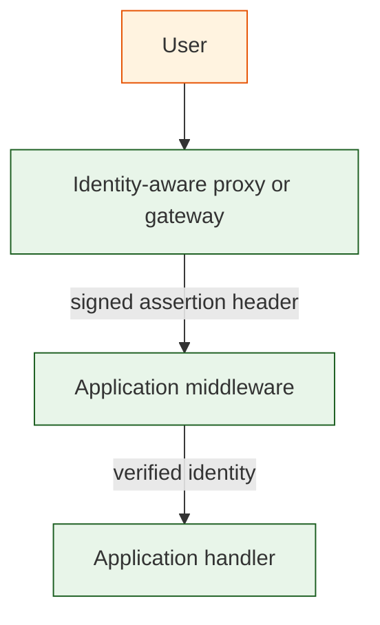

# Trusted proxy auth libraries

`proxy-auth-lib/` contains vendor-neutral middleware examples for applications that sit behind an identity-aware proxy or access gateway.

## Problem boundary

The middleware validates a signed JWT/JWS assertion from a trusted upstream component. It does not implement login flows, browser sessions, or authorization policy.

## Trust model



Never trust raw identity headers such as `X-Forwarded-User`, `X-User`, `X-Email`, or `Remote-User` without cryptographic verification. The examples in this repository require a signed assertion, a JWKS, an expected issuer, an expected audience, and a valid expiration time.

## Shared configuration

Every setting is optional. By default the auth domain is derived from the host's FQDN (`web1.os.example.org` → `auth.os.example.org`); the issuer and JWKS URL come from that domain. Override any single value with its own variable.

| Variable | Default | Purpose |
|---|---|---|
| `TRUSTED_PROXY_AUTH_DOMAIN` | `auth.<parent-domain-of-hostname>` | Base domain used to derive the issuer and JWKS URL |
| `TRUSTED_PROXY_ASSERTION_HEADER` | `X-Trusted-Proxy-Assertion` | Header containing the signed assertion |
| `TRUSTED_PROXY_JWKS_URL` | `https://<domain>/.well-known/jwks.json` | JWKS URL for key discovery |
| `TRUSTED_PROXY_ISSUER` | `https://<domain>` | Expected issuer |
| `TRUSTED_PROXY_AUDIENCE` | `https://<domain>` | Expected audience |
| `TRUSTED_PROXY_PUBLIC_KEY` | _(unset)_ | Inline PEM public key; skips JWKS and verifies offline |
| `TRUSTED_PROXY_PUBLIC_KEY_FILE` | _(unset)_ | Path to a PEM public key (alternative to the inline form) |

### Key source: JWKS vs static public key

JWKS is preferred and is the default: it supports key rotation and is what OIDC providers (Authentik, Cloudflare Access, Pomerium) publish. A static public key is an opt-in alternative for the self-signed case where your own proxy mints assertions with a key you control. When `TRUSTED_PROXY_PUBLIC_KEY` (or `_FILE`) is set, verification uses it directly and never calls the network; otherwise the JWKS URL is used. Either way the algorithm is pinned to `RS256`.

## Implemented MVP targets

| Language | Framework target | Package path |
|---|---|---|
| Node.js | Express-style middleware | `proxy-auth-lib/nodejs/` |
| Python | ASGI middleware for FastAPI / Starlette-style apps | `proxy-auth-lib/python/` |
| Rust | Axum middleware | `proxy-auth-lib/rust/` |
| Go | `net/http` middleware | `proxy-auth-lib/go/` |

## Vendor-neutral examples

Cloudflare Access, Pomerium, OAuth2 Proxy, Envoy `ext_authz`, Traefik ForwardAuth, NGINX `auth_request`, and custom gateways all fit the same pattern when they can forward a signed assertion. The application should trust the signature and claims, not the proxy brand.

## Verified identity examples

### Node.js

```js
app.use(createTrustedProxyAuth(loadConfigFromEnv()));
app.get('/me', (req, res) => res.json(req.trustedProxyIdentity));
```

### Python

```python
app = TrustedProxyAuthMiddleware(app, load_config_from_env())
# request.scope["trusted_proxy_identity"] inside the downstream app
```

### Rust

```rust
let app = Router::new()
    .route("/me", get(handler))
    .layer(middleware::from_fn_with_state(auth.clone(), axum_middleware));
```

### Go

```go
mux.Handle("/me", auth.Middleware(http.HandlerFunc(func(w http.ResponseWriter, r *http.Request) {
    identity, _ := trustedproxyauth.IdentityFromContext(r.Context())
    json.NewEncoder(w).Encode(identity)
})))
```
