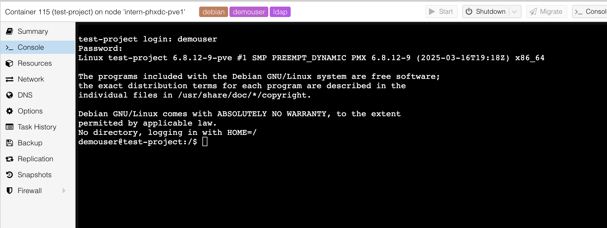

# Monitoring Container in Proxmox Web GUI

Once you have created a container, whether through the Web GUI, command line, or Proxmox Launchpad, you can monitor the container's performance using the Proxmox Web GUI located at [https://opensource.mieweb.org:8006](https://opensource.mieweb.org:8006).

## Container Dashboard

Upon logging in, you can see a dashboard with all of your active containers:

> In this screenshot, I have one active container called test-project with a CTID of 115.

Each container ID has a tag of the OS and your username.

## Accessing Container Metrics

Double click on the container that you want to manage.

The container dashboard allows you to view the CPU usage, the Memory usage, the SWAP usage, and the SSD of your container. At the top, there are progress bars which show your usage compared to the amount of resource you have allocated.

Proxmox also provides graphs that show your container's usage of a certain metric oer a period of time (usually an hour by default).

:::important Important
It is very important to monitor you container metrics at regular intervals, especially if your container is slow (ie, packages not installing quickly/hanging, etc.). If your application is constantly using 80% or more of a metric, reach out to an MIE cluster admin and we can upgrade that resource for your container.
:::

## Accessing Container Shell

You can also access your container's shell right from Proxmox.

:::note Only use Proxmox Shell when Necessary
It is recommended to modify your container using a terminal on your local machine on a regular basis.
:::