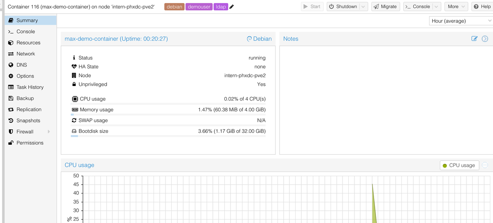

# Using the API with curl

!!! tip "Interactive API Docs"

    Your server hosts interactive Swagger documentation at [`{{ manager_url }}/api`]({{ manager_url }}/api) with a "Try it out" console and full request/response schemas. The OpenAPI spec is served at `/api/v1/openapi.yaml`.

The API is a JSON-only REST API served under the **`/api/v1`** base path.

**Prerequisites:**

* An active account, an [API key](./api-keys.md), `curl`, and your **site ID** (visible in the web interface URL, e.g. `/sites/1/...`).

## Authentication

Pass your API key as a Bearer token. All examples below set a reusable variable:

```bash
API="{{ manager_url }}/api/v1"
KEY="your_api_key_here"
```

Every request sends `Authorization: Bearer $KEY`. CSRF tokens are **not** required for Bearer-authenticated requests (they apply only to browser session auth).

## Response Envelope

Successful responses wrap the payload in a `data` key; errors use an `error` object:

```json
{ "data": { "id": 1, "hostname": "my-app" } }
```

```json
{ "error": { "code": "invalid_request", "message": "hostname is required" } }
```

`curl ... | jq .data` is a convenient way to read results.

## 1. List External Domains

You need an external domain's `id` to expose HTTP services (and TLS-terminated TCP services). List the domains available to you:

```bash
curl -s "$API/external-domains" -H "Authorization: Bearer $KEY" | jq '.data'
```

## 2. Discover Image Metadata (optional)

Inspect a Docker image's exposed ports, entrypoint, and environment before creating a container:

```bash
curl -s -G "$API/sites/1/containers/metadata" \
  -H "Authorization: Bearer $KEY" \
  --data-urlencode 'image=ghcr.io/mieweb/opensource-server/base:latest' | jq '.data'
```

## 3. Create a Container

Send a JSON body to `POST /sites/{siteId}/containers`. A least-loaded node in the site is selected automatically — you do not choose a node.

```bash
curl -s -X POST "$API/sites/1/containers" \
  -H "Authorization: Bearer $KEY" \
  -H 'Content-Type: application/json' \
  -d '{
    "hostname": "my-app",
    "template": "ghcr.io/mieweb/opensource-server/base:latest",
    "services": {
      "ssh":  { "type": "tcp",  "internalPort": 22 },
      "web":  { "type": "http", "internalPort": 3000, "externalHostname": "my-app", "externalDomainId": 1 }
    }
  }' | jq '.data'
```

On success this returns `201` with the new container ID and the creation job ID:

```json
{ "data": { "containerId": 42, "jobId": 100, "hostname": "my-app", "status": "pending" } }
```

Watch the job to completion — see [Track the Creation Job](#5-track-the-creation-job).

### Request Fields

| Field | Required | Description |
|-------|----------|-------------|
| `hostname` | yes | Lowercase letters, digits, hyphens. |
| `template` | yes | A Docker image reference (e.g. `ghcr.io/mieweb/opensource-server/base:latest`, `docker.io/library/nginx:latest`). Use the literal string `custom` together with `customTemplate` to supply an image not in the standard list. |
| `customTemplate` | no | Image reference used when `template` is `"custom"`. |
| `entrypoint` | no | Override the container entrypoint. |
| `nvidiaRequested` | no | `true` to schedule on an NVIDIA-capable node and inject GPU env vars. |
| `environmentVars` | no | Array of `{ "key": "...", "value": "..." }` objects. |
| `services` | no | An **object** whose keys are arbitrary labels and whose values are service definitions (see below). |

### Services

`services` is a JSON object (a map), not an array. The keys (`"ssh"`, `"web"`, … above) are arbitrary labels you choose; only the values matter:

| Type | Required fields | Notes |
|------|-----------------|-------|
| `tcp` | `internalPort` | External port auto-assigned. For TLS termination, also send `tls: true` with `externalHostname` + `externalDomainId` (see below). |
| `udp` | `internalPort` | External port auto-assigned (range 2000–65535). |
| `http` | `internalPort`, `externalHostname`, `externalDomainId` | Public side is always HTTPS. |
| `https` | `internalPort`, `externalHostname`, `externalDomainId` | Same as `http` but the proxy talks HTTPS to your backend. |
| `srv` | `internalPort`, `dnsName` | DNS SRV record, e.g. `_ldap._tcp`. |

!!! note

    Add a `tcp` service with `internalPort: 22` to expose SSH. Its external port is auto-assigned; read it back from the container detail (`sshPort`) once created.

#### TLS-Terminated TCP Service

To have the load balancer terminate TLS for a TCP service (using the same certificate as the matching HTTP domain), set `tls: true` and provide an external domain. TLS is supported for `tcp` only, not `udp`.

```bash
curl -s -X POST "$API/sites/1/containers" \
  -H "Authorization: Bearer $KEY" \
  -H 'Content-Type: application/json' \
  -d '{
    "hostname": "my-db",
    "template": "docker.io/library/postgres:16",
    "services": {
      "pg": {
        "type": "tcp",
        "internalPort": 5432,
        "tls": true,
        "externalHostname": "db",
        "externalDomainId": 1
      }
    }
  }' | jq '.data'
```

## 4. List Your Containers

```bash
# All containers in a site
curl -s "$API/sites/1/containers" -H "Authorization: Bearer $KEY" | jq '.data'

# A single container (note the auto-assigned sshPort and service externalPorts)
curl -s "$API/sites/1/containers/42" -H "Authorization: Bearer $KEY" | jq '.data'
```

The container payload includes `status`, `ipv4Address`, `sshPort`, and a `services` array where each transport service reports its auto-assigned `externalPort`.

## 5. Track the Creation Job

Container creation is asynchronous. Use the `jobId` from the create response:

```bash
# Poll job metadata (status: pending | running | completed | failed)
curl -s "$API/jobs/100" -H "Authorization: Bearer $KEY" | jq '.data.status'

# Read job log lines
curl -s "$API/jobs/100/status" -H "Authorization: Bearer $KEY" | jq '.data'

# Or follow the live Server-Sent Events stream
curl -N "$API/jobs/100/stream" -H "Authorization: Bearer $KEY"
```

## 6. Update or Delete a Container

```bash
# Update services, environment variables, or entrypoint. Existing services are
# immutable (except auth) — delete and re-add to change them. Applying changes
# may enqueue a restart job.
curl -s -X PUT "$API/sites/1/containers/42" \
  -H "Authorization: Bearer $KEY" \
  -H 'Content-Type: application/json' \
  -d '{ "services": { "extra": { "type": "tcp", "internalPort": 8080 } } }' | jq '.data'

# Restart only (no other changes)
curl -s -X PUT "$API/sites/1/containers/42" \
  -H "Authorization: Bearer $KEY" \
  -H 'Content-Type: application/json' \
  -d '{ "restart": true }' | jq '.data'

# Delete (also cleans up DNS; returns any warnings)
curl -s -X DELETE "$API/sites/1/containers/42" -H "Authorization: Bearer $KEY" | jq '.data'
```

## 7. Access Your Container

**SSH:** `ssh -p <sshPort> <username>@<hostname>.<domain>`

**HTTP:** `https://<externalHostname>.<externalDomain>`

**Proxmox console:** [{{ proxmox_url }}]({{ proxmox_url }}) — your container is listed with your username in the tags field.


