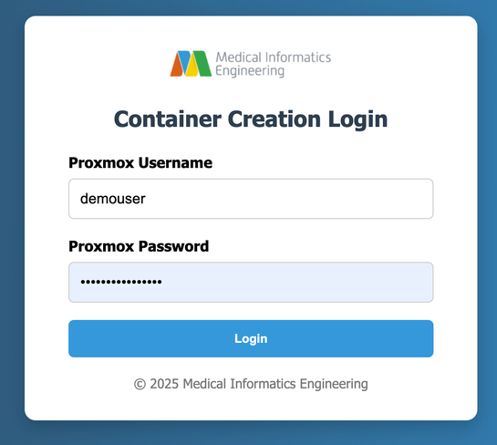
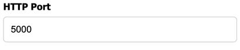

import { ProxmoxUrl, ContainerCreationUrl } from '@site/src/components/InstanceUrl';

# Using the Web GUI
:::note Note
This walkthrough assumes that you already have a registered proxmox account in the cluster. If not, see [Introduction](/docs/intro).
:::

This guide shows you how to set up a basic LXC container on the MIE Opensource Proxmox Cluster using the a Web GUI. The Web GUI can be accessed at <ContainerCreationUrl><ContainerCreationUrl /></ContainerCreationUrl>.

## 1. Authenticate Your Proxmox Account
 
Upon navigating, you will be prompted for your Proxmox Login Credentials, as shown in the image below:



**Options:**
- Enter your valid Proxmox username and password
- If authentication fails, you'll see a "Invalid username or password" message and be prompted again.

## 2. Choose a Container Hostname

This will be your container's subdomain:


**Options:**
- Use a single word containing only letters, numbers, and hyphens (e.g., `myapp`, `test-api`)
- The hostname will be available at `your-hostname.opensource.mieweb.org`
- If the name is already taken or contains invalid characters, you'll be asked to choose another

## 3. Select a Linux Distribution

This dropdown presents available distributions:


**Options:**
- Type `debian` for Debian 12 (Bookworm)
- Type `rocky` for Rocky Linux 9
- Any invalid input defaults to Debian

## 4. Set the HTTP Port

Specify which port your application will listen on:



**Options:**
- Any number between 80 and 60,000
- Common choices: 80, 3000, 8080, 5000, 8000
- Invalid entries will prompt you to try again

## 5. Configure SSH Access

Enter a public key from your local machine:


**Options:**
- Enter your SSH public key (starts with `ssh-rsa`, `ssh-ed25519`, etc.)
- Leave blank to skip SSH key configuration
- Invalid keys will prompt for a valid key or blank entry

:::important Important
Entering a public key is highly recommended. It will allow you to access the create-container command line setup without entering a password. Additionally, it will allow you to SSH to your container without having to input your proxmox password, making the connection process faster and more secure.

To create a private/public key pair on your machine, reference [this guide](https://docs.github.com/en/authentication/connecting-to-github-with-ssh/generating-a-new-ssh-key-and-adding-it-to-the-ssh-agent#generating-a-new-ssh-key).
:::

## 6. Container Creation Process

After providing all required information, the system will:
1. Transfer your configuration to the hypervisor
2. Begin the container creation process
3. Set up networking, DNS, and reverse proxy
4. Configure the container with your specified settings
5. Deploy your application if requested

Once the container creation process is complete, your container will be accessible via an ssh command in the form of:

```
ssh -p <your-container-port> <proxmox-username>@opensource.mieweb.org
```

## 7. Understanding the Output

Once your container is created, you will receieve an output that looks somthing like this:

```
━━━━━━━━━━━━━━━━━━━━━━━━━━━━━━━━━━━━━━━━━━━━━━━━━━━━━━━━━━━━
🔔  COPY THESE PORTS DOWN — For External Access
━━━━━━━━━━━━━━━━━━━━━━━━━━━━━━━━━━━━━━━━━━━━━━━━━━━━━━━━━━━━
📌  Note: Your container listens on SSH Port 22 internally,
    but EXTERNAL traffic must use the SSH port listed below:
━━━━━━━━━━━━━━━━━━━━━━━━━━━━━━━━━━━━━━━━━━━━━━━━━━━━━━━━━━━━
✅  Hostname Registration: max-demo-container → 10.15.19.181
🔐  SSH Port               : 2376
🌐  HTTP Port              : 3000
━━━━━━━━━━━━━━━━━━━━━━━━━━━━━━━━━━━━━━━━━━━━━━━━━━━━━━━━━━━━
📦  Container ID        : 116
🌐  Internal IP         : 10.15.19.181
🔗  Domain Name         : https://max-demo-container.opensource.mieweb.org
🛠️  SSH Access          : ssh -p 2376 demouser@max-demo-container.opensource.mieweb.org
🔑  Container Password  : Your proxmox account password
━━━━━━━━━━━━━━━━━━━━━━━━━━━━━━━━━━━━━━━━━━━━━━━━━━━━━━━━━━━━
NOTE: Additional background scripts are being ran in detached terminal sessions.
Wait up to two minutes for all processes to complete.
━━━━━━━━━━━━━━━━━━━━━━━━━━━━━━━━━━━━━━━━━━━━━━━━━━━━━━━━━━━━
Still not working? Contact Max K. at maxklema@gmail.com
━━━━━━━━━━━━━━━━━━━━━━━━━━━━━━━━━━━━━━━━━━━━━━━━━━━━━━━━━━━━
```

:::important Important
Your container password is the same as your Proxmox Account Password.
:::

The first block will list all of the ports that your container uses. By default, it will display an SSH Port and an HTTP Port. If you added any other special protocols, they will appear there as well.

```
━━━━━━━━━━━━━━━━━━━━━━━━━━━━━━━━━━━━━━━━━━━━━━━━━━━━━━━━━━━━
✅  Hostname Registration: max-demo-container → 10.15.19.181
🔐  SSH Port               : 2376
🌐  HTTP Port              : 3000
━━━━━━━━━━━━━━━━━━━━━━━━━━━━━━━━━━━━━━━━━━━━━━━━━━━━━━━━━━━━
```

The second block contains network information about your container specifically, including its IP address, public domain name, and ssh command:

```
━━━━━━━━━━━━━━━━━━━━━━━━━━━━━━━━━━━━━━━━━━━━━━━━━━━━━━━━━━━━
📦  Container ID        : 116
🌐  Internal IP         : 10.15.19.181
🔗  Domain Name         : https://max-demo-container.opensource.mieweb.org
🛠️  SSH Access          : ssh -p 2376 demouser@max-demo-container.opensource.mieweb.org
🔑  Container Password  : Your proxmox account password
━━━━━━━━━━━━━━━━━━━━━━━━━━━━━━━━━━━━━━━━━━━━━━━━━━━━━━━━━━━━
```

:::note Note
The IP that is given is an **internal IP** allocated by our local DHCP server. It is not public. Additionally, since we are setting up a basic container, nothing will be deployed yet, so navigating to the domain will return a 502 bad gateway error from our nginx server. This is expected.
:::

:::warning Warning
Save your SSH port number, as well as any port numbers, because you will not be able to see them again. This will be fixed at a later time.
:::

## 8. Viewing your Container on Proxmox

To see your container on the Proxmox GUI, navigate to <ProxmoxUrl><ProxmoxUrl /></ProxmoxUrl>. Once signed in, on the summary view, you should see the name of your container. If you double click on it, you will be able to access details, like the shell, metrics, and other network/filesystem information.


:::note Note
As of writing, you are able to reboot, start, and shutdown your container as you please. However, you must reach out to a cluster admin to delete your container.
:::

---

## Docker Container Configuration

When creating containers from Docker images, you can configure additional settings that are specific to containerized applications.

### Environment Variables

Environment variables allow you to pass configuration to your containerized application at runtime. These are commonly used for:
- Database connection strings
- API keys and secrets
- Feature flags
- Application modes (development, production, etc.)

To add environment variables, expand the **Environment Variables** section and click **Add Variable** to create key-value pairs.

:::warning System Containers
Environment variables are intended for **Docker-based containers** only. System containers (created from Proxmox templates like Debian or Rocky Linux) typically expect `init` as PID 1 and may not use environment variables in the same way. If you're using a standard Linux template, you generally don't need to set environment variables here.
:::

### Entrypoint Command

The entrypoint command overrides the default startup command for a Docker container. This is useful when you need to:
- Run a specific script or binary
- Pass custom arguments to your application
- Chain multiple startup commands

:::warning System Containers
The entrypoint command is intended for **Docker-based containers** only. System containers expect `init` as PID 1 and should not have their entrypoint overridden. Changing the entrypoint on a system container may prevent it from starting correctly.
:::

### Restarting After Configuration Changes

When you modify environment variables or the entrypoint command on an existing container, the system will automatically restart the container to apply the changes. You can monitor the restart progress from the container list page.

---

**Need Help?**: For questions about container configuration or troubleshooting, contact the MIE team.
