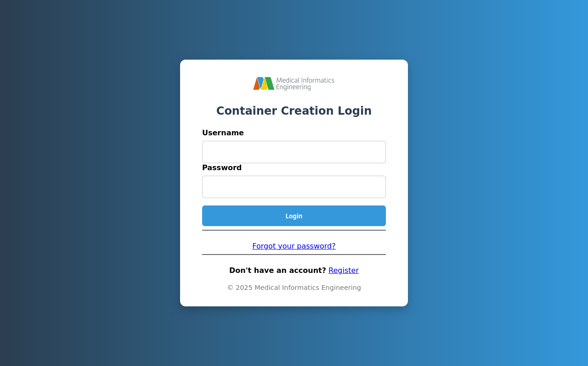
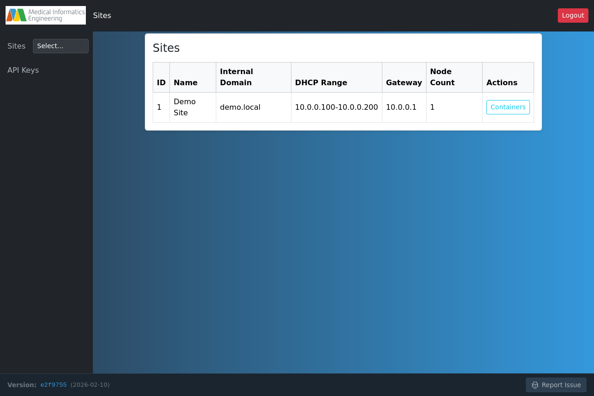
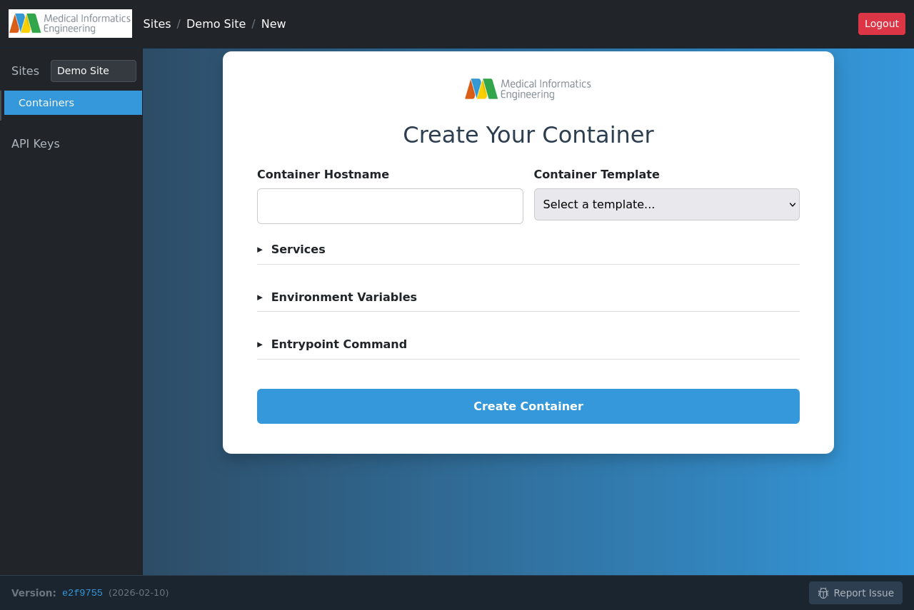
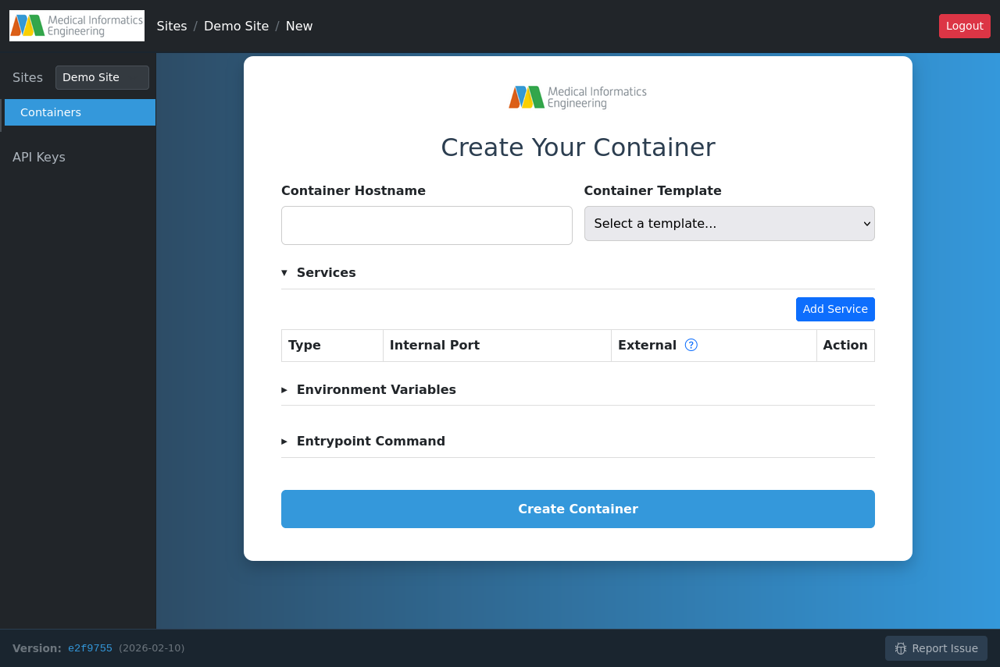
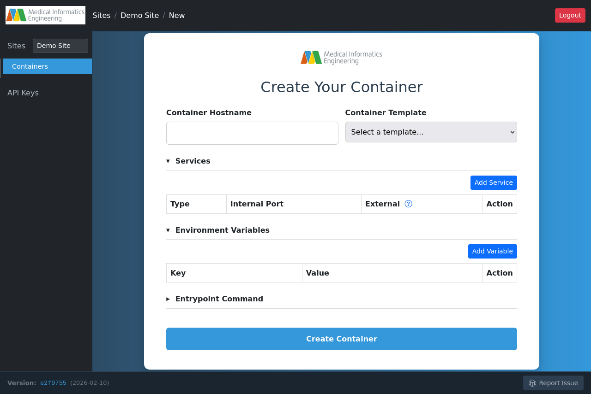
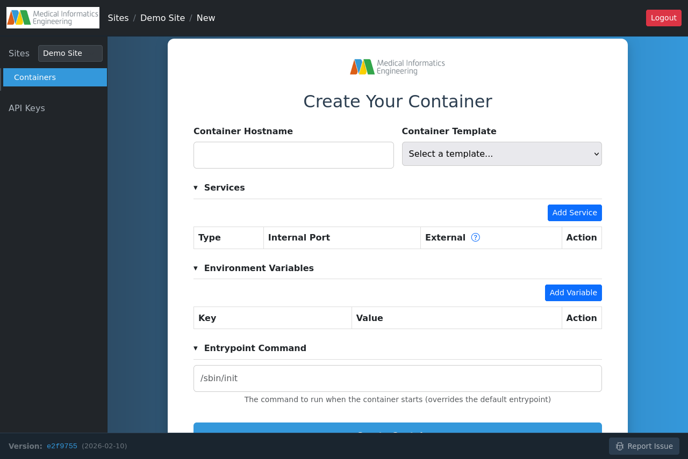

import { ProxmoxUrl, ContainerCreationUrl } from '@site/src/components/InstanceUrl';

# Using the Web GUI

This guide shows you how to create and manage LXC containers using the web-based graphical interface.

## Prerequisites

- A registered account in the system
- At least one configured site with Proxmox nodes
- For first-time users, see the [Introduction](/docs/intro) for account setup

## Logging In

Navigate to the web interface and enter your credentials:



**Login Details:**
- **Username**: Your account username
- **Password**: Your account password

If you don't have an account, click "Register" to create one.

:::info First Time Registration
New registrations require administrator approval before you can log in. You'll receive an email notification once your account is approved.
:::

## Navigating the Interface

After logging in, you'll see the main navigation:

### Top Navigation
- **MIE Logo**: Return to the main dashboard
- **Breadcrumbs**: Show your current location (Sites / Site Name / Page)
- **Logout**: Sign out of your session

### Sidebar
- **Sites**: View and manage all sites
- **Site Selector**: Quickly switch between sites
- **Containers**: View containers for the selected site (when a site is selected)
- **API Keys**: Manage your API authentication tokens

## Selecting a Site

Before creating containers, you must select a site. The site determines which Proxmox cluster and network configuration will be used.



**Site Information Displayed:**
- **ID**: Unique site identifier
- **Name**: Human-readable site name
- **Internal Domain**: DNS domain for containers (e.g., `demo.local`)
- **DHCP Range**: IP address pool for containers
- **Gateway**: Network gateway address
- **Node Count**: Number of Proxmox nodes in this site

Click **Containers** to view and manage containers for a specific site.

## Viewing Your Containers

After selecting a site, you'll see your container list:


**Container Information:**
- **Hostname**: Container's network hostname
- **Status**: Current state (pending, creating, running, stopped, failed)
- **IPv4**: Internal IP address assigned by DHCP
- **Template**: The image or template used to create the container
- **Node**: Which Proxmox node hosts this container
- **SSH Port**: External SSH port for remote access
- **HTTP Port**: External HTTP port (if configured)
- **Actions**: Start, stop, restart, configure, or delete

Click **New Container** to create a new container.

## Creating a Container

### Step 1: Container Basics



Fill in the basic information:

**Container Hostname**
- A unique name for your container
- Must contain only lowercase letters, numbers, and hyphens
- Will be used as the subdomain (e.g., `myapp.demo.local`)
- Examples: `web-server`, `api-backend`, `test-env`

**Container Template**
- Select from available templates or choose "Custom Docker Image..."
- **Proxmox Templates**: Pre-configured LXC templates (Debian, Ubuntu, etc.)
- **Docker Images**: Pull from container registries (Docker Hub, GHCR, etc.)

:::tip Docker Image Format
When using custom Docker images, use the full registry path:
- `docker.io/library/nginx:latest`
- `ghcr.io/mieweb/opensource-server/base:main`
:::


### Step 2: Configure Services (Optional)

Expand the **Services** section to expose container ports:



**Adding a Service:**
1. Click **Add Service**
2. Select service **Type** (SSH, HTTP, HTTPS, Custom)
3. Enter the **Internal Port** your application listens on
4. External port will be automatically assigned
5. Click **Add** to save

**Common Service Examples:**
- SSH: Internal port 22
- HTTP: Internal port 80, 3000, 8080
- HTTPS: Internal port 443
- Custom: Any port your application uses

:::info External Ports
External ports are automatically assigned from available ranges and used for accessing your container from outside the internal network.
:::

### Step 3: Environment Variables (Optional)

Expand **Environment Variables** to configure your application:



**Adding Variables:**
1. Click **Add Variable**
2. Enter the variable **Key** (e.g., `DATABASE_URL`, `API_KEY`)
3. Enter the **Value**
4. Click **Add** to save

**Common Use Cases:**
- Database connection strings
- API keys and secrets
- Application configuration (debug mode, port numbers)
- Feature flags

:::warning Docker Images Only
Environment variables are intended for Docker-based containers. System templates (Debian, Ubuntu) may not use them in the same way.
:::

### Step 4: Entrypoint Command (Optional)

Expand **Entrypoint Command** to override the startup command:



**Default Value:** `/sbin/init` (for system containers)

**When to Override:**
- Running a specific application binary
- Starting with custom arguments
- Chaining multiple commands
- Using Docker containers with custom startup scripts

**Examples:**
- `/usr/bin/python app.py`
- `/bin/bash -c "npm start"`
- `/usr/local/bin/my-application --config=/etc/app.conf`

:::warning System Containers
Do not change the entrypoint for system templates (Debian, Ubuntu, etc.). They expect `/sbin/init` as PID 1. Changing it will prevent the container from starting properly.
:::

### Step 5: Create the Container

Once you've configured all settings, click **Create Container**.

The system will:
1. Validate your configuration
2. Queue a creation job
3. Allocate a container ID (VMID) from Proxmox
4. Pull the Docker image or clone the template
5. Configure networking and services
6. Start the container
7. Assign IP address via DHCP
8. Configure DNS and reverse proxy

:::info Creation Time
Container creation typically takes 1-3 minutes depending on the image size and whether it needs to be pulled from a registry.
:::

## Monitoring Container Status

After creation, you can monitor your container's status from the containers list:

**Status Values:**
- **pending**: Waiting to be created
- **creating**: Currently being built and configured
- **running**: Container is active and accessible
- **stopped**: Container is stopped
- **failed**: Creation or startup failed (check job logs)

## Accessing Your Container

Once your container is running, you can access it via:

**SSH Access:**
```bash
ssh -p <SSH-PORT> <username>@<hostname>.<domain>
```

**HTTP Access:**
If you configured an HTTP service:
```
http://<hostname>.<domain>
```

or via the external port:
```
http://<gateway-ip>:<HTTP-PORT>
```

**Proxmox Console:**
You can also access the container console directly through the Proxmox web interface at <ProxmoxUrl />.

## Managing Containers

### Starting and Stopping

Use the **Actions** column to:
- **Start**: Power on a stopped container
- **Stop**: Gracefully shut down a container
- **Restart**: Stop and start the container
- **Force Stop**: Immediately kill the container process

### Editing Configuration

Click **Edit** to modify:
- Environment variables
- Entrypoint command
- Services (add/remove ports)

:::info Restart Required
Changing environment variables or entrypoint requires a container restart to take effect.
:::

### Deleting Containers

Click **Delete** to permanently remove a container.

:::danger Data Loss
Deleting a container is permanent and will erase all data inside it. Make sure to backup any important data first.
:::

## Troubleshooting

### Container Won't Start

**Check the status:**
- If status is "failed", check the creation job logs
- Verify the template/image name is correct
- Ensure the entrypoint command is valid for your image type

**Common Issues:**
- Wrong entrypoint for system containers (should be `/sbin/init`)
- Invalid Docker image reference
- Network connectivity issues pulling images
- Insufficient resources on Proxmox node

### Can't Connect via SSH

**Verify:**
- Container status is "running"
- Using the correct external SSH port
- Your SSH key is configured (if using key-based auth)
- Firewall allows the connection

### HTTP Service Not Accessible

**Check:**
- Your application is actually listening on the configured internal port
- Container status is "running"
- HTTP service was added during creation
- Using the correct external HTTP port or domain name

### Need Help?

For additional support:
- Check container logs in Proxmox console
- Review job logs for creation failures
- Contact your system administrator
- Report issues via the "Report Issue" link at the bottom of any page

---

## Next Steps

- [Learn about API Keys](./api-keys.mdx) for programmatic access
- [Use the Command Line](./command-line.mdx) for automation
- [Understand the System Architecture](../../developers/system-architecture.md)
