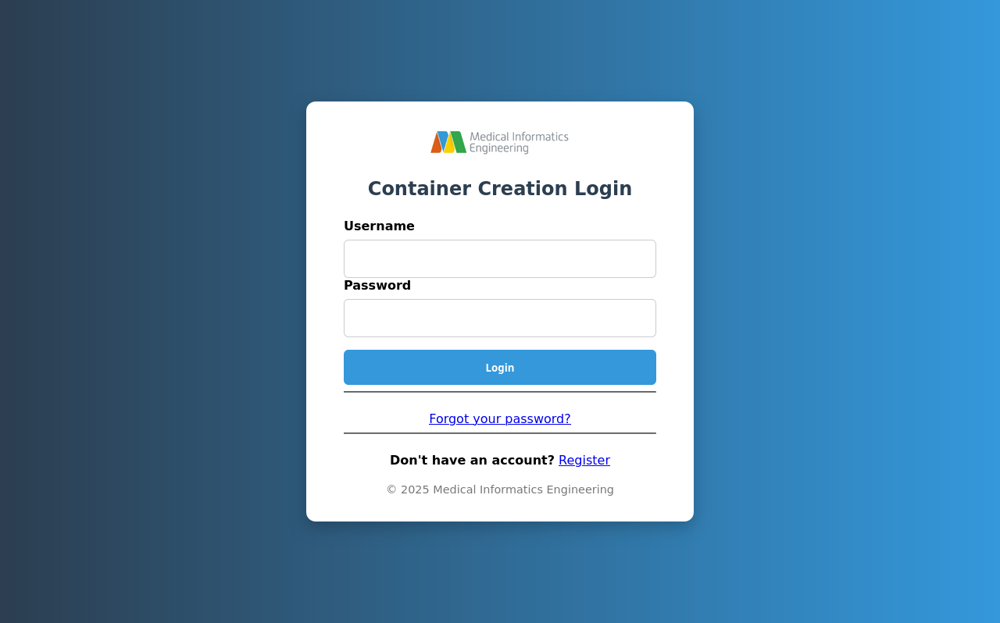
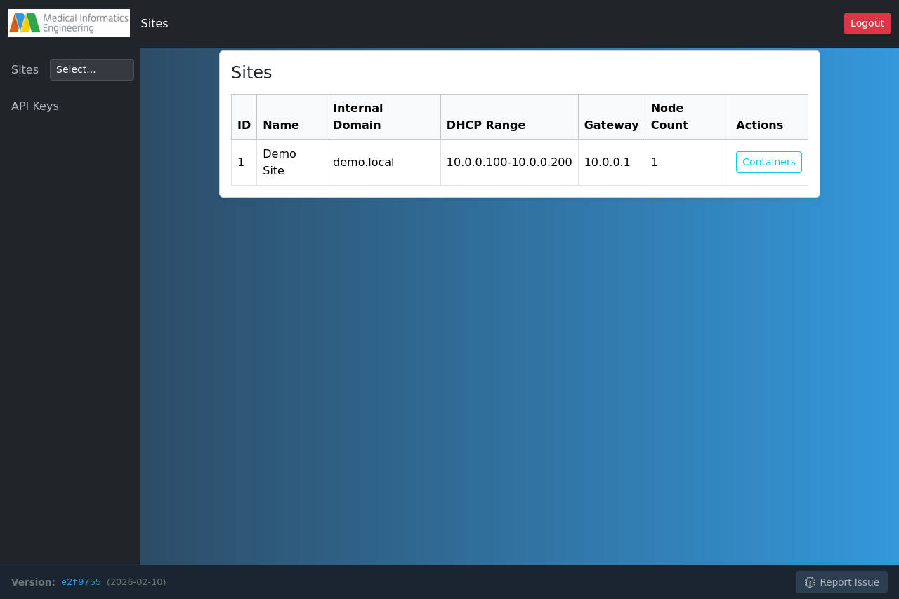
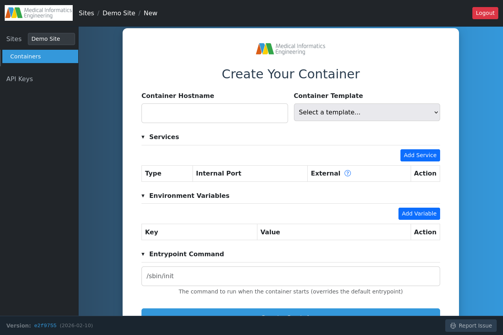

import { ProxmoxUrl, ContainerCreationUrl } from '@site/src/components/InstanceUrl';

# Using the Web GUI

Create and manage LXC containers through the web interface.

**Prerequisites:** A registered account and at least one configured site. See [Getting Started](/docs/users/getting-started) for account setup.

## Logging In

Navigate to the web interface and enter your credentials.

## Selecting a Site

Select a site before creating containers — the site determines the Proxmox cluster and network. Click **Containers** to view containers for a site.

## Creating a Container

Click **New Container** from the containers list.

### Hostname

Unique name (lowercase letters, numbers, hyphens). Containers within the same site can reach each other at `<hostname>.<internal domain>`.

### Template

Select a standard image or choose "Custom Docker Image..." for any registry image. Temlates auto-populate services, environment variables, and entrypoint.

- **Debian 13**: `ghcr.io/mieweb/opensource-server/base:latest`
- **NodeJS 24**: `ghcr.io/mieweb/opensource-server/nodejs:latest`
- **Custom**: Full registry path (e.g., `docker.io/library/nginx:latest`)

### Services (Optional)

Expose container ports. Click **Add Service**, select a type, and enter the internal port.

| Type | Description |
|------|-------------|
| **HTTP** | Reverse-proxies to the container over plain HTTP. Use when the backend listens on an unencrypted port. |
| **HTTPS** | Reverse-proxies to the container over HTTPS. Use when the backend terminates TLS itself. |
| **TCP / UDP** | Maps an auto-assigned external port to the container's internal port. |
| **SRV** | Creates a DNS SRV record for service discovery. |

Both HTTP and HTTPS services are served to the public over HTTPS with automatic TLS certificates — the type controls the protocol used between the reverse proxy and your container.

HTTP and HTTPS services require selecting an external domain; the hostname defaults to the container hostname. TCP/UDP services are auto-assigned an external port.

:::note
You'll need to add a TCP service with internal port 22 in order to expose the SSH connection to your container.
:::

### Environment Variables (Optional)

Key-value pairs written to `/etc/environment` in system containers. See [Building Custom Images](./using-environment-variables.mdx) for details on systemd integration.

### Entrypoint Command (Optional)

Default: `/sbin/init` for system containers.

:::warning
Changing the entrypoint for provided templates or derived images is not supported. This should only be used to add arguments to standard Docker images.
:::

### NVIDIA GPU (Optional)

If your site has NVIDIA-capable nodes (configured by an administrator), a **NVIDIA GPU** checkbox appears on the form. Checking it:

- Assigns the container to a node with GPU support
- Sets `NVIDIA_VISIBLE_DEVICES=all` and `NVIDIA_DRIVER_CAPABILITIES=utility compute` automatically
- Attaches the nvidia-container-toolkit hookscript for GPU passthrough

If no NVIDIA-capable nodes are available, the checkbox is greyed out with an explanation. You can override the auto-injected environment variables by explicitly setting `NVIDIA_VISIBLE_DEVICES` or `NVIDIA_DRIVER_CAPABILITIES` in the Environment Variables section.

### Submit

Click **Create Container**. You'll be redirected to a page to watch the creation job progress. After the creation finishes successfully, please allow up to 1 minute to allow the load balancer to reconfigure before your services are accessible.

## Accessing Your Container

**SSH:** `ssh -p <SSH-PORT> <username>@<hostname>.<domain>`

**HTTP:** `https://<hostname>.<domain>`

**Proxmox Console:** <ProxmoxUrl><ProxmoxUrl /></ProxmoxUrl>

## Managing Containers

- **Start/Stop/Restart/Force Stop** via the Actions column
- **Edit** to modify environment variables, entrypoint, or services (restart required)
- **Delete** to permanently remove (irreversible — back up data first)

