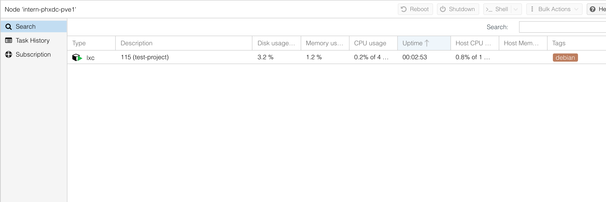
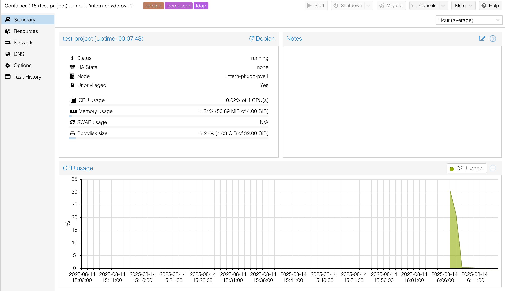
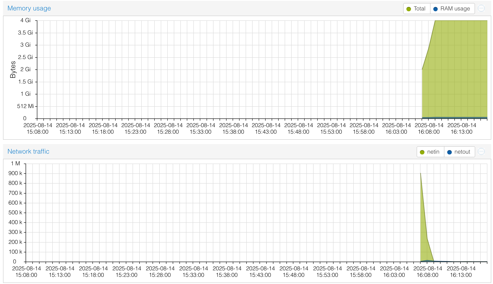

import { ProxmoxUrl } from '@site/src/components/InstanceUrl';

# Monitoring Containers in Proxmox

Monitor container performance in the Proxmox Web GUI at <ProxmoxUrl><ProxmoxUrl /></ProxmoxUrl>.

## Dashboard

After logging in, you'll see your active containers. Each has a tag showing the OS and your username.

## Metrics

Double-click a container to view CPU, memory, swap, and disk usage with progress bars and time-series graphs.

:::important
If any metric stays above 80%, contact an MIE cluster admin to upgrade that resource.
:::

## Shell Access

Access the container shell directly from Proxmox. Prefer using SSH from your local machine for regular work.

