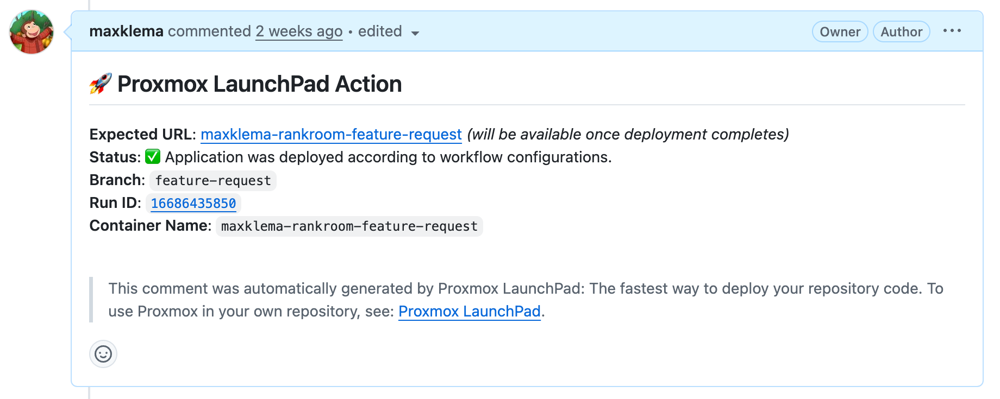

# Automatic Runner Provisioning (Path 2)

:::caution Outdated Documentation
This page predates the last major rewrite and may not be accurate. Check back weekly for updates.
:::

This guide covers **Path 2** of Proxmox Launchpad: automatic runner provisioning where our action creates and manages GitHub runners for you. Each branch gets its own dedicated runner and container with complete lifecycle management.

:::warning Security Consideration
**This pathway requires sharing your GitHub Personal Access Token** with our action to manage runners on your behalf. Only use this if you're comfortable with this security consideration.
:::

:::tip Enhanced Pull Request (PR) Integration
When you provide your GitHub PAT in the manage-container job, Proxmox Launchpad will automatically comment on pull requests with container access information, making it easy for collaborators to test your changes.
:::

## Prerequisites

Before getting started, ensure you have:

- **Valid Proxmox account** on the MIE cluster
- **GitHub Personal Access Token** with runner management permissions
- **Repository secrets** configured (see below)

### Repository Secrets Setup

Navigate to your repository settings and add these secrets:

| Secret Name | Description | Example |
|-------------|-------------|---------|
| `PROXMOX_USERNAME` | Your assigned Proxmox username | `john.doe` |
| `PROXMOX_PASSWORD` | Your assigned Proxmox password | `your-password` |
| `GH_PAT` | GitHub Personal Access Token with runner permissions | `ghp_xxxxxxxxxxxx` |

:::note Secret Management
Store these securely in your repository's **Settings > Secrets and variables > Actions**. Never commit credentials directly to your code.
:::

## GitHub Personal Access Token Setup

### Creating a GitHub PAT

To use automatic runner provisioning, you must create a GitHub Personal Access Token with runner management permissions:

1. **Navigate to GitHub settings**: Go to your GitHub account settings
2. **Access developer settings**: Click "Developer settings" (bottom left)
3. **Create new token**: Navigate to "Personal Access Tokens (classic)" → "Generate new token"
4. **Configure token**:
   - Give your token a descriptive name
   - Set an appropriate expiration date (No expiration date is not recommended)
   - **Select the `manage_runners:org` permission** (or `manage_runners:enterprise` for enterprise repositories)
5. **Generate and store**: Generate the token and store it securely
6. **Add to repository**: Add it as a repository secret named `GH_PAT`

:::warning PAT Security Warning
This PAT gives our action the ability to create, modify, and delete runners in your GitHub organization/repository. Store it securely and never share it publicly.
:::

### PAT Permissions Required

| Permission | Scope | Purpose |
|------------|-------|---------|
| `manage_runners:org` | Organization repositories | Create/delete runners for org repos |
| `manage_runners:enterprise` | Enterprise repositories | Create/delete runners for enterprise repos |

## Workflow Setup

### Required Workflow Triggers

All Proxmox Launchpad workflows must include these trigger events:

```yaml
on:
  push:     # Updates existing containers
  create:   # Creates containers for new branches
  delete:   # Removes containers when branches are deleted
```

### Dual-Job Configuration

Automatic runner provisioning requires **two jobs**: a setup job and a container management job:

```yaml
name: Proxmox Container Management (Auto Runners)

on:
  push:
  create:
  delete:

jobs:
  setup-runner:
    runs-on: ubuntu-latest
    steps:
      - name: Install Dependencies
        run: |
          sudo apt install -y sshpass jq

      - uses: maxklema/proxmox-launchpad@main
        with:
          proxmox_username: ${{ secrets.PROXMOX_USERNAME }}
          proxmox_password: ${{ secrets.PROXMOX_PASSWORD }}
          github_pat: ${{ secrets.GH_PAT }}

  manage-container:
    runs-on: self-hosted
    needs: setup-runner
    steps:
      - uses: maxklema/proxmox-launchpad@main
        with:
          proxmox_username: ${{ secrets.PROXMOX_USERNAME }}
          proxmox_password: ${{ secrets.PROXMOX_PASSWORD }}
          github_pat: ${{ secrets.GH_PAT }}  # Enables PR commenting
```

### Job Responsibilities

| Job | Purpose | Runner | Description |
|-----|---------|---------|-------------|
| `setup-runner` | Runner provisioning | `ubuntu-latest` | Creates dedicated runners for your branch |
| `manage-container` | Container management | `self-hosted` | Manages containers using the provisioned runner |

## Configuration Options

### Basic Container Properties

Configure your container's fundamental settings:

```yaml
- uses: maxklema/proxmox-launchpad@main
  with:
    proxmox_username: ${{ secrets.PROXMOX_USERNAME }}
    proxmox_password: ${{ secrets.PROXMOX_PASSWORD }}
    github_pat: ${{ secrets.GH_PAT }}

    # Optional: HTTP port (default: 3000)
    http_port: 8080

    # Optional: Linux distribution (default: debian)
    linux_distribution: debian  # Options: debian, rocky

    # Optional: SSH public key for passwordless access
    public_key: ${{ secrets.SSH_PUBLIC_KEY }}
```

#### Configuration Details

| Property | Required | Default | Description |
|----------|----------|---------|-------------|
| `proxmox_username` | Yes | N/A | Your assigned Proxmox username |
| `proxmox_password` | Yes | N/A | Your assigned Proxmox password |
| `github_pat` | Yes | N/A | GitHub Personal Access Token with runner permissions |
| `http_port` | No | `3000` | HTTP port (80-60000) for your application |
| `linux_distribution` | No | `debian` | Container OS: `debian` (Debian 12) or `rocky` (Rocky 9.5) |
| `public_key` | No | N/A | SSH public key for passwordless container access |

### SSH Access Setup

For enhanced security, add your SSH public key:

```yaml
public_key: ${{ secrets.SSH_PUBLIC_KEY }}
```

**Benefits:**
- Passwordless SSH access to your containers
- More secure than password authentication
- Easier automation and scripting

:::note Note
Entering a public key is highly recommended. To create a private/public key pair on your machine, reference [this guide](https://docs.github.com/en/authentication/connecting-to-github-with-ssh/generating-a-new-ssh-key-and-adding-it-to-the-ssh-agent#generating-a-new-ssh-key).
:::

## Automatic Deployment Configuration

Deployment configuration is identical to Path 1 — see [Automatic Deployment Configuration](/docs/users/proxmox-launchpad/supplied-runners#automatic-deployment-configuration) for full details on:
- Single and multi-component applications
- Deployment properties reference table
- Services configuration
- Custom services

The only difference is that deployment properties go in the `manage-container` job:

```yaml
manage-container:
  runs-on: self-hosted
  needs: setup-runner
  steps:
    - uses: maxklema/proxmox-launchpad@main
      with:
        proxmox_username: ${{ secrets.PROXMOX_USERNAME }}
        proxmox_password: ${{ secrets.PROXMOX_PASSWORD }}
        github_pat: ${{ secrets.GH_PAT }}

        # Add deployment properties here (same as Path 1)
        install_command: "npm install"
        start_command: "npm start"
        runtime_language: "nodejs"
```

## Pull Request Integration

### Automatic PR Comments

When you include `github_pat` in your `manage-container` job, Proxmox Launchpad automatically comments on pull requests with container information:

:::tip Enhanced Collaboration
This feature enables team members to easily access and test changes without needing to set up their own environments.
:::

**PR Comment includes:**
- **Public domain URL** for easy access
- **Workflow run ID** for tracking
- **Deployment status** (success/failure)
- **Container details** (SSH access, ports)

### Example PR Comment



## Complete Workflow Examples

### Example 1: React Application with MongoDB

```yaml
name: React App with Auto Runners

on:
  push:
  create:
  delete:

jobs:
  setup-runner:
    runs-on: ubuntu-latest
    steps:
      - name: Install Dependencies
        run: |
          sudo apt install -y sshpass jq
      - uses: maxklema/proxmox-launchpad@main
        with:
          proxmox_username: ${{ secrets.PROXMOX_USERNAME }}
          proxmox_password: ${{ secrets.PROXMOX_PASSWORD }}
          github_pat: ${{ secrets.GH_PAT }}

  manage-container:
    runs-on: self-hosted
    needs: setup-runner
    steps:
      - uses: maxklema/proxmox-launchpad@main
        with:
          proxmox_username: ${{ secrets.PROXMOX_USERNAME }}
          proxmox_password: ${{ secrets.PROXMOX_PASSWORD }}
          github_pat: ${{ secrets.GH_PAT }}
          public_key: ${{ secrets.SSH_PUBLIC_KEY }}

          # Container settings
          http_port: 3000
          linux_distribution: debian

          # Application deployment
          install_command: "npm install"
          build_command: "npm run build"
          start_command: "npm start"
          runtime_language: "nodejs"

          # Environment and services
          container_env_vars: '{"REACT_APP_API_URL": "http://0.0.0.0:5000", "NODE_ENV": "production"}'
          services: '["mongodb"]'
```

### Example 2: Full-Stack Application (Frontend + Backend)

```yaml
name: Full-Stack Auto Deployment

on:
  push:
  create:
  delete:

jobs:
  setup-runner:
    runs-on: ubuntu-latest
    steps:
      - name: Install Dependencies
        run: |
          sudo apt install -y sshpass jq
      - uses: maxklema/proxmox-launchpad@main
        with:
          proxmox_username: ${{ secrets.PROXMOX_USERNAME }}
          proxmox_password: ${{ secrets.PROXMOX_PASSWORD }}
          github_pat: ${{ secrets.GH_PAT }}

  manage-container:
    runs-on: self-hosted
    needs: setup-runner
    steps:
      - uses: maxklema/proxmox-launchpad@main
        with:
          proxmox_username: ${{ secrets.PROXMOX_USERNAME }}
          proxmox_password: ${{ secrets.PROXMOX_PASSWORD }}
          github_pat: ${{ secrets.GH_PAT }}
          public_key: ${{ secrets.SSH_PUBLIC_KEY }}

          # Multi-component configuration
          install_command: '{"/client": "npm install", "/server": "pip install -r requirements.txt"}'
          build_command: '{"/client": "npm run build"}'
          start_command: '{"/client": "npm start", "/server": "flask run --host=0.0.0.0 --port=5000"}'
          runtime_language: '{"/client": "nodejs", "/server": "python"}'

          # Services for the application
          services: '["mongodb", "redis"]'
```

### Example 3: Basic Container (No Automatic Deployment)

```yaml
name: Basic Container with Auto Runners

on:
  push:
  create:
  delete:

jobs:
  setup-runner:
    runs-on: ubuntu-latest
    steps:
      - name: Install Dependencies
        run: |
          sudo apt install -y sshpass jq
      - uses: maxklema/proxmox-launchpad@main
        with:
          proxmox_username: ${{ secrets.PROXMOX_USERNAME }}
          proxmox_password: ${{ secrets.PROXMOX_PASSWORD }}
          github_pat: ${{ secrets.GH_PAT }}

  manage-container:
    runs-on: self-hosted
    needs: setup-runner
    steps:
      - uses: maxklema/proxmox-launchpad@main
        with:
          proxmox_username: ${{ secrets.PROXMOX_USERNAME }}
          proxmox_password: ${{ secrets.PROXMOX_PASSWORD }}
          github_pat: ${{ secrets.GH_PAT }}
          public_key: ${{ secrets.SSH_PUBLIC_KEY }}
```

## Important Deployment Notes

See [Deployment Notes in Path 1](/docs/users/proxmox-launchpad/supplied-runners#important-deployment-notes) for application binding requirements, framework-specific notes (Meteor, Vite.js), and environment variable details.

## Runner Lifecycle Management

### Automatic Runner Creation

**What happens during setup-runner:**
1. **Container provisioning**: Creates dedicated container for your branch
2. **Runner installation**: Installs GitHub Actions runner software
3. **Runner registration**: Registers runner with your repository
4. **Network configuration**: Sets up container networking and DNS

### Runner Lifecycle

| Event | Action | Result |
|-------|--------|---------|
| **First push to branch** | Creates runner + container | ~5-10 minutes setup time |
| **Subsequent pushes** | Uses existing runner | ~30 seconds - 2 minutes |
| **Branch deletion** | Removes runner + container | Automatic cleanup (may take up to 5 minutes) |

### Benefits of Automatic Runners

- **Isolation**: Each branch gets dedicated resources
- **Consistency**: Same environment across all runs
- **Scalability**: No need to manage runner infrastructure
- **Cleanup**: Automatic removal prevents resource buildup

## Container Access and Management

### Accessing Your Container

After successful deployment, you'll receive output like:

```
━━━━━━━━━━━━━━━━━━━━━━━━━━━━━━━━━━━━━━━━━━━━━━━━━━━━━━━━━━━━
Hostname Registration: my-app-feature → 10.15.129.23
SSH Port               : 2344
HTTP Port              : 3000
━━━━━━━━━━━━━━━━━━━━━━━━━━━━━━━━━━━━━━━━━━━━━━━━━━━━━━━━━━━━
Container ID        : 136
Internal IP         : 10.15.129.23
Domain Name         : https://my-app-feature.opensource.mieweb.org
SSH Access          : ssh -p 2344 root@my-app-feature.opensource.mieweb.org
━━━━━━━━━━━━━━━━━━━━━━━━━━━━━━━━━━━━━━━━━━━━━━━━━━━━━━━━━━━━
```

### SSH Access Methods

**With password (default):**
```bash
ssh -p 2344 root@my-app-feature.opensource.mieweb.org
# Use your Proxmox account password
```

**With SSH key (if configured):**
```bash
ssh -p 2344 -i ~/.ssh/id_rsa root@my-app-feature.opensource.mieweb.org
# Passwordless access
```

:::note Background Processing
Even after the GitHub Action completes, background scripts may still be running. Wait 1-2 minutes for all processes to complete before accessing your application.
:::

## Troubleshooting

### Path 2-Specific Issues

**Setup-runner job fails:**
- Check that `GH_PAT` secret is set correctly
- Verify PAT has `manage_runners:org` permission
- Ensure PAT hasn't expired

**Runner status check:**
```bash
sudo systemctl status actions.runner.*
```

For general container issues (not accessible, dependencies failing, services not communicating), see [Troubleshooting in Path 1](/docs/users/proxmox-launchpad/supplied-runners#troubleshooting).

## Security Considerations

### PAT Security Best Practices

:::warning Important Security Notes
- **Limit PAT scope**: Only grant `manage_runners:org` permission
- **Set expiration**: Use reasonable expiration dates for PATs
- **Monitor usage**: Regularly audit PAT usage in your organization
- **Rotate tokens**: Replace PATs periodically for security
:::

### Alternative Approaches

If you're uncomfortable sharing your PAT:
- Consider using [Path 1: Supplied Runners](/docs/users/proxmox-launchpad/supplied-runners) instead
- Set up your own self-hosted runners for enhanced security
- Use organization-level runners with restricted permissions

---

**Next Steps**: Explore [Path 1: Supplied Runners](/docs/users/proxmox-launchpad/supplied-runners) for a more secure alternative.
