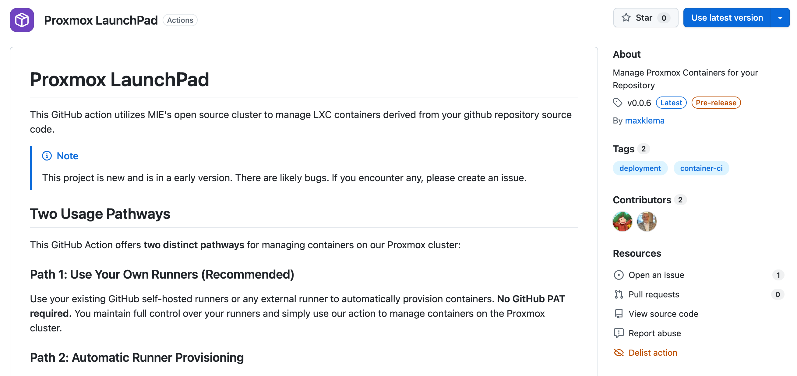

# What is Proxmox Launchpad?

:::caution Outdated Documentation
This section predates the last major rewrite and may not be accurate. Check back weekly for updates.
:::

Proxmox Launchpad is a powerful GitHub Action that automatically provisions and manages LXC containers on MIE's open source Proxmox cluster. It streamlines the development workflow by creating dedicated containers for each branch of your repository and keeping them synchronized with your code changes.

:::note Public Marketplace Page
The link to Proxmox Launchpad on the GitHub Actions Marketplace Site is [https://github.com/marketplace/actions/proxmox-launchpad](https://github.com/marketplace/actions/proxmox-launchpad)
:::
## Key Features

### **Automatic Container Lifecycle Management**
- **First push**: Creates a new container for your branch
- **Subsequent pushes**: Updates the existing container (much faster)
- **Branch deletion**: Automatically removes the associated container

### **Branch-Based Isolation**
Each branch gets its own dedicated container, allowing you to:
- Test different features in isolated environments
- Run multiple versions simultaneously
- Collaborate on different branches without conflicts

### **Intelligent Updates**
- Initial container creation takes a few minutes
- Subsequent updates are significantly faster since the container already exists
- Automatic deployment keeps your container in sync with your latest code

### **Flexible Deployment Options**
- **Basic containers**: Create empty containers for manual setup
- **Automatic deployment**: Deploy your application automatically on every push
- **Multi-component support**: Handle complex applications with multiple services
- **Custom services**: Install databases, web servers, and other dependencies

## How It Works

1. **Branch Creation/Push**: Triggers the workflow
2. **Container Check**: Determines if container exists for the branch
3. **Provisioning**: Creates new container or updates existing one
4. **Deployment**: Optionally deploys your application automatically
5. **Access**: Provides public URL and SSH access details
6. **Cleanup**: Removes container when branch is deleted

## What You Get

Each container provides:
- **Public domain**: `https://your-branch-name.opensource.mieweb.org`
- **SSH access**: Direct terminal access to your container
- **Automatic networking**: DNS and reverse proxy configuration
- **Security monitoring**: Integrated with Wazuh security system
- **LDAP authentication**: Connected to MIE's authentication system

## Two Usage Pathways

Proxmox Launchpad offers **two distinct approaches** for managing your containers, each with different security and performance characteristics:

### **Path 1: Use Your Own Runners (Recommended)**

:::tip Recommended Approach
This is the **recommended pathway** for most users as it provides better security and performance.
:::

Use your existing GitHub self-hosted runners or any external runner to manage containers.

**Benefits:**
- **No GitHub PAT required** - Enhanced security
- **Faster execution** - No runner provisioning overhead
- **Full control** - Use your preferred runner environment
- **Simpler setup** - Fewer configuration steps

**Requirements:**
- Existing GitHub self-hosted runner or external runner
- Basic Proxmox credentials

### **Path 2: Automatic Runner Provisioning**

:::warning Security Consideration
This pathway requires sharing your GitHub Personal Access Token with our action to manage runners on your behalf. Only use this if you're comfortable with this security consideration.
:::

Our action automatically creates and manages GitHub runners for you.

**Benefits:**
- **Complete automation** - No runner management needed
- **Dedicated resources** - Each branch gets its own runner
- **Automatic cleanup** - Runners are deleted with branches

**Requirements:**
- GitHub Personal Access Token with runner management permissions
- Additional setup time for runner provisioning

:::important GitHub PAT Requirements
For automatic runner provisioning, you must provide a GitHub Personal Access Token with `manage_runners:org` (or `manage_runners:enterprise`) permissions. This gives our action the ability to create, modify, and delete runners in your GitHub organization.
:::

:::note Getting Started
Ready to start using Proxmox Launchpad? Check out our [setup guides](/docs/category/proxmox-launchpad/) to choose the pathway that works best for your project.
:::

---

**Next Steps**: Jump to [Path 1 Setup](/docs/users/proxmox-launchpad/supplied-runners) or [Path 2 Setup](/docs/users/proxmox-launchpad/automatic-runner-provisioning) to get started.

