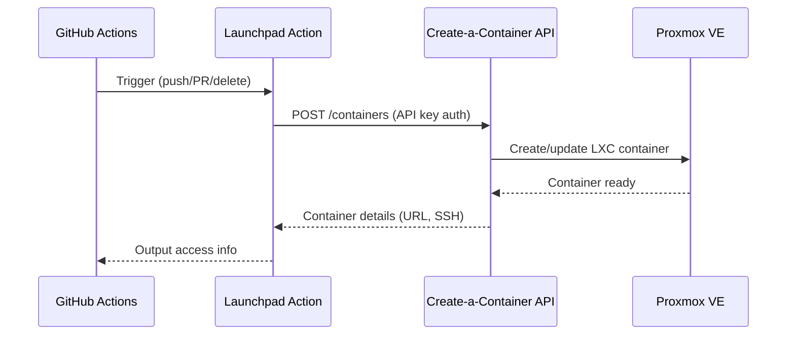

# What is Launchpad?

Launchpad is a GitHub Action that provisions and manages LXC containers on MIE's open source Proxmox cluster. It deploys Docker/OCI images as containers with automatic networking, DNS, and reverse proxy configuration.

:::note GitHub Marketplace
[View Launchpad on the GitHub Actions Marketplace](https://github.com/marketplace/actions/mieweb-launchpad)
:::

## How It Works

1. **Workflow trigger** — A push, PR, or branch event triggers the action
2. **API call** — The action authenticates with an API key and requests a container from the create-a-container server
3. **Container provisioning** — The server pulls the specified Docker/OCI image and creates an LXC container on Proxmox
4. **Access** — The container gets a public URL and SSH access automatically

## What You Get

Each container provides:

| Feature | Details |
|---------|---------|
| Public domain | `https://<hostname>.os.mieweb.org` |
| SSH access | Direct terminal access via assigned port |
| Networking | Automatic DNS and nginx reverse proxy configuration |
| Security monitoring | Integrated with Wazuh security system |
| Authentication | Connected to MIE's LDAP authentication system |

## Key Features

- **Docker/OCI image support** — Deploy from Docker Hub, GHCR, or any OCI registry
- **API-key authentication** — No Proxmox credentials needed in your workflow
- **PR preview environments** — Automatically deploy previews on pull requests and clean up on close
- **Container lifecycle management** — Create, update, and destroy containers via CI/CD
- **Service registry** — HTTP, TCP/UDP, and DNS services are automatically configured

---

**Next Steps**: See the [Getting Started](/docs/users/proxmox-launchpad/getting-started) guide to set up Launchpad in your repository.

