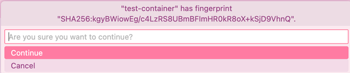

# VSCode Remote SSH Setup

Connect VSCode directly to your Proxmox container for remote development.

**Prerequisites:** VSCode installed, a running container with SSH access.

## 1. Install Remote SSH Extension

In VSCode, open Extensions (`Ctrl+Shift+X`), search "Remote - SSH" by Microsoft, and install it.


## 2. Configure SSH

Open Command Palette (`Ctrl+Shift+P`) → "Remote-SSH: Open SSH Configuration File". Add:

```ssh-config
Host my-container
    HostName <external-domain-name>
    User <your-proxmox-username>
    Port <your-ssh-port>
```

| Field | Description |
|-------|-------------|
| `Host` | Display name for this connection |
| `HostName` | The same domain name used to access the web UI |
| `User` | Your Proxmox username |
| `Port` | SSH port from container output |

For multiple containers, add separate `Host` entries with different names and ports.

## 3. Connect

Command Palette → "Remote-SSH: Connect to Host..." → select your host → choose "Linux" → accept the host key on first connection.



**Authentication:** If you provided a public key during container setup, connection is automatic. Otherwise, enter your Proxmox password when prompted.

## 4. Open Project

Once connected: **Open Folder** (`Ctrl+K Ctrl+O`) → navigate to your project directory (typically `/root/` or `/home/<username>/`).

:::tip
If you can't access `/root`, run `sudo su` in the VSCode terminal using your Proxmox password.
:::

## 5. Develop

The integrated terminal (`Ctrl+`` `) runs inside the container. Use your **Proxmox password** for `sudo`.

