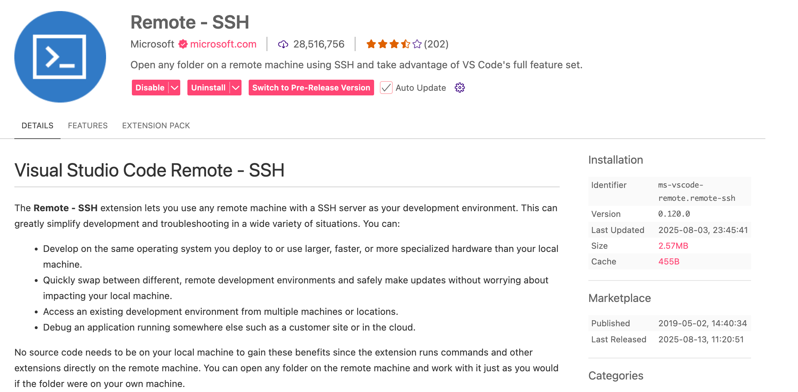

# Accessing your Container from VSCode

When managing an entire repository, many developers prefer to work in an IDE, such as VSCode, rather than a terminal/shell. This guide walks you through setting up VSCode Remote SSH to connect directly to your Proxmox container for seamless development.

## Prerequisites

Before getting started, ensure you have:

- **VSCode installed** on your local machine
- **Container created** with Proxmox Launchpad (either [Path 1](/docs/proxmox-launchpad/supplied-runners) or [Path 2](/docs/proxmox-launchpad/automatic-runner-provisioning))
- **Container access details** from your deployment output (SSH port, hostname, etc.)

## 1: Install Remote SSH Extension

### Install the Extension

1. **Open VSCode** on your local machine
2. **Access Extensions**: Click the Extensions icon in the sidebar (or press `Ctrl+Shift+X`)
3. **Search for Remote SSH**: Type "Remote - SSH" in the search box
4. **Install**: Click "Install" on the "Remote - SSH" extension by Microsoft



:::note Extension Details
The full extension name is **"Remote - SSH"** published by **Microsoft**. This is the official extension for SSH connections.
:::

## 2: Configure SSH Connection

### Access SSH Configuration

1. **Open Command Palette**: Press `Ctrl+Shift+P` (Windows/Linux) or `Cmd+Shift+P` (Mac)
2. **Search for SSH Config**: Type "Remote-SSH: Open SSH Configuration File"
3. **Select Configuration File**: Choose your SSH config file (usually the first option)

:::tip SSH Config Location
- **Windows**: `C:\Users\{username}\.ssh\config`
- **macOS/Linux**: `~/.ssh/config`

If the file doesn't exist, VSCode will create it for you.
:::

### Add Your Container Host

Add the following configuration to your SSH config file, replacing the values with your container details:

```ssh-config
Host my-container
    HostName opensource.mieweb.org
    User <your-proxmox-username>
    Port <your-proxmox-port>
```

#### Configuration Details

| Field | Description | Example |
|-------|-------------|---------|
| `Host` | Name for your container connection | `my-container`, `my-app-dev` |
| `HostName` | Server address (always use `opensource.mieweb.org`) | `opensource.mieweb.org` |
| `User` | Your Proxmox username | `john.doe`, `jane.smith` |
| `Port` | SSH port from your container output | `2344`, `2387` |

### Example Configuration

Based on typical container output, your config might look like:

```ssh-config
Host my-fullstack-app
    HostName opensource.mieweb.org
    User demouser
    Port 2348
```

:::important Important
- Replace `your-proxmox-username` with your actual Proxmox account username
- Replace `2344` with the SSH port from your container deployment output
- Choose a descriptive `Host` name that helps you identify the container
:::

## 3: Connect to Your Container

### Establish SSH Connection

1. **Open Command Palette**: Press `Ctrl+Shift+P` (Windows/Linux) or `Cmd+Shift+P` (Mac)
2. **Connect to Host**: Type "Remote-SSH: Connect to Host..."
3. **Select Your Host**: Choose the host you just configured (e.g., `my-container`)
4. **Select Platform**: Choose "Linux" when prompted for the platform

### Accept Host Key

When connecting for the first time:

1. **Host Key Warning**: You'll see a security warning about the host's authenticity
2. **Accept Key**: Click "Continue" or type "yes" to accept the host key
3. **Trust Permanently**: This adds the host to your known hosts file


:::note Security Note
This warning appears only on the first connection. The host key fingerprint is stored to verify future connections.
:::

### Authentication

Depending on your container setup:

#### If You Provided a Public Key
- **Automatic Login**: VSCode should connect automatically using your SSH key
- **No Password Required**: The connection will be seamless

#### If You Did NOT Provide a Public Key
1. **Password Prompt**: Enter your Proxmox account password when prompted
2. **Connection Established**: VSCode will connect to your container

:::tip Password Management
If you're frequently entering passwords, consider setting up SSH key authentication for a better experience. You can add your public key to the container later by appending it to the `~/.ssh/authorized_keys` file. If you do not have
:::

## 4: Open Your Project Folder

### Navigate to Your Project

1. **Open Folder**: Once connected, click "Open Folder" or press `Ctrl+K Ctrl+O`
2. **Navigate to Home**: Go to `/root/`
3. **Select Project**: Choose your project directory (usually matches your repository name)
4. **Confirm**: Click "OK" to open the folder

:::tip Tip
If you can't access `/root`, run `sudo su` in your VSCode terminal. It may prompt you for your password. This will be your proxmox password.
:::

:::note Note
If you did not choose to automtically deploy your application during container setup, the `/root` directory is likely empty. In that case, it is recommended to create all project files inside your `/home/proxmox-username/` directory.
:::

### Example Directory Structure

Your container typically contains:

```
/root
├── your-repository-name/     # Your project files
│   ├── src/
│   ├── package.json
│   └── README.md
├── .bashrc
└── other-files
```

:::note Project Location
If you used automatic deployment, your repository is cloned to `/home/your-proxmox-username/repository-name/`.
:::

## 5: Working in VSCode

### Integrated Terminal

1. **Open Terminal**: Press `Ctrl+`` (backtick) or go to Terminal > New Terminal
2. **Container Terminal**: You now have a terminal running inside your container
3. **Full Access**: Run commands, install packages, start services directly

### Using Sudo

When you need administrator privileges:

```bash
sudo command-here
```

**Password**: Use your **Proxmox account password** (same as your SSH password)

:::important Sudo Password
The sudo password is always your Proxmox account password, not a separate root password.
:::

### Development Workflow

You can now:

- **Edit Files**: Directly modify your project files
- **Run Commands**: Execute build, test, and start commands
- **Install Extensions**: Use VSCode extensions that work with remote connections
- **Debug Applications**: Set breakpoints and debug your code
- **Version Control**: Use Git integration for commits and pushes

### Multiple Containers

For multiple containers, add separate entries:

```ssh-config
Host main-branch
    HostName opensource.mieweb.org
    User john.doe
    Port 2344

Host feature-branch
    HostName opensource.mieweb.org
    User john.doe
    Port 2387

Host dev-environment
    HostName opensource.mieweb.org
    User john.doe
    Port 2401
```

## Troubleshooting

### Connection Issues

**Cannot connect to host:**
- Verify the SSH port matches your container output
- Ensure your container is running and accessible
- Check that `opensource.mieweb.org` is reachable

**Permission denied:**
- Double-check your Proxmox username
- Verify your password is correct
- Ensure your SSH key is properly configured (if using keys)

**Host key verification failed:**
- Remove the old host key: `ssh-keygen -R [opensource.mieweb.org]:2344`
- Reconnect and accept the new host key

### Container Access

**Sudo password not working:**
- Always use your Proxmox account password for sudo
- If you changed your Proxmox password, use the new password

**Project files not found:**
- Check `/home/your-username/` or `/root` for your repository
- Verify automatic deployment completed successfully
- SSH into the container directly to check file locations

---

**Next Steps**: With VSCode connected to your container, you can now develop directly in your remote environment. Consider exploring [container deployment guides](/docs/creating-containers/advanced-containers/deploying-containers-overview) for automatic application setup.
