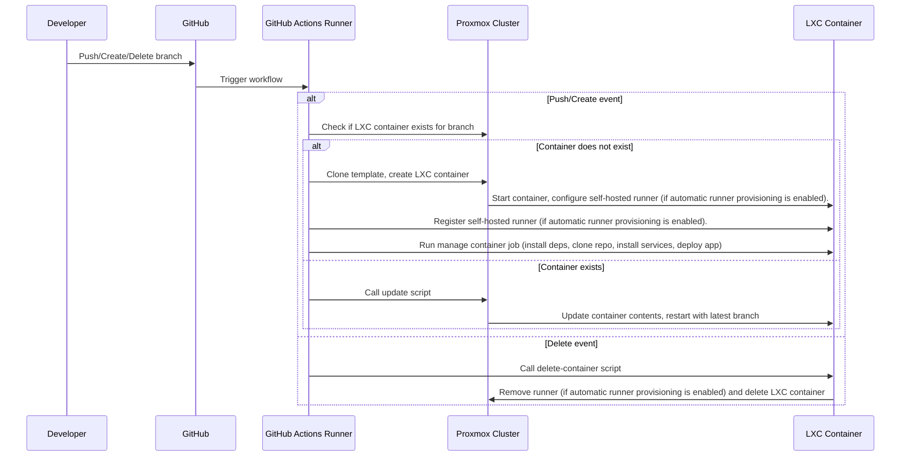

# Proxmox LaunchPad

This GitHub action utilizes MIE's open source cluster to manage LXC containers derived from your github repository source code.

> [!NOTE]
> This project is new and is in a early version. There are likely bugs. If you encounter any, please create an issue.

## Two Usage Pathways

This GitHub Action offers **two distinct pathways** for managing containers on our Proxmox cluster:

### **Path 1: Use Your Own Runners (Recommended)**
Use your existing GitHub self-hosted runners or any external runner to automatically provision containers. **No GitHub PAT required.** You maintain full control over your runners and simply use our action to manage containers on the Proxmox cluster.

### **Path 2: Automatic Runner Provisioning**
Our action automatically creates and manages GitHub runners for you. Each branch gets its own dedicated runner and container. **Requires a GitHub PAT** with runner management permissions. We handle runner lifecycle (creation/deletion) automatically.

> [!WARNING]
> **Path 2 requires sharing your GitHub Personal Access Token** with our action to manage runners on your behalf. Only use this if you're comfortable with this security consideration.

## Table of Contents
1. [Video Walkthroughs](#video-walkthroughs)
2. [Sequence Diagram](#sequence-diagram)
3. [Prerequisites](#prerequisites)
4. [Getting Started](#getting-started)
    - [Path 1: Using Your Own Runners](#path-1-using-your-own-runners)
    - [Path 2: Automatic Runner Provisioning](#path-2-automatic-runner-provisioning)
        - [Personal Access Token Setup](#creating-a-github-pat-for-automatic-runner-provisioning)
        - [Setup-Runner Job](#setup-runner-job)
        - [Manage-Container Job](#manage-container-job-for-automatic-runners)
5. [Configurations](#configurations)
    - [Basic Properties](#basic-properties)
    - [Automatic Deployment Properties](#automatic-deployment-properties)
6. [Important Notes for Automatic Deployment](#important-notes-for-automatic-deployment)
7. [Output](#output)
8. [Sample Workflow Files](#sample-workflow-files)
9. [Misc.](#misc)

## Video Walkthroughs

I have created a series of videos to walk you through automatic deployment, both in GitHub and via the command line.

**[Long-Form]** Proxmox LaunchPad Walkthrough: [Video](https://youtu.be/Xa2L1o-atEM)<br>
**[Short-Form]** Proxmox LaunchPad Demonstration: [Short](https://youtube.com/shorts/SuK73Jej5j4)<br>
**[Long-Form]** Automatic Deployment through Command Line: [Video](https://youtu.be/acDW-a32Yr8)<br>
**[Long-Form]** Getting Started with Creating LXC Continers with Proxmox: [Video](https://youtu.be/sVW3dkBqs4E)

## Sequence Diagram

The sequence diagram below describes the sequence of events executed by this Github Action.



## Prerequisites
- Proxmox Datacluster Setup that mirrors/forks [https://github.com/mieweb/opensource-server](https://github.com/mieweb/opensource-server).
- Valid Proxmox Account.

## Getting Started

Both pathways require the following trigger events in your workflow file:

```yaml
on:
  push:
  create:
  delete:
```

This allows a container to be created/updated on a push command, created when a new branch is created, and deleted when a branch is deleted (like in the case of an accepted PR).

### Path 1: Using Your Own Runners

> [!TIP]
> **This is the recommended approach** as it gives you full control over your runners and doesn't require sharing a GitHub PAT.

If you have your own GitHub self-hosted runners or external runners, you can use them directly with our action. Simply create a workflow file with the manage-container job:

```yaml
name: Proxmox Container Management

on:
  push:
  create:
  delete:

jobs:
  manage-container:
    runs-on: self-hosted  # or your runner label
    steps:
      - uses: maxklema/proxmox-launchpad@main
        with:
          proxmox_username: ${{ secrets.PROXMOX_USERNAME }}
          proxmox_password: ${{ secrets.PROXMOX_PASSWORD }}
          # No github_pat needed for this path
          # Add other configuration options as needed
```

**Benefits of Path 1:**
- No GitHub PAT required
- Full control over runner environment
- Enhanced security
- Simpler workflow configuration

### Path 2: Automatic Runner Provisioning

> [!CAUTION]
> **This path requires you to provide your GitHub Personal Access Token**, giving our action permission to create and manage runners on your behalf. Only use this if you're comfortable with this security consideration.

#### Creating a GitHub PAT for Automatic Runner Provisioning

To use automatic runner provisioning, you must create a GitHub Personal Access Token with runner management permissions:

1. Navigate to your GitHub account settings
2. Click "Developer settings" (bottom left)
3. Navigate to "Personal Access Tokens (classic)"
4. Click "Generate new token"
5. Give your token a name and expiration date
6. Select the **`manage_runners:org`** permission (or `manage_runners:enterprise` for enterprise repositories)
7. Generate the token and store it securely
8. Add it as a repository secret named `GH_PAT` in your repository

> [!WARNING]
> This PAT gives our action the ability to create, modify, and delete runners in your GitHub organization/repository. Store it securely and never share it.

#### Setup-Runner Job

For automatic runner provisioning, you need both a `setup-runner` job and a `manage-container` job:

```yaml
name: Proxmox Container Management

on:
  push:
  create:
  delete:

jobs:
  setup-runner:
    runs-on: ubuntu-latest
    steps:
      - name: Install Dependencies
        run: |
          sudo apt install -y sshpass jq

      - uses: maxklema/proxmox-launchpad@main
        with:
          proxmox_password: ${{ secrets.PROXMOX_PASSWORD }}
          proxmox_username: ${{ secrets.PROXMOX_USERNAME }}
          github_pat: ${{ secrets.GH_PAT }}

  manage-container:
    runs-on: self-hosted
    needs: setup-runner
    steps:
      - uses: maxklema/proxmox-launchpad@main
        with:
          proxmox_password: ${{ secrets.PROXMOX_PASSWORD }}
          proxmox_username: ${{ secrets.PROXMOX_USERNAME }}
          github_pat: ${{ secrets.GH_PAT }}
          # Add other configuration options as needed
```


> [!TIP]
> It is recommended to also pass your `github_pat` in the manage-container job, too. This allows Proxmox Launchpad to create deployments on every update to your main branch. Additionally, if a branch is part of an open pull request, Proxmox Launchpad will comment on that PR with information regarding the public domain for that container, the job status, and the job ID, allowing others to easily access it.

**What happens with automatic runner provisioning:**
- A new runner is created for each branch
- Runners are automatically deleted when branches are deleted
- Each branch gets its own dedicated container and runner
- Complete lifecycle management (no manual cleanup needed)


## Configurations

At the very minimum, two configuration settings are required to create any container. With all of these properties specified, you can create an empty container for a branch.

### Basic Properties

| Propety | Required? | Description | Supplied by Github? |
| ---------------- | ------ | ---------------------------------------------- | ------ |
| `proxmox_username` | Yes | Your proxmox username assigned to you. | N/A
| `proxmox_password` | Yes | Your proxmox password assigned to you. | N/A
| `http_port` | No | The HTTP Port for your container to listen on. It must be between `80` and `60000`. Default value is `3000`. | N/A
| `linux_distribution` | No | The Linux Distribution that runs on your container. Currently, `rocky` (Rocky 9.5) and `debian` (Debian 12) are available. Default value is `Debian`. | N/A
| `github_pat` | Conditional | Your GitHub Personal Access Token. This is used to manage runners in your containers. This is **only required for Path 2 (Automatic Runner Provisioning).**| Yes. Accessible in developer settings. |

There are a few other properties that are not required, but can still be specified in the workflow file:
<br>

| Propety | Required? | Description | Supplied by Github? |
| --------- | ----- |  ------------------------------------ | ------ |
| `public_key` | No | Your machine's public key that will be stored in the `~/.ssh/authorized_keys` file of your repository. This allows you to SSH into your container without a password. It is more secure and recommended. | N/A

### Automatic Deployment Properties

This github action can *attempt* to automatically deploy services on your container. This is done by fetching your repository contents on the branch that the script is being ran in, installing dependencies/services, and running build and start commands in the background.

Additionally, with automatic deployment enabled, your container will update on every push command automatically, preventing you from having to SSH into the container and setting it up manually.

> [!NOTE]
> Properties below that are required assuming you want to automatically deploy your project. If not, none of these properties are needed.

| Property | Required? | Description |
| --------- | ----- |  ------------------------------------ |
| `project_root` | No | The root directory of your project to deploy from. Example: `/flask-server`. If the root directory is the same as the github root directory, leave blank.
| `services` | No | A JSON array of services to add to your container. Example: ```services: '["mongodb", "docker"]'```. These services will automatically install and start up on container creation. **NOTE**: All services in this list must belong on the list of available services below. If you need a service that is not on the list, see `custom_services`.<br><br> Available Services: `meteor`, `mongodb`, `docker`, `redis`, `postgresql`, `apache`, `nginx`, `rabbitmq`, `memcached`, `mariadb`.
| `custom_services` | No | A 2D JSON array of custom service installation commands to install any custom service(s) not in `services`.<br> <br>Example: ```custom_services: [["sudo apt-get install -y service", "sudo systemctl enable service", "sudo systemctl start service"], ["sudo apt-get install -y service2", "sudo systemctl enable service2", "sudo systemctl start service2"]]```

There are two types of deployments: single component and multi-component deployment. Single component deployment involves deploying only a single service (i.e. a single Flask Server, REACT application, MCP Server, etc.). Multi-component deployment involves deploying more than one service at the same time (i.e. a flask backend and a vite.js backend).

> [!IMPORTANT]
> In Multi-Component applications, each top-layer key represents the file path, relative to the root directory, to the component (service) to place those variables/commands in. 

| Propety | Required? | Description | Single Component | Multi-Component |
| --------- | ----- |  ------------------------------------ | ---- | --- |
|  `container_env_vars` | No. | Key-Value Environment variable pairs. | Dictionary in the form of: `{ "api_key": "123", "password": "abc"}` | Dictionary in the form of: `'{"/frontend": { "api_key": "123"}, "/backend": { "password": "abc123" }}'`.
|  `install_command` | Yes | Commands to install all project dependencies | String of the installation command, i.e. `npm install`. | Dictionary in the form of: `'{"/frontend": "npm install", "/backend": "pip install -r ../requirements.txt"}'`.
|  `build_command` | No | Commands to build project components | String of the build command, i.e. `npm build`. | Dictionary in the form of: `'{"/frontend": "npm build", "/backend": "python3 build.py"}'`.
|  `start_command` | Yes | Commands to start project components. | String of the start command, i.e. `npm run`. | Dictionary in the form of: `'{"/frontend": "npm run", "/backend": "flask run"}'`.
|  `runtime_language` | Yes | Runtime language of each project component, which can either be `nodejs` or `python`. | String of runtime environment, i.e. `nodejs` | Dictionary in the form of: `'{"/frontend": "nodejs", "/backend": "python"}'`.
|  `root_start_command` | No | Command to run at the project directory root for **multi-component applications**. | N/A | String of the command, i.e. `Docker run`

## Important Notes for Automatic Deployment

Below are some important things to keep in mind if you want your application to be automatically deployed:
- If you are using meteor, you must start your application with the flags ``--allow-superuser`` and `--port 0.0.0.0:<http-port>`.
  - Meteor is a large package, so deploying it may take more time than other applications.
- When running a service, ensure it is listening on `0.0.0.0` (your IP) instead of only locally at `127.0.0.1`.
- The Github action will fail with an exit code and message if a property is not set up correctly.

## Output

When a container is successfully created (Github Action is successful), you will see an output with all of your container details. This includes all your ports, container ID, container IP Address (internal in 10.15.x.x subnet), public domain name, and ssh command to access your container.

See an example output below:

```
━━━━━━━━━━━━━━━━━━━━━━━━━━━━━━━━━━━━━━━━━━━━━━━━━━━━━━━━━━━━
🔔  COPY THESE PORTS DOWN — For External Access
━━━━━━━━━━━━━━━━━━━━━━━━━━━━━━━━━━━━━━━━━━━━━━━━━━━━━━━━━━━━
📌  Note: Your container listens on SSH Port 22 internally,
    but EXTERNAL traffic must use the SSH port listed below:
━━━━━━━━━━━━━━━━━━━━━━━━━━━━━━━━━━━━━━━━━━━━━━━━━━━━━━━━━━━━
✅  Hostname Registration: polyglot-test-maxklema-pull-request → 10.15.129.23
🔐  SSH Port            : 2344
🌐  HTTP Port           : 32000
━━━━━━━━━━━━━━━━━━━━━━━━━━━━━━━━━━━━━━━━━━━━━━━━━━━━━━━━━━━━
📦  Container ID        : 136
🌐  Internal IP         : 10.15.129.23
🔗  Domain Name         : https://polyglot-test-maxklema-pull-request.opensource.mieweb.org
🛠️  SSH Access          : ssh -p 2344 root@polyglot-test-maxklema-pull-request.opensource.mieweb.org
━━━━━━━━━━━━━━━━━━━━━━━━━━━━━━━━━━━━━━━━━━━━━━━━━━━━━━━━━━━━
NOTE: Additional background scripts are being ran in detached terminal sessions.
Wait up to two minutes for all processes to complete.
━━━━━━━━━━━━━━━━━━━━━━━━━━━━━━━━━━━━━━━━━━━━━━━━━━━━━━━━━━━━
Still not working? Contact Max K. at maxklema@gmail.com
━━━━━━━━━━━━━━━━━━━━━━━━━━━━━━━━━━━━━━━━━━━━━━━━━━━━━━━━━━━━
```

> [!NOTE]
> Even if your GitHub Action workflow is finished, *it may not be accessible right away. Background tasks (migration, template cloning, cleanup, etc) are still be ran in detatched terminal sessions*. Wait a few minutes for all tasks to complete.

## Sample Workflow Files

### Path 1: Using Your Own Runners

```yaml
name: Proxmox Container Management (Own Runners)

on:
  push:
  create:
  delete:

jobs:
  manage-container:
    runs-on: self-hosted  # Use your own runner
    steps:
      - uses: maxklema/proxmox-launchpad@main
        with:
          proxmox_password: ${{ secrets.PROXMOX_PASSWORD }}
          proxmox_username: ${{ secrets.PROXMOX_USERNAME }}
          container_env_vars: '{"API_KEY": "1234"}'
          install_command: npm i
          start_command: npm start
          runtime_language: nodejs
          services: '["mongodb"]'
```

### Path 2: Automatic Runner Provisioning

```yaml
name: Proxmox Container Management (Auto Runners)

on:
  push:
  create:
  delete:

jobs:
  setup-runner:
    runs-on: ubuntu-latest
    steps:
      - name: Install Dependencies
        run: |
          sudo apt install -y sshpass jq
      - uses: maxklema/proxmox-launchpad@main
        with:
          proxmox_password: ${{ secrets.PROXMOX_PASSWORD }}
          proxmox_username: ${{ secrets.PROXMOX_USERNAME }}
          github_pat: ${{ secrets.GH_PAT }}

  manage-container:
    runs-on: self-hosted
    needs: setup-runner
    steps:
      - uses: maxklema/proxmox-launchpad@main
        with:
          proxmox_password: ${{ secrets.PROXMOX_PASSWORD }}
          proxmox_username: ${{ secrets.PROXMOX_USERNAME }}
          github_pat: ${{ secrets.GH_PAT }}
          container_env_vars: '{"API_KEY": "1234"}'
          install_command: npm i
          start_command: npm start
          runtime_language: nodejs
          services: '["mongodb"]'
```

## Misc.
Written by [maxklema](https://github.com/maxklema).<br>
Feel free to submit a PR/issue here.