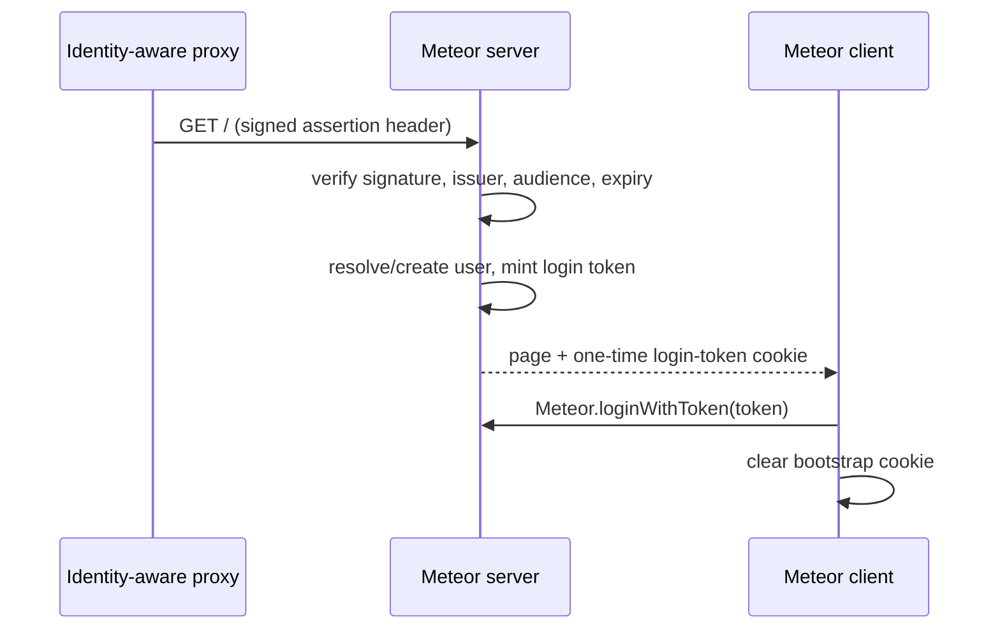

# mieweb:accounts-proxy-auth

Logs Meteor users in from a signed identity assertion supplied by a trusted
upstream proxy. Reuses the audited verification core from the
`@mieweb/trusted-proxy-auth` npm package, so it stays consistent with the
Express, Fastify, Hono, Python, Rust, and Go implementations.

## Install

```sh
meteor add mieweb:accounts-proxy-auth
```

The package depends on `@mieweb/trusted-proxy-auth` (declared via `Npm.depends`),
which Meteor installs automatically when the package is built.

> **Local development:** `Npm.depends` resolves `@mieweb/trusted-proxy-auth` from
> the npm registry, so the package must be published first. Until then, build
> against the in-repo source by linking it:
>
> ```sh
> cd proxy-auth-lib/nodejs && npm link
> cd <your-meteor-app> && npm link @mieweb/trusted-proxy-auth
> ```
>
> or vendor the package into the app's `node_modules` before running `meteor`.

## Configure

Every setting is optional. By default the auth domain is derived from the host's
FQDN (`web1.os.example.org` → `auth.os.example.org`). Override any single value
with its own environment variable:

| Variable | Default | Purpose |
|---|---|---|
| `TRUSTED_PROXY_AUTH_DOMAIN` | `auth.<parent-domain-of-hostname>` | Base domain used to derive the issuer and JWKS URL |
| `TRUSTED_PROXY_ASSERTION_HEADER` | `X-Trusted-Proxy-Assertion` | Header carrying the signed assertion |
| `TRUSTED_PROXY_JWKS_URL` | `https://<domain>/.well-known/jwks.json` | JWKS URL for signing keys |
| `TRUSTED_PROXY_ISSUER` | `https://<domain>` | Expected JWT issuer |
| `TRUSTED_PROXY_AUDIENCE` | `https://<domain>` | Expected JWT audience |
| `TRUSTED_PROXY_PUBLIC_KEY` | _(unset)_ | Inline PEM public key; skips JWKS and verifies offline |
| `TRUSTED_PROXY_PUBLIC_KEY_FILE` | _(unset)_ | Path to a PEM public key (alternative to the inline form) |

JWKS is preferred (key rotation, and what OIDC providers publish); set a static
public key only for the self-signed case where your own proxy mints assertions.

## Flow



The server verifies the assertion on the top-level page request, ensures a
matching Meteor user exists, mints a one-time login token, and delivers it to
the client in a short-lived (`60s`) cookie. The client calls
`Meteor.loginWithToken` on startup and clears the cookie.

## Custom user mapping

By default a user is matched/created by `services.proxyAuth.subject`. Override
the mapping on the server:

```js
import { TrustedProxyAccounts } from 'meteor/mieweb:accounts-proxy-auth';

TrustedProxyAccounts.setUserResolver(async (identity) => {
  const user = await Meteor.users.findOneAsync({ 'emails.address': identity.email });
  return user?._id ?? Accounts.insertUserDoc({}, {
    emails: [{ address: identity.email, verified: true }],
    services: { proxyAuth: { subject: identity.subject } },
  });
});
```

The `identity` argument exposes `subject`, `email`, `name`, and the raw verified
`claims`.

## Security boundary

A missing or invalid assertion never blocks page delivery — the client simply
stays logged out and the application enforces its own authorization. Only a
signature verified against the configured JWKS, issuer, audience, and expiration
results in a login. Raw identity headers such as `X-Forwarded-User` are never
trusted on their own.
